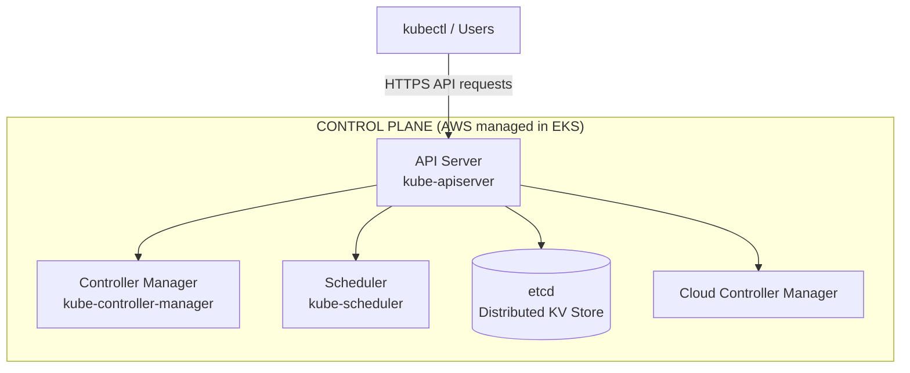
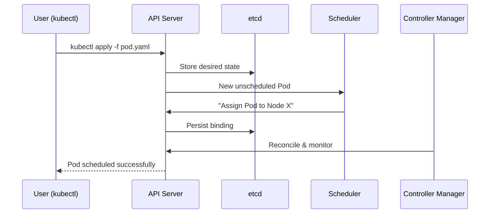
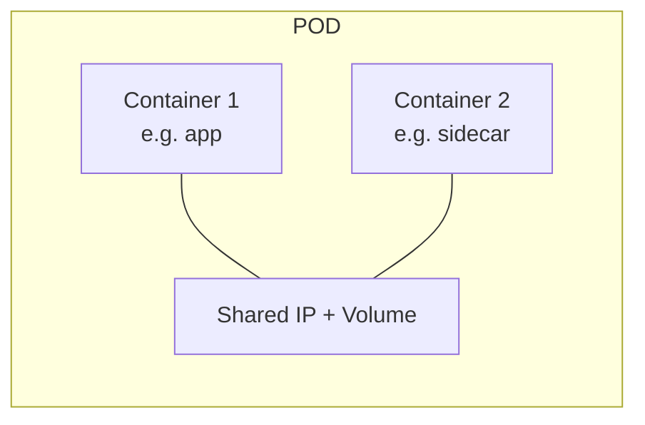
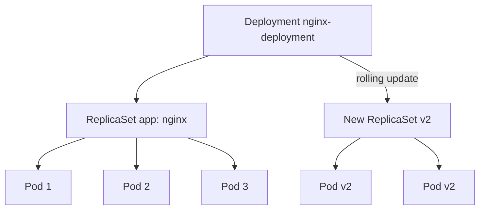
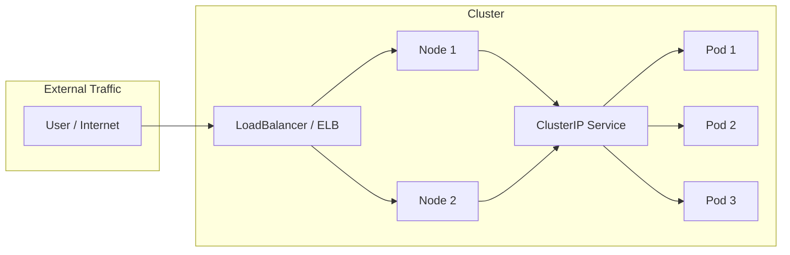

# Containers and Kubernetes Basics

> A beginner-friendly introduction to containers, container orchestration, and the core Kubernetes concepts you need before working with **Amazon EKS**.

---

## Table of Contents

- [What is a Container?](#what-is-a-container)
- [Container Architecture (Kitchen Analogy)](#container-architecture--kitchen-analogy)
- [What Does a Container Orchestrator Do?](#what-does-a-container-orchestrator-do)
- [Primary Kubernetes Components](#primary-kubernetes-components)
- [Control Plane Components](#control-plane-components)
- [Worker Node Components](#worker-node-components)
- [Kubernetes Workloads](#kubernetes-workloads)
  - [Pod](#pod)
  - [ReplicaSet](#replicaset)
  - [Deployment](#deployment)
- [Kubernetes Services](#kubernetes-services)

---

## What is a Container?

A **container** is a lightweight, standalone, and executable unit of software that packages an application together with everything it needs to run:

- **Code**
- **Runtime**
- **System libraries**
- **Dependencies**

Because everything is bundled, a container runs the **same way no matter where it is deployed** — on your laptop, a test server, or in the cloud.

### Real-world Example (Lunchbox)

Imagine you are traveling and need to take food with you:

- You pack a lunchbox with rice, curry, a spoon, and a napkin.
- No matter where you go — home, office, or park — you open the lunchbox and eat.
- You don't depend on whether the location has food or utensils.

Similarly, a **container** packages an application with its necessary files, so it runs consistently across different computers.

---

## Container Architecture (Kitchen Analogy)

Container architecture has multiple components that work together, just like a well-organized kitchen operates to serve meals.


> Source: [Docker — What is a Container?](https://www.docker.com/resources/what-container/)

The container image is the **immutable template**, pulled from a **registry** (Docker Hub / ECR). The **runtime** (containerd / Docker) runs it, and an **orchestrator** (Kubernetes / Docker Swarm) manages many containers across hosts.

### 1. Container Runtime → Kitchen Stove (Cooking Equipment)

The **container runtime** is like a **kitchen stove** that actually **cooks the food** (runs the containers). Without it, no meal (container) can be prepared.

> **Example:** Docker Engine, containerd, CRI-O

### 2. Container Image → Pre-Packaged Meal Kit

A **container image** is like a **pre-packaged meal kit** that includes all the ingredients and instructions needed to prepare a dish. Once built, you can reuse it multiple times, ensuring consistency.

> **Example:** A biryani meal kit that anyone can use to cook biryani anywhere.

### 3. Container Orchestration → Head Chef (Kitchen Manager)

When multiple stoves (runtimes) and containers are working together, someone must **coordinate operations, manage scaling, and ensure efficiency**. The **orchestration system** is like a **head chef** who supervises everything.

> **Example:** Kubernetes (K8s), Docker Swarm, Amazon ECS, Amazon EKS, Apache Mesos

### 4. Container Registry → Cookbook/Recipe Shelf

A **container registry** is like a **cookbook or recipe shelf** that stores multiple meal kits (images) for later use. Whenever you need to prepare a dish, you pick a recipe (pull an image) and start cooking (run a container).

> **Example:** Docker Hub, Amazon ECR, Azure Container Registry

### Analogy Mapping

| Container Concept       | Easy Analogy                            |
|-------------------------|-----------------------------------------|
| Container Runtime       | Kitchen Stove (Cooking Equipment)       |
| Container Image         | Pre-Packaged Meal Kit                   |
| Container Registry      | Cookbook/Recipe Shelf                   |
| Container Orchestration | Head Chef / Kitchen Manager             |

### Real-world Example (Restaurant)

Think of a restaurant where meals (applications) are prepared efficiently:

- A **cookbook / recipe shelf (container registry)** stores different meal kits (images) so chefs can quickly pick a recipe and cook.
- A **kitchen stove (container runtime)** cooks meals based on a **pre-packaged meal kit (image)**.
- The **head chef (Kubernetes)** manages multiple stoves and chefs, ensuring meals are prepared at the right time in the right quantity.

---

## What Does a Container Orchestrator Do?

Kubernetes (used through **EKS – Amazon Elastic Kubernetes Service**) is responsible for managing and automating containerized applications. Think of it as a **restaurant manager** who ensures everything runs smoothly.

### Challenges Without Container Orchestrators

- **Manual Scaling & Management** – You must manually start, stop, and scale containers, making it hard to handle high traffic.
- **Lack of Self-Healing** – If a container crashes, you must detect and restart it manually, leading to downtime.
- **Complex Networking & Load Balancing** – Managing container-to-container communication and distributing traffic requires manual setup.

| Restaurant Scenario                                                        | Kubernetes Functionality                                                                    |
|----------------------------------------------------------------------------|---------------------------------------------------------------------------------------------|
| The manager hires more chefs when customers increase.                      | **Auto-scaling** – adds more containers automatically when traffic increases.                |
| The manager replaces a sick chef with a new one.                           | **Self-healing** – if a container crashes, it is replaced automatically.                     |
| The manager ensures food reaches the right table.                          | **Networking & Service Discovery** – routes traffic to the correct container.                |
| The manager schedules chefs in sections (Starters, Main Course, Desserts). | **Workload Scheduling** – places containers on the best available nodes.                     |
| The manager keeps a record of food stock.                                  | **Storage Management** – ensures containers have the storage they need.                      |
| The manager hires extra staff during peak hours.                           | **Load Balancing** – distributes traffic to prevent overload.                                |

---

## Primary Kubernetes Components

Kubernetes has two main parts:

1. **Control Plane** – Manages the cluster (`brain`)
2. **Worker Nodes** – Run the actual applications


> Source: [Kubernetes — Cluster Architecture](https://kubernetes.io/docs/concepts/architecture/)

| Part          | What it does                                            | Managed by        |
|---------------|---------------------------------------------------------|-------------------|
| **Control Plane** | API server, scheduler, controller-manager, etcd        | **AWS** (managed) |
| **Worker Nodes** | Kubelet, kube-proxy, container runtime, your pods      | **You** (node pool) |

---

## Control Plane Components

The **Control Plane** is the **brain** of Kubernetes. It manages the cluster, schedules workloads, and ensures everything runs as expected.

### Control Plane Component Overview

| Component                     | Purpose                                                                                     |
|-------------------------------|---------------------------------------------------------------------------------------------|
| **API Server (kube-apiserver)**   | The **front door** of Kubernetes; handles all API requests from users and tools.             |
| **Controller Manager**            | Ensures the desired state of the cluster (replicas, failed pods, node health).               |
| **Scheduler (kube-scheduler)**    | Decides **where** to run new pods based on resource availability.                            |
| **etcd**                          | Stores all cluster data (state, configurations, deployments) in a distributed database.      |
| **Cloud Controller Manager**      | Integrates K8s with cloud providers (AWS, Azure, GCP) for networking, storage, load balancers. |




### 1. API Server (`kube-apiserver`) – The Front Door

**Purpose:**

- Acts as the **entry point** for all Kubernetes commands (from `kubectl`, dashboards, or automation tools).
- It **validates** requests and forwards them to other components.
- Exposes the **Kubernetes API**, allowing internal and external users to communicate with the cluster.

```sh
kubectl get pods
```

The API Server **receives the request**, **retrieves data from etcd**, and **returns the pod list**.

### 2. etcd – The Database

**Purpose:**

- Stores all **cluster data** (pod status, deployments, configurations).
- A **key-value store** that holds the **desired and current state** of Kubernetes.
- Highly available and distributed to avoid data loss.

```sh
kubectl apply -f myapp.yaml
```

The API Server **writes the deployment details into etcd**. If a pod crashes, etcd still holds the data, allowing Kubernetes to restore it.

### 3. Controller Manager (`kube-controller-manager`) – The Supervisor

**Purpose:**

- Watches etcd and ensures the cluster **matches the desired state**.
- Runs different **controllers** that handle specific tasks.

**Important Controllers:**

- **Node Controller** – Monitors node health and replaces failed nodes.
- **Job Controller** – Watches for Job objects and creates Pods to run one-off tasks to completion.
- **Service Account Controller** – Manages authentication tokens for pods.

If a **node fails**, the **Node Controller** detects it and **moves pods to another node** automatically.

### 4. Scheduler (`kube-scheduler`) – The Decision Maker

**Purpose:**

- Decides **which node** will run a newly created pod.
- Picks a node based on **resource availability, taints, and tolerations**.

```yaml
apiVersion: v1
kind: Pod
metadata:
  name: my-app
spec:
  containers:
    - name: my-container
      image: nginx
```

The **API Server receives it**, and the **Scheduler assigns it to a node with enough resources**.

### 5. Cloud Controller Manager – The Cloud Bridge

**Purpose:**

- Connects Kubernetes to **cloud providers (AWS, Azure, GCP, etc.)**.
- Manages cloud-specific resources like **load balancers, storage, and networking**.

**Example in AWS EKS:**

When you create a Kubernetes `Service` of type `LoadBalancer`, the Cloud Controller Manager:

- Requests an AWS **Elastic Load Balancer (ELB)**.
- Configures the ELB to forward traffic to the Kubernetes service.

### How Control Plane Components Work Together



---

## Worker Node Components

A **Worker Node** is where the actual applications (containers) run. The Control Plane **manages** the cluster, but the Worker Nodes **execute** workloads.


### Worker Node Component Overview

| Component            | Purpose                                                                                     |
|----------------------|---------------------------------------------------------------------------------------------|
| **Kubelet**             | Runs on each worker node; communicates with the API server and ensures assigned containers run. |
| **Container Runtime**   | Runs containers on the node (e.g., Docker, containerd, CRI-O).                               |
| **Kube Proxy**          | Manages networking and ensures pods communicate with each other and external services.       |
| **Pods**                | The smallest unit in Kubernetes; a pod contains one or more containers sharing storage and networking. |

### 1. Kubelet – The Node Manager

- **Main agent** running on each Worker Node.
- Talks to the **API Server** and ensures pods run correctly.
- Continuously monitors pod health and reports back to the Control Plane.

The Scheduler assigns a pod to a Worker Node. The **Kubelet receives the instruction** and starts the container using the container runtime. If the pod crashes, Kubelet **restarts it automatically**.

### 2. Container Runtime – Runs Containers

- Responsible for **pulling container images**, **running containers**, and **handling lifecycle management**.
- Kubernetes supports different runtimes: **Docker, containerd, CRI-O**.

```yaml
apiVersion: v1
kind: Pod
metadata:
  name: my-nginx
spec:
  containers:
    - name: nginx-container
      image: nginx:latest
```

The **Kubelet asks the container runtime** to pull the `nginx` image and run it inside the pod.

### 3. Kube Proxy – Manages Networking

- Handles **networking rules** and **pod communication** inside the cluster.
- Ensures **each pod gets a unique IP address**.
- Manages **load balancing** between pods in a service.

A pod (`frontend-app`) wants to talk to another pod (`backend-service`). Kube Proxy ensures **network routing** happens correctly. If one backend pod fails, Kube Proxy **automatically routes traffic to healthy pods**.

### 4. Pods – The Smallest Deployable Unit

- A pod is **a wrapper around one or more containers**.
- It shares **storage, networking, and configuration** between containers.
- Each pod has a unique **IP address** inside the cluster.

```yaml
apiVersion: v1
kind: Pod
metadata:
  name: my-app-pod
spec:
  containers:
    - name: app-container
      image: my-app
    - name: logging-container
      image: log-collector
```

Both containers share **storage and network**, allowing them to communicate easily.

### How Worker Node Components Work Together

1. **Scheduler assigns a pod** to a Worker Node.
2. **Kubelet receives the instruction** and starts the pod.
3. **Container Runtime pulls the image** and runs the container inside the pod.
4. **Kube Proxy sets up networking** so the pod can communicate with other pods/services.
5. **Pod runs successfully** and serves requests.


---

## Kubernetes Workloads

### Pod

A **Pod** is the smallest and simplest deployable unit in Kubernetes. It represents one or more containers.




### ReplicaSet

A **ReplicaSet** is a Kubernetes object that ensures a **specified number of identical pod replicas** are always running. It acts as a safety net for your applications by automatically replacing failed or deleted Pods.

#### Key Features of ReplicaSet

| Feature         | Description                                                                      |
|-----------------|----------------------------------------------------------------------------------|
| Pod Availability   | Maintains the exact number of Pod replicas defined in the `replicas` field.       |
| Self-Healing       | Automatically replaces failed, crashed, or deleted Pods to match the desired state. |
| Manual Scaling     | Scale Pods up/down by updating the `replicas` count (e.g., `kubectl scale`).      |
| Label Selector     | Uses labels to identify and manage Pods (e.g., `app: my-web-app`).                |
| No Updates         | **Does NOT support rolling updates** – use a **Deployment** for updating Pods.    |

#### Example: ReplicaSet YAML

```yaml
apiVersion: apps/v1
kind: ReplicaSet
metadata:
  name: nginx-replicaset
spec:
  replicas: 3
  selector:
    matchLabels:
      app: nginx
  template:
    metadata:
      labels:
        app: nginx
    spec:
      containers:
        - name: nginx
          image: nginx:latest
```

**What happens?**

- Creates 3 pods with the Nginx container.
- If a pod crashes, a new one is created automatically.
- If a pod is deleted manually, ReplicaSet replaces it.

#### Operating ReplicaSets

```sh
# Scale up from 3 to 5
kubectl scale rs nginx-replicaset --replicas=5

# Check running pods
kubectl get pods

# Delete a pod and watch auto-recovery
kubectl delete pod <pod-name>
```

ReplicaSet immediately creates a new pod to maintain 3 replicas.

#### Limitations of ReplicaSet

- Cannot **update existing pods** (e.g., rolling out a new version).
- Only ensures the **desired number of replicas**; no version control.

#### When Should You Use Deployment Instead?

ReplicaSet **does not support rolling updates** (changing container images). If you want **version updates, rollbacks, or gradual updates**, use a **Deployment**, which internally manages a ReplicaSet.

### Deployment

A **Deployment** is a higher-level abstraction that manages **ReplicaSets** and enables **rolling updates, rollbacks, and scaling** without downtime.

#### Example Scenario

- You deploy **version 1** of your app.
- Later, you update the image to **version 2** → Deployment performs a **smooth rollout**.
- If the update fails, you can **rollback** to the previous version.

#### Why Use a Deployment?

- Ensures a fixed number of replicas (via ReplicaSet)
- Supports **rolling updates** (zero-downtime updates)
- Allows **rollbacks** (revert to a previous version)
- Handles **scaling up/down** automatically

#### Example: Deployment YAML

```yaml
apiVersion: apps/v1
kind: Deployment
metadata:
  name: nginx-deployment
spec:
  replicas: 3  # Maintain 3 running pods
  selector:
    matchLabels:
      app: nginx
  template:
    metadata:
      labels:
        app: nginx
    spec:
      containers:
        - name: nginx
          image: nginx:latest
          ports:
            - containerPort: 80
```



#### Rolling Update (Zero Downtime)

- **How it works:** Updates **one pod at a time** instead of stopping everything at once.
- **Use case:** When **zero downtime** is required, like web applications.
- **Drawback:** Slow if the update is large.

```yaml
strategy:
  type: RollingUpdate
  rollingUpdate:
    maxUnavailable: 1  # Max 1 pod can be unavailable during update
    maxSurge: 1        # 1 extra pod can be created temporarily
```

#### ReplicaSet vs Deployment

| Feature                                     | ReplicaSet | Deployment      |
|---------------------------------------------|------------|-----------------|
| Ensures a fixed number of pods              | Yes        | Yes (via ReplicaSet) |
| Automatically replaces failed pods          | Yes        | Yes             |
| Supports Rolling Updates                    | No         | Yes             |
| Supports Rollbacks                          | No         | Yes             |
| Manages multiple ReplicaSets (for updates)  | No         | Yes             |
| Recommended for production                  | No         | Yes             |

---

## Kubernetes Services

In Kubernetes, a **Service** is an abstraction that defines a logical set of Pods and a policy to access them. It provides a **stable endpoint (IP address and DNS name)** for communication with the Pods, even as the Pods themselves come and go due to scaling, updates, or failures.

### Why Services are Needed

Pods are ephemeral — they can be created, destroyed, or replaced dynamically, and each gets its own (unstable) IP. If you rely on Pod IPs directly, your application breaks when Pods are replaced. **Services** solve this by providing a **stable network identity** for your application.

### How Services Work

1. **Selector** – A Service uses a `selector` to identify the Pods it routes traffic to (e.g., `app: my-app`).
2. **Endpoints** – Kubernetes automatically creates an `Endpoints` object listing the IPs and ports of matching Pods.
3. **kube-proxy** – Runs on each node and ensures the Service IP is reachable, routing traffic to the correct Pods.


### Types of Services


#### 1. ClusterIP (Default)

- Exposes the Service on a **cluster-internal IP** — reachable only from within the cluster.
- **Use case:** Communication between application components (e.g., frontend to backend).
- **Advantages:** Secure (not exposed externally); stable IP and DNS for internal communication.

```yaml
apiVersion: v1
kind: Service
metadata:
  name: my-service
spec:
  type: ClusterIP
  selector:
    app: my-app
  ports:
    - protocol: TCP
      port: 80
      targetPort: 80
```

#### 2. NodePort

- Exposes the Service on a **static port on each Node's IP** — accessible externally via `<NodeIP>:<NodePort>`.
- **Use case:** Expose an application externally without a LoadBalancer.
- **Advantages:** Simple; works without a cloud provider.

```yaml
apiVersion: v1
kind: Service
metadata:
  name: my-service
spec:
  type: NodePort
  selector:
    app: my-app
  ports:
    - protocol: TCP
      nodePort: 30000
      port: 80
      targetPort: 80
```

#### 3. LoadBalancer

- Exposes the Service externally using a **cloud provider's load balancer**; automatically assigns an external IP.
- **Use case:** Running in a cloud environment (AWS, GCP, Azure) and exposing the app to the internet.
- **Advantages:** Auto-provisions a load balancer; handles traffic distribution across nodes.

```yaml
apiVersion: v1
kind: Service
metadata:
  name: my-service
spec:
  type: LoadBalancer
  selector:
    app: my-app
  ports:
    - protocol: TCP
      port: 80
      targetPort: 9376
```



### Key Advantages of Services

1. **Stable Network Identity** – Consistent IP and DNS even as Pods come and go.
2. **Load Balancing** – Traffic distributed evenly across Pods.
3. **Decoupling** – Applications don't need to know individual Pod IPs.
4. **Scalability** – Scale up/down without affecting clients.
5. **Flexibility** – Different Service types for different exposure needs.

### Example Use Cases

| Service Type      | Use Case                                                   |
|-------------------|------------------------------------------------------------|
| **ClusterIP**     | Frontend app talking to a backend API.                     |
| **NodePort**      | Exposing a web app for testing or development.             |
| **LoadBalancer**  | Exposing a production app to the internet.                 |
| **ExternalName**  | Connecting to an external database or third-party service. |

### Why Are Services Important?

| Feature               | Without Service                                                                                | With Service                                                                                              |
|-----------------------|------------------------------------------------------------------------------------------------|-----------------------------------------------------------------------------------------------------------|
| Pod Communication     | Breaks when Pods restart/scale — Pod IPs change.                                               | Stable communication via a consistent IP and DNS name.                                                    |
| External Access       | Cannot expose apps to external users.                                                          | Exposes apps via **NodePort** or **LoadBalancer**.                                                        |
| Load Balancing        | No traffic distribution; clients handle Pod IPs manually.                                      | Automatic traffic distribution across Pods.                                                               |
| Pod Discovery         | Hard to track dynamic Pod IPs manually.                                                        | DNS name for easy discovery and access.                                                                   |
| High Availability     | Single point of failure; no automatic recovery.                                                | Routes traffic to healthy Pods.                                                                           |
| Scalability           | Scaling Pods breaks client connections.                                                        | Seamless scaling without affecting clients.                                                               |
| Decoupling            | Tight coupling between clients and Pods.                                                       | Clients only need to know the Service IP/DNS.                                                             |
| Security              | Exposes Pod IPs directly, increasing attack surface.                                           | Hides Pod IPs and provides controlled access.                                                             |
| Service Types         | Limited to direct Pod access.                                                                  | Supports **ClusterIP**, **NodePort**, **LoadBalancer**, **ExternalName**.                                 |
| Health Checks         | No automatic health checks or failover.                                                        | Integrates with readiness/liveness probes to route traffic to healthy Pods.                               |

---

## Summary

| Concept            | Purpose                                          | Kubernetes Object         |
|--------------------|--------------------------------------------------|---------------------------|
| Container          | Packages app + dependencies                      | Wrapped by a Pod          |
| Pod                | Smallest deployable unit (one or more containers) | `Pod`                    |
| ReplicaSet         | Ensures N identical pods are running             | `ReplicaSet`              |
| Deployment         | Manages ReplicaSets + rolling updates/rollbacks  | `Deployment`              |
| Service            | Stable network endpoint to a set of Pods         | `Service`                 |

With this foundation, you're ready to dive into **Amazon EKS** — continue with [02-introduction-to-eks.md](02-introduction-to-eks.md).