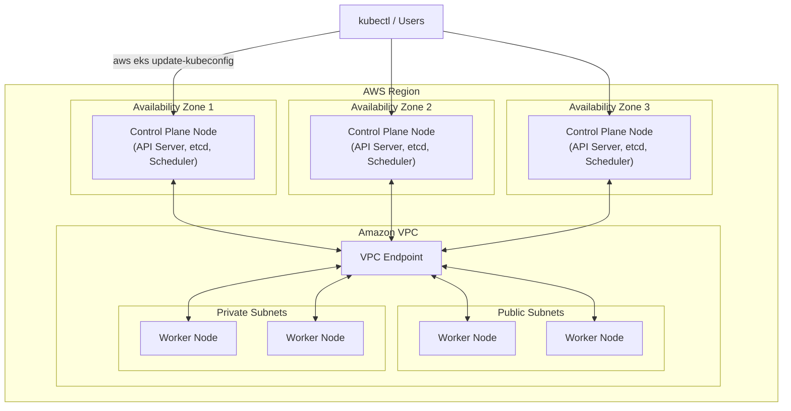
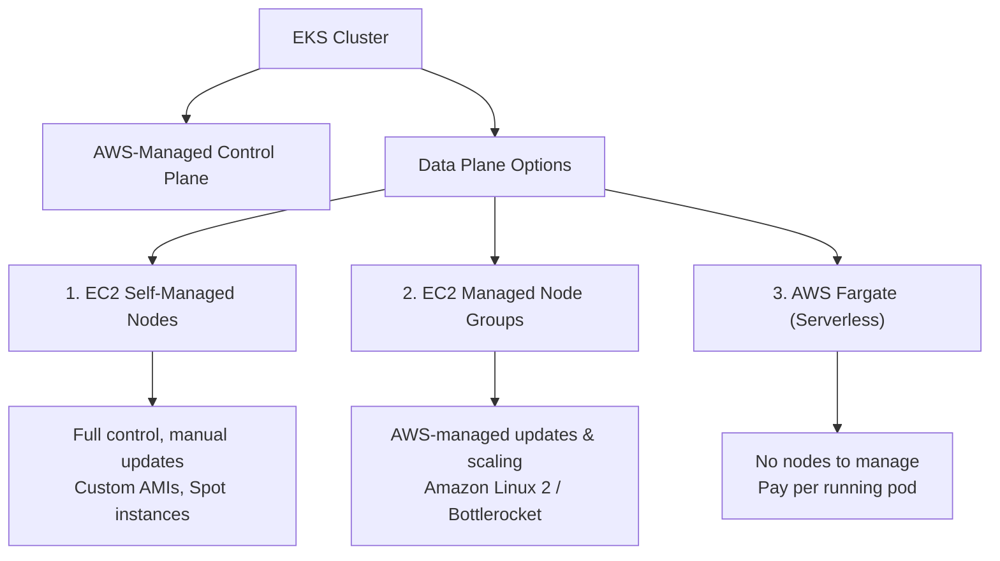

# Introduction to Amazon EKS

> **Amazon Elastic Kubernetes Service (EKS)** is a fully managed Kubernetes service from AWS. It lets you run Kubernetes **without installing, operating, or maintaining your own control plane or nodes**.

---

## Table of Contents

- [What is EKS?](#what-is-eks)
- [Key Features of EKS](#key-features-of-eks)
- [EKS vs Self-Managed Kubernetes](#eks-vs-self-managed-kubernetes)
- [EKS Control Plane Architecture](#eks-control-plane-architecture)
- [EKS Data Plane Options](#eks-data-plane-options)
- [Most Commonly Used AWS Services with EKS](#most-commonly-used-aws-services-with-eks)
- [EKS Cluster Creation Methods](#eks-cluster-creation-methods)
- [Why eksctl is the Preferred Option](#why-eksctl-is-the-preferred-option)
- [eksctl & kubectl](#eksctl--kubectl)
- [Prerequisites to Install eksctl](#prerequisites-to-install-eksctl)

---

## What is EKS?

**Amazon Elastic Kubernetes Service (EKS)** is a fully managed Kubernetes service provided by AWS. It simplifies the deployment, management, and scaling of containerized applications using Kubernetes on AWS infrastructure.

With EKS you get:

- An **AWS-managed Kubernetes control plane** (high availability, patching, upgrades done by AWS).
- Deep integration with AWS services (IAM, VPC, CloudWatch, ELB, etc.).
- Choice of data planes — EC2 managed nodes, self-managed nodes, or **Fargate**.

---

## Key Features of EKS

### 1. Managed Control Plane

- AWS manages the Kubernetes control plane (API server, etcd, scheduler, etc.), ensuring high availability and reliability.
- The control plane is automatically scaled and patched by AWS.

### 2. Integration with AWS Services

- Seamlessly integrates with **IAM**, **VPC**, **CloudWatch**, **Load Balancers**, and **RDS**.
- Enables secure, scalable application architectures.

### 3. High Availability

- The control plane runs across **multiple Availability Zones (AZs)** for fault tolerance.
- Worker nodes can also be distributed across AZs for resilience.

### 4. Security

- Integrates with **AWS IAM** for fine-grained access control.
- Supports **encryption** for data at rest and in transit.
- Provides **network isolation** using VPC and security groups.

### 5. Scalability

- Scales worker nodes automatically using **Cluster Autoscaler** or **AWS Fargate** for serverless workloads.
- Handles thousands of nodes and pods efficiently.

### 6. Cost-Effective

- Pay only for the resources you use (worker nodes, EBS volumes, etc.).
- **No additional charge for the managed control plane** (since October 2020).

### 7. Hybrid and Multi-Cloud Support

- Supports **EKS Anywhere** for running Kubernetes on-premises or in other clouds.
- Consistent tooling and APIs across environments.

---

## EKS vs Self-Managed Kubernetes

| Feature                     | Self-Managed Kubernetes                                                        | Amazon EKS                                                                                  |
|-----------------------------|--------------------------------------------------------------------------------|---------------------------------------------------------------------------------------------|
| **Control Plane Management**| You set up and maintain it (API server, scheduler, controller manager, etc.).  | AWS fully manages it, including scaling, security, and updates.                              |
| **Worker Nodes**            | You provision and manage them (on-premises or cloud VMs).                      | You only manage worker nodes; AWS handles the control plane.                                 |
| **High Availability**       | You configure HA across servers/regions yourself.                              | AWS runs the control plane across multiple AZs automatically.                                |
| **Networking**              | Kubernetes networking set up manually.                                         | Integrates with AWS networking (VPC, ALB, NLB, etc.).                                         |
| **Security & IAM**          | You manage authentication, RBAC, security policies.                            | Integrated with AWS IAM, security groups, and encryption.                                    |
| **Upgrades & Patching**     | Manual Kubernetes version upgrades and patches.                                | Automated upgrades and patches for the control plane.                                        |
| **Monitoring & Logging**    | You configure Prometheus, Grafana, etc.                                        | Integrated with CloudWatch, CloudTrail, and X-Ray.                                           |
| **Autoscaling**             | Configure Cluster Autoscaler manually.                                         | Supports AWS Auto Scaling for nodes and pods.                                                |
| **Integration with AWS**    | Custom configurations required.                                                | Built-in support for ECR, IAM, CloudWatch, RDS, etc.                                         |
| **Pricing**                 | Free, but you pay for the infrastructure you use.                              | You pay for worker nodes (the control plane is now free).                                    |

> Historically EKS charged ~$0.10/hour per cluster; since **October 2020** the control plane is free and you only pay for the worker nodes and other AWS resources you consume.

---

## EKS Control Plane Architecture

Under the hood, AWS **EKS** manages the **Kubernetes control plane** across multiple **Availability Zones (AZs)** to ensure **high availability and fault tolerance**.

EKS runs **three master node copies spanning three AZs**, providing a **99.95% uptime SLA** for the Kubernetes API server.




### Master Node Architecture Highlights

- EKS runs **three copies** of the Kubernetes control plane across **three different AZs**.
- Control plane nodes are **distributed** to prevent a single point of failure.
- If one AZ goes down, the other two continue handling requests.
- AWS handles **scaling, patching, and failure recovery** of the master nodes automatically.
- Users **do not have access** to these control plane nodes.
- The control plane talks to worker nodes through an **Amazon VPC endpoint**, ensuring **low latency and secure communication**.

---

## EKS Data Plane Options

In EKS, the **Control Plane** is managed by AWS, but you choose how your **worker nodes (Data Plane)** run. There are three main options:

1. **Amazon EC2 Self-Managed Node Groups**
2. **Amazon EC2 Managed Node Groups**
3. **AWS Fargate**



### 1. Amazon EC2 Self-Managed Node Groups (Full Control, More Management)

- You manually **provision, configure, and manage** EC2 instances as worker nodes.
- You handle **scaling, updates, and security patches**.
- Best for **custom configurations, special instance types, or Spot instances**.
- Requires a **custom AMI** or the optimized AMI provided by AWS.

> **Use case:** When you need **full control** over node management.

### 2. Amazon EC2 Managed Node Groups (AWS Manages Nodes)

- AWS **automatically provisions and manages** EC2 worker nodes.
- Supports automatic **updates, scaling, and lifecycle management**.
- Uses **Amazon Linux 2 or Bottlerocket** as the default AMI.
- You only select the **instance type and size**.

> **Use case:** When you **want EC2 flexibility** without managing updates manually; easier autoscaling than self-managed nodes.

### 3. AWS Fargate (Serverless, No Nodes to Manage)

- **Fully serverless** — no need to manage EC2 instances.
- AWS automatically provisions and scales **pods**, not nodes.
- **Pay-per-use** — you only pay for running pods.
- No OS patching, scaling, or security updates to worry about.

> **Use cases:**
> - Fully managed, cost-effective approach.
> - Short-lived workloads, bursty applications, and batch jobs.
> - Microservices that don't need direct node management.

### Comparison Chart: EKS Data Plane Options

| Feature                | EC2 Self-Managed Nodes  | EC2 Managed Nodes          | AWS Fargate                             |
|------------------------|-------------------------|----------------------------|-----------------------------------------|
| **Who Manages Nodes?** | You                     | AWS                        | AWS (no nodes, only pods)               |
| **Scaling**            | Manual or custom        | Auto-managed               | Auto-managed                            |
| **OS Updates**         | Manual                  | AWS-managed                | AWS-managed                             |
| **Custom AMI Support** | Yes                     | No (AWS AMI only)          | No (AWS manages runtime)                |
| **Pod Density Control**| Yes                     | Yes                        | No (pods run individually)              |
| **Best For**           | Custom setups, Spot     | Standard workloads, autoscal | Serverless, cost-efficient apps        |
| **Cost**               | High (EC2 + management) | Medium (AWS manages updates) | Low (pay per pod runtime)             |
| **Ideal Workloads**    | High-performance, GPU, ML | Web apps, backend services | Serverless, microservices               |

---

## Most Commonly Used AWS Services with EKS

| **AWS Service**       | **Usage with EKS**                                                                           |
|-----------------------|----------------------------------------------------------------------------------------------|
| **Amazon VPC**        | Networking and security for EKS clusters; pods communicate via VPC CNI.                      |
| **Elastic Load Balancer (ELB)** | Exposes EKS apps to the internet using **ALB, NLB, or CLB**.                        |
| **Amazon EBS**        | Persistent storage for worker nodes; ideal for databases and stateful apps.                   |
| **Amazon EFS**        | Shared file storage for multiple pods; useful for distributed workloads.                      |
| **AWS IAM**           | Authentication and authorization for users, roles, and Kubernetes service accounts.           |
| **Amazon RDS & Aurora**| Managed databases that EKS apps connect to for persistent storage.                            |
| **Amazon S3**         | Logs, backups, and artifacts for applications running in EKS.                                 |
| **AWS CloudWatch**    | Monitors logs, metrics, and alarms; integrates with Fluent Bit for logging.                   |
| **AWS X-Ray**         | Distributed tracing and debugging of microservices in EKS.                                    |
| **AWS Secrets Manager**| Stores secrets (API keys, credentials, DB passwords) securely for use in EKS.                |
| **AWS App Mesh**      | Service mesh for observability, traffic control, and security in EKS.                         |
| **AWS KMS**           | Encrypts secrets, data, and Kubernetes secrets stored in EKS.                                 |

---

## EKS Cluster Creation Methods

| **Method**          | **Infrastructure Control**      | **Best For**                                      |
|---------------------|---------------------------------|---------------------------------------------------|
| **eksctl** (Preferred)| Limited (auto-configured VPC, IAM, networking) | Quick & production-ready clusters |
| **AWS Console**      | Limited                         | Beginners, testing                                |
| **AWS CLI**          | Full control                    | Advanced users, scripting                         |
| **CloudFormation**   | Full control                    | Enterprises, repeatable infra                     |
| **AWS CDK / Terraform** | Full control                | Large-scale production workloads                  |

---

## Why eksctl is the Preferred Option

- **Simplifies Cluster Creation** – Automates the entire EKS cluster setup (VPC, node groups, IAM roles).
- **One command setup**:

  ```sh
  eksctl create cluster --name my-cluster --region us-east-1
  ```

- **YAML support** – Define cluster config in a file for repeatability.
- **Officially recommended** – Built for EKS by Weaveworks.
- **Simplifies Node Group Management** – Easy managed/self-managed nodes.
- **Faster and more efficient** than the Console or manual CloudFormation.

### Common eksctl Commands

| **Command**                                                                                    | **Description**                                                                                       |
|------------------------------------------------------------------------------------------------|-------------------------------------------------------------------------------------------------------|
| `eksctl create cluster`                                                                        | Creates a cluster with a default configuration (one node group, two `m5.large` nodes).                |
| `eksctl create cluster --name <name> --version 1.31 --node-type t3.micro --nodes 2`            | Creates a cluster with K8s version `1.31`, node group with two `t3.micro` nodes.                      |
| `eksctl create cluster --name <name> --fargate`                                                | Creates a cluster with **Fargate** — serverless compute, no worker nodes to manage.                   |

---

## eksctl & kubectl

| **Feature**           | **eksctl**                                                                 | **kubectl**                                                                                          |
|-----------------------|----------------------------------------------------------------------------|------------------------------------------------------------------------------------------------------|
| **Purpose**           | Creates and manages **EKS clusters and node groups**.                      | Manages Kubernetes workloads and resources (pods, deployments, services) on **any** cluster.          |
| **Scope**             | **Amazon EKS only**.                                                        | Works with **all** Kubernetes clusters (EKS, self-managed, other cloud K8s).                         |
| **Functionality**     | Automates EKS setup: VPC, IAM, node groups.                                 | Interacts with the Kubernetes API to deploy, manage, and inspect resources.                          |

---

## Prerequisites to Install eksctl

1. **AWS CLI** – Installed and configured with credentials (`aws configure`).
2. **kubectl** – Required for managing Kubernetes resources after cluster creation.
3. **AWS IAM Permissions** – Permission to create and manage EKS clusters.

---

## Next Steps

Now that you understand EKS fundamentals, continue with [03-eks-cluster-creation.md](03-eks-cluster-creation.md) to set up the tools and create your first cluster.