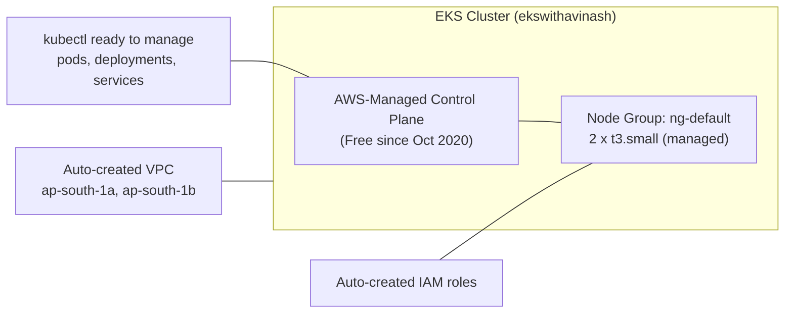
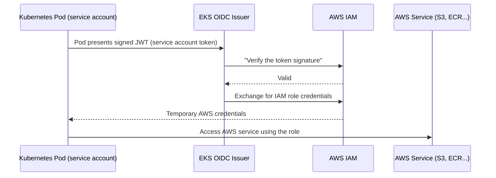

# AWS EKS Setup Guide

> A complete, step-by-step guide to install the required tools and create your first Amazon EKS cluster.

---

## Table of Contents

- [Reference Documentation](#reference-documentation)
- [Installing kubectl](#installing-kubectl)
- [Installing eksctl](#installing-eksctl)
- [Creating an EKS Cluster](#creating-an-eks-cluster)
- [IAM OIDC Provider](#iam-oidc-provider)
- [Managing Clusters](#managing-clusters)
- [Deploying an Application](#deploying-an-application)
- [Working with Nodes](#working-with-nodes)
- [Working with Pods](#working-with-pods)
- [Kubernetes Basic Commands Cheat Sheet](#kubernetes-basic-commands-cheat-sheet)

---

## Reference Documentation

Always refer to the official AWS documentation for the latest updates and detailed steps:
[Amazon EKS Setup Guide](https://docs.aws.amazon.com/eks/latest/userguide/setting-up.html)

---

## Installing kubectl

`kubectl` is the command-line tool used for interacting with Kubernetes clusters. It allows you to deploy applications, inspect and manage cluster resources, and view logs.

### Installing kubectl on Linux (amd64)

Download the `kubectl` binary:

```sh
curl -O https://s3.us-west-2.amazonaws.com/amazon-eks/1.32.0/2024-12-20/bin/linux/amd64/kubectl
```

Make the downloaded file executable:

```sh
chmod +x ./kubectl
```

### Moving kubectl to a Directory in Your PATH

To ensure `kubectl` is accessible from anywhere in the terminal, move it to a directory included in your `PATH`:

```sh
mkdir -p $HOME/bin && cp ./kubectl $HOME/bin/kubectl && export PATH=$HOME/bin:$PATH
```

Persist the changes by adding the updated `PATH` to your `.bashrc`:

```sh
echo 'export PATH=$HOME/bin:$PATH' >> ~/.bashrc
```

Apply the changes and verify:

```sh
source ~/.bashrc
kubectl version
```

---

## Installing eksctl

`eksctl` is a command-line tool for creating and managing Amazon EKS clusters. It simplifies cluster creation and automates many manual steps.

Refer to the official installation guide: [eksctl Installation](https://eksctl.io/installation/)

### Download and Install the Latest Release

Set the architecture for your system (default is `amd64`). If using an ARM-based system, set `ARCH` to `arm64`, `armv6`, or `armv7`:

```sh
ARCH=amd64
PLATFORM=$(uname -s)_$ARCH
```

Download the latest `eksctl` binary:

```sh
curl -sLO "https://github.com/eksctl-io/eksctl/releases/latest/download/eksctl_$PLATFORM.tar.gz"
```

(Optional) Verify the checksum to ensure file integrity:

```sh
curl -sL "https://github.com/eksctl-io/eksctl/releases/latest/download/eksctl_checksums.txt" | grep $PLATFORM | sha256sum --check
```

Extract the binary and move it to `/usr/local/bin` for system-wide access:

```sh
tar -xzf eksctl_$PLATFORM.tar.gz -C /tmp && rm eksctl_$PLATFORM.tar.gz
sudo mv /tmp/eksctl /usr/local/bin
```

Verify the installation:

```sh
eksctl version
```

---

## Creating an EKS Cluster

### Method 1: Using the Command Line

To create an EKS cluster with `eksctl`:

```bash
eksctl create cluster --name=ekswithavinash \
  --version 1.31 \
  --region=ap-south-1 \
  --zones=ap-south-1a,ap-south-1b \
  --nodegroup-name ng-default \
  --node-type t3.small \
  --nodes 2 \
  --managed
```

### Method 2: Using a Config File

Instead of specifying all parameters in the command, create a YAML configuration file (`eksctl-create.yaml`) and use:

```bash
eksctl create cluster --config-file=eksctl-create.yaml
```

### Creating a Node Group Manually

To create a node group manually, use the following command:

```bash
eksctl create nodegroup \
  --cluster ekswithavinash \
  --name managed-ng \
  --node-type t3.small \
  --nodes 2 \
  --nodes-min 1 \
  --nodes-max 3 \
  --node-ami-family AmazonLinux2 \
  --region ap-south-1
```



---

## IAM OIDC Provider

> **What is an IAM OIDC Provider in AWS EKS?**
>
> The **IAM OpenID Connect (OIDC) Provider** allows **AWS Identity and Access Management (IAM)** to authenticate **Kubernetes service accounts** and assign **AWS IAM permissions** to them.
>
> In simple terms, it lets your EKS workloads securely access AWS services **without using static IAM credentials** (e.g., via IRSA — IAM Roles for Service Accounts).



### Step 1: Check if OIDC Provider Exists

```bash
aws eks describe-cluster --name ekswithavinash --region ap-south-1 --query "cluster.identity.oidc.issuer" --output text
```

If an **OIDC URL** is returned, it already exists. If **empty**, you need to create it.

### Step 2: Create IAM OIDC Provider (If Not Exists)

```bash
eksctl utils associate-iam-oidc-provider \
  --region ap-south-1 \
  --cluster ekswithavinash \
  --approve
```

This registers the **OIDC provider** with IAM.

### Step 3: Verify IAM OIDC Provider

```bash
aws iam list-open-id-connect-providers | grep $(aws eks describe-cluster --name ekswithavinash --region ap-south-1 --query "cluster.identity.oidc.issuer" --output text | sed 's|https://||')
```

If it returns an `arn:aws:iam::xxxxx:oidc-provider/`, OIDC is successfully associated.

---

## Managing Clusters

### List all EKS Clusters

```bash
eksctl get cluster
```

### View All Resources in the Cluster

```bash
kubectl get all
```

### Delete an EKS Cluster

```bash
eksctl delete cluster --name=ekswithavinash
```

---

## Deploying an Application

### Apply a Deployment Manifest

Deploy an application using a Kubernetes deployment YAML file:

```bash
kubectl apply -f nginx-deploy.yaml
```

### View All Deployments

```bash
kubectl get deployments
```

### Get Detailed Information About a Deployment

```bash
kubectl describe deployment <deployment-name>
```

---

## Working with Nodes

### List All Nodes in the Cluster

```bash
kubectl get nodes
```

### Describe a Specific Node

```bash
kubectl describe node <node-name>
```

---

## Working with Pods

### List All Pods

```bash
kubectl get pods
```

### List All Pods in All Namespaces

```bash
kubectl get pods --all-namespaces
```

### View Pod Logs

```bash
kubectl logs <pod-name>
```

### Stream Logs from a Running Pod

```bash
kubectl logs -f <pod-name>
```

### Delete a Pod

```bash
kubectl delete pod <pod-name>
```

---

## Kubernetes Basic Commands Cheat Sheet

### Cluster Information

| Command                        | Description                         |
|--------------------------------|-------------------------------------|
| `kubectl cluster-info`         | Displays cluster information.        |
| `kubectl version`              | Shows client and server versions.    |

### Working with Nodes

| Command                          | Description                                           |
|----------------------------------|-------------------------------------------------------|
| `kubectl get nodes`              | Lists all nodes in the cluster.                       |
| `kubectl describe node <node>`   | Displays detailed information about a node.           |
| `kubectl top nodes`              | Displays resource usage of nodes.                     |

### Working with Pods

| Command                                 | Description                                         |
|-----------------------------------------|-----------------------------------------------------|
| `kubectl get pods`                      | Lists all pods in the default namespace.            |
| `kubectl get pods --all-namespaces`     | Lists all pods across all namespaces.                |
| `kubectl describe pod <pod>`            | Displays detailed information about a pod.           |
| `kubectl logs <pod>`                    | Fetches logs from a pod.                             |
| `kubectl logs -f <pod>`                 | Streams logs from a pod.                             |
| `kubectl exec -it <pod> -- <command>`   | Executes a command inside a running pod.             |
| `kubectl exec -it <pod> -- /bin/sh`     | Opens a shell session inside a pod.                  |
| `kubectl delete pod <pod>`              | Deletes a pod.                                       |
| `kubectl top pods`                      | Displays resource usage of pods.                     |
| `kubectl port-forward <pod> <l>:<p>`    | Forwards a local port to a pod.                      |

### Working with Deployments

| Command                                             | Description                                        |
|-----------------------------------------------------|----------------------------------------------------|
| `kubectl get deployments`                           | Lists all deployments.                             |
| `kubectl apply -f <deployment-file.yaml>`           | Creates or updates a deployment from YAML.         |
| `kubectl scale deployment <name> --replicas=<num>`  | Scales a deployment.                               |
| `kubectl delete deployment <name>`                  | Deletes a deployment.                              |

### Managing Resources

| Command                                    | Description                                        |
|--------------------------------------------|----------------------------------------------------|
| `kubectl apply -f <file.yaml>`              | Applies a YAML configuration.                      |
| `kubectl delete -f <file.yaml>`             | Deletes resources defined in a YAML file.         |
| `kubectl edit <resource-type> <resource>`   | Edits a resource directly.                         |

### Working with Services

| Command                              | Description                          |
|--------------------------------------|--------------------------------------|
| `kubectl get services`               | Lists all services.                  |
| `kubectl apply -f <service-file.yaml>`| Creates a service from a YAML file.  |
| `kubectl delete service <name>`      | Deletes a service.                   |

### Debugging & Troubleshooting

| Command                                     | Description                         |
|---------------------------------------------|-------------------------------------|
| `kubectl describe <type> <name>`             | Describes a Kubernetes resource.    |
| `kubectl get events`                         | Displays cluster events.            |
| `kubectl get all`                            | Lists all resources in the cluster. |

### Cleanup

| Command                                    | Description                              |
|--------------------------------------------|------------------------------------------|
| `kubectl delete pods --all -n <ns>`         | Deletes all pods in a namespace.          |
| `kubectl delete all --all -n <ns>`          | Deletes all resources in a namespace.     |

---

## Next Steps

With your cluster running, continue with [04-deploy-pod-and-service.md](04-deploy-pod-and-service.md) to deploy your first pod, ReplicaSet, Deployment, and Service.