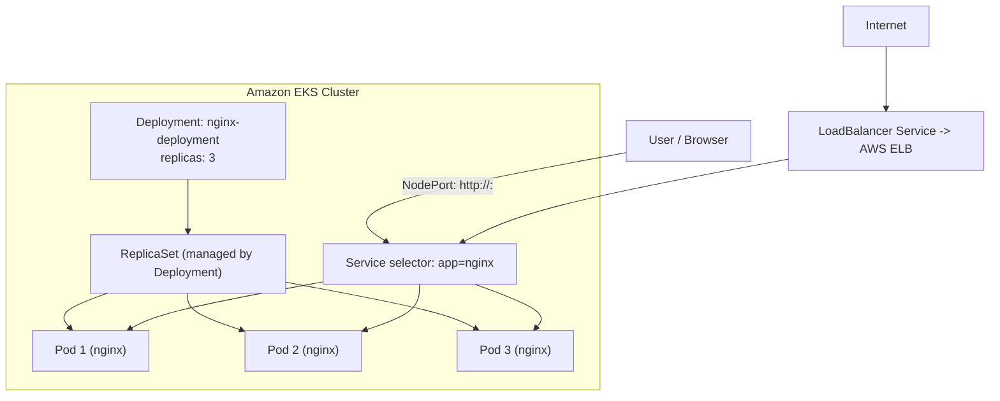
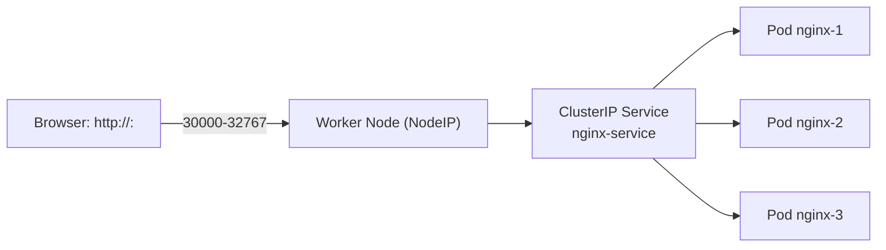
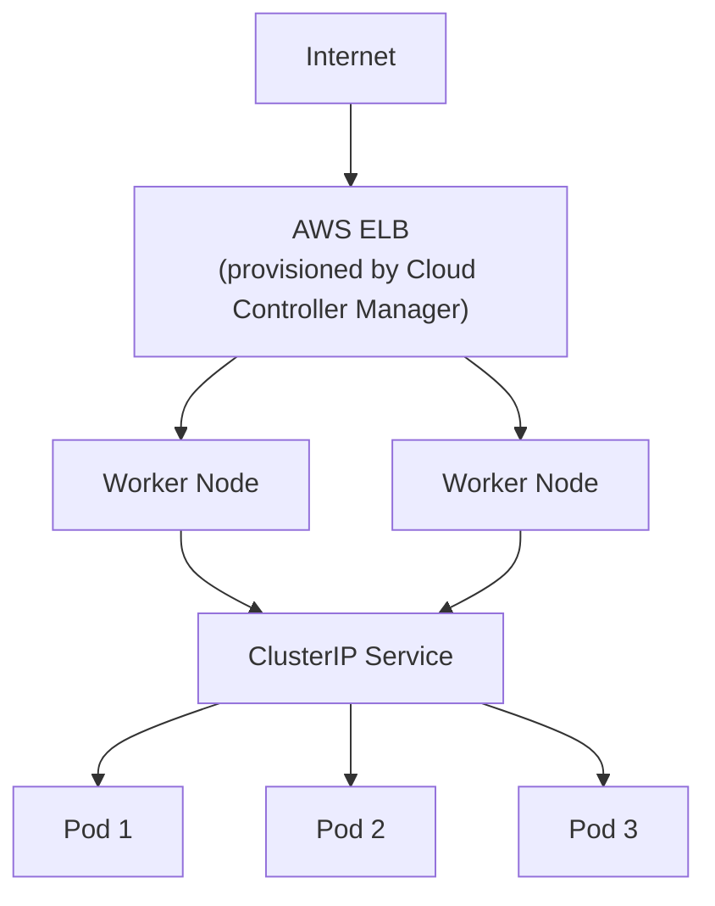

# Deploy Your First Pod and Service

> Hands-on examples for deploying a **Pod**, **ReplicaSet**, **Deployment**, and exposing it with a **Service** on EKS. All resources are Nginx-based so you can verify them in a browser.

---

## Table of Contents

- [Architecture Overview](#architecture-overview)
- [1. Create a Basic Nginx Pod](#1-create-a-basic-nginx-pod)
- [2. Create a ReplicaSet for Nginx](#2-create-a-replicaset-for-nginx)
- [3. Create a Deployment](#3-create-a-deployment)
- [4. Expose the Deployment with a NodePort Service](#4-expose-the-deployment-with-a-nodeport-service)
- [5. Expose the Deployment with a LoadBalancer Service](#5-expose-the-deployment-with-a-loadbalancer-service)

---

## Architecture Overview



---

## 1. Create a Basic Nginx Pod

### `nginx-pod.yaml`

```yaml
apiVersion: v1
kind: Pod
metadata:
  name: nginx-pod
  labels:
    app: nginx
spec:
  containers:
    - name: nginx-container
      image: nginx
      ports:
        - containerPort: 80
```

### Annotated Version

```yaml
# Specifies the API version to use for this Kubernetes resource.
# 'v1' is the core API version that includes basic objects like Pods, Services, ConfigMaps, etc.
apiVersion: v1

# Defines the type of Kubernetes resource being created.
# Here, we are creating a 'Pod'.
kind: Pod

# Metadata section provides identifying information about the Pod.
metadata:
  # Name of the Pod (should be unique within the namespace).
  name: nginx-pod

  # Labels help categorize and select Kubernetes resources.
  # Here, we label the Pod with 'app: nginx' for easier identification.
  labels:
    app: nginx

# Specification section that defines the desired state of the Pod.
spec:
  # The list of containers to run inside the Pod.
  containers:
    - name: nginx-container          # Name of the container (useful for logging and debugging).
      image: nginx                   # The Docker image to use for the container.

      # List of ports that the container exposes.
      ports:
        - containerPort: 80          # Exposes port 80 inside the container (HTTP traffic).
```

### Apply the Pod

```sh
kubectl apply -f nginx-pod.yaml
```

### Verify the Pod

```sh
kubectl get pods
kubectl describe pod nginx-pod
```

---

## 2. Create a ReplicaSet for Nginx

ReplicaSets guarantee N identical pods run at all times, but they don't support rolling updates — use them only for learning or simple scenarios.

### `nginx-replicaset.yaml`

```yaml
apiVersion: apps/v1
kind: ReplicaSet
metadata:
  name: nginx-replicaset
spec:
  replicas: 3
  selector:
    matchLabels:
      app: nginx
  template:
    metadata:
      labels:
        app: nginx
    spec:
      containers:
        - name: nginx-container
          image: nginx
          ports:
            - containerPort: 80
```

### Apply the ReplicaSet

```sh
kubectl apply -f nginx-replicaset.yaml
```

### Verify the ReplicaSet

```sh
kubectl get rs
kubectl get pods
```

---

## 3. Create a Deployment

A **Deployment** is the recommended way to run stateless workloads — it supports rolling updates, rollbacks, and scaling.

### `nginx-deployment.yaml`

```yaml
apiVersion: apps/v1
kind: Deployment
metadata:
  name: nginx-deployment
spec:
  replicas: 3
  selector:
    matchLabels:
      app: nginx
  template:
    metadata:
      labels:
        app: nginx
    spec:
      containers:
        - name: nginx-container
          image: nginx
          ports:
            - containerPort: 80
```

### Apply the Deployment

```sh
kubectl apply -f nginx-deployment.yaml
```

### Verify the Deployment

```sh
kubectl get deployments
kubectl get pods
```

---

## 4. Expose the Deployment with a NodePort Service

A **NodePort** service exposes the app on a static port (`30000`–`32767`) on every node's IP — simple external access without a cloud load balancer.

### `nginx-service.yaml`

```yaml
apiVersion: v1
kind: Service
metadata:
  name: nginx-service
spec:
  selector:
    app: nginx
  ports:
    - protocol: TCP
      port: 80
      targetPort: 80
  type: NodePort
```

### Apply the Service

```sh
kubectl apply -f nginx-service.yaml
```

### Verify the Service

```sh
kubectl get services
kubectl describe service nginx-service
```

### Access the Nginx Service

- Get the **NodePort** assigned to the service:

  ```sh
  kubectl get service nginx-service
  ```

- Find the node IP:

  ```sh
  kubectl get nodes -o wide
  ```

- Open a browser and go to:

  ```
  http://<your-cluster-node-ip>:<node-port>
  ```



---

## 5. Expose the Deployment with a LoadBalancer Service

A **LoadBalancer** service creates an AWS **Elastic Load Balancer (ELB)** and gives you a public endpoint — production-grade external access.

### `nginx-service-elb.yaml`

```yaml
apiVersion: v1
kind: Service
metadata:
  name: nginx-service
spec:
  selector:
    app: nginx
  ports:
    - protocol: TCP
      port: 80
      targetPort: 80
  type: LoadBalancer
```

### Apply the Service

```sh
kubectl apply -f nginx-service.yaml
```

### Verify the Service and Get the ELB Endpoint

```sh
kubectl get services
kubectl describe service nginx-service
```

Wait until the `EXTERNAL-IP` column shows a hostname (e.g., `xxxxxxxxxxx.ap-south-1.elb.amazonaws.com`), then open it in a browser:

```
http://<EXTERNAL-IP>
```



---

## Summary

| Object                      | YAML File                   | Command                  | Purpose                                     |
|-----------------------------|-----------------------------|--------------------------|---------------------------------------------|
| Pod                         | `nginx-pod.yaml`            | `kubectl apply -f`       | Single container instance                   |
| ReplicaSet                  | `nginx-replicaset.yaml`     | `kubectl apply -f`       | Keep N pods running (no updates)            |
| Deployment                  | `nginx-deployment.yaml`     | `kubectl apply -f`       | Managed ReplicaSet + rolling updates        |
| Service (NodePort)          | `nginx-service.yaml`        | `kubectl apply -f`       | Expose app on node port                     |
| Service (LoadBalancer)      | `nginx-service-elb.yaml`    | `kubectl apply -f`       | Expose app via AWS ELB                      |

## Next Steps

Learn how to fine-tune where and how pods run — continue with [05-deployment-controls.md](05-deployment-controls.md).