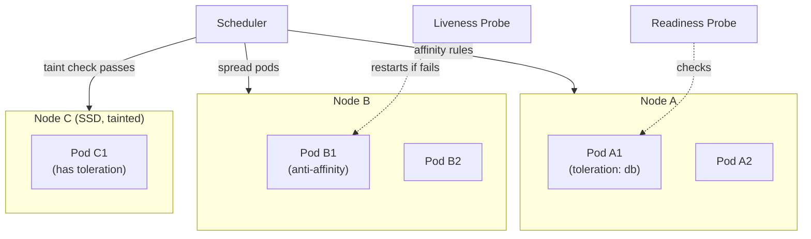
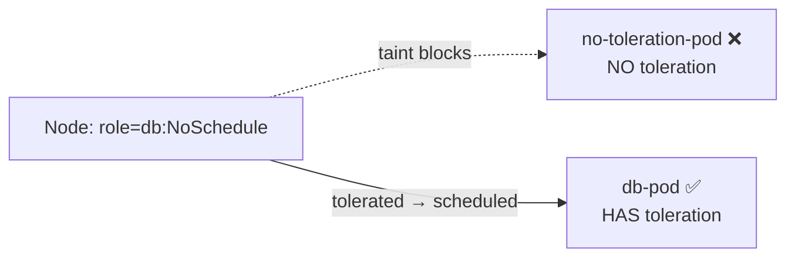
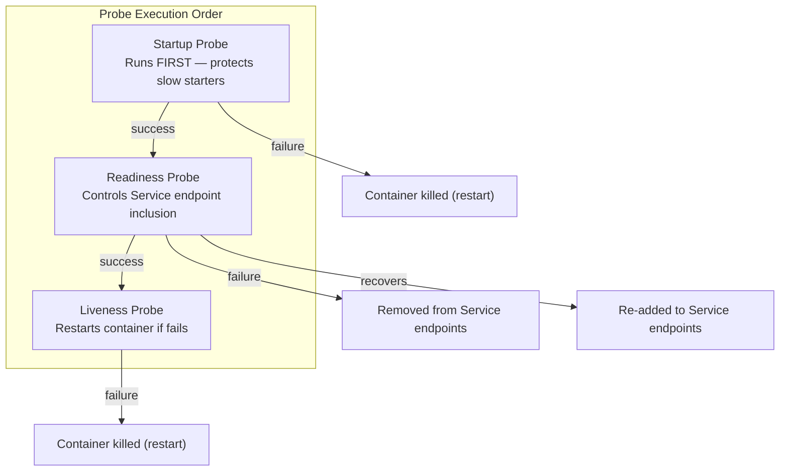

# Kubernetes Advanced Deployment Controls

> A guide to **Taints & Tolerations**, **Affinities**, **Probes**, and other advanced deployment controls in Kubernetes. Each section includes ready-to-deploy YAML manifests for production use.

---

## Table of Contents

- [Architecture Overview](#architecture-overview)
- [1. Affinities (Where Pods Should Run)](#1-affinities-where-pods-should-run)
- [2. Taints & Tolerations](#2-taints--tolerations)
- [3. Probes (Health Checks)](#3-probes-health-checks)
- [4. Deployment Timing Options](#4-deployment-timing-options)
- [5. Pod Disruption Budgets (PDB)](#5-pod-disruption-budgets-pdb)
- [6. PriorityClasses](#6-priorityclasses)
- [Summary](#summary)

---

## Architecture Overview



---

## 1. Affinities (Where Pods Should Run)

Affinities control **where** pods are scheduled in the cluster.

| Type              | Analogy                                          | Effect                                                  |
|-------------------|--------------------------------------------------|---------------------------------------------------------|
| **Node Affinity**    | "I prefer a computer with SSD storage."          | Pods only on nodes matching a label expression.         |
| **Pod Affinity**     | "I want to sit close to my friend."              | Pods scheduled near each other (co-location).           |
| **Pod Anti-Affinity**| "I don't want to sit next to my friend."         | Pods spread across different nodes (availability).      |

### Node Affinity Example — Deploy on SSD Nodes Only

```yaml
apiVersion: apps/v1
kind: Deployment
metadata:
  name: ssd-app
spec:
  replicas: 2
  selector:
    matchLabels:
      app: ssd-app
  template:
    metadata:
      labels:
        app: ssd-app
    spec:
      affinity:
        nodeAffinity:
          requiredDuringSchedulingIgnoredDuringExecution:
            nodeSelectorTerms:
              - matchExpressions:
                  - key: disktype
                    operator: In
                    values:
                      - ssd
      tolerations:
        - key: role
          operator: Equal
          value: db
          effect: NoSchedule
      containers:
        - name: nginx
          image: nginx:1.25
          ports:
            - containerPort: 80
```

**Add a label to a node:**

```sh
kubectl label nodes ip-192-168-60-251.ap-south-1.compute.internal disktype=ssd
```

### Pod Anti-Affinity Example — Spread Pods Across Nodes

Pods with the label `app=web` will be scheduled on **different nodes**, maximizing availability.

```yaml
apiVersion: apps/v1
kind: Deployment
metadata:
  name: web-app
spec:
  replicas: 2
  selector:
    matchLabels:
      app: web
  template:
    metadata:
      labels:
        app: web
    spec:
      affinity:
        podAntiAffinity:
          preferredDuringSchedulingIgnoredDuringExecution:
            - weight: 100
              podAffinityTerm:
                labelSelector:
                  matchExpressions:
                    - key: app
                      operator: In
                      values:
                        - web
                topologyKey: "kubernetes.io/hostname"
      tolerations:
        - key: role
          operator: Equal
          value: db
          effect: NoSchedule
      containers:
        - name: web
          image: httpd:2.4
          ports:
            - containerPort: 80
```

---

## 2. Taints & Tolerations

> **Taint (Node):** Like a bus seat marked "Reserved".
> **Toleration (Pod):** The special pass that lets you sit there.
> Without the pass, you cannot sit on the reserved seat.

| Taint Effect       | Meaning                                                              |
|--------------------|----------------------------------------------------------------------|
| `NoSchedule`       | New pods won't be scheduled here unless they tolerate this taint.     |
| `PreferNoSchedule` | Kubernetes will try to avoid scheduling here, but may still do it.    |
| `NoExecute`        | Existing pods on the node are **evicted** unless they tolerate it.    |

**Real-world use cases:**
- Dedicated nodes for databases, GPU workloads, or specific applications.
- Isolating workloads by team, environment, or resource requirements.
- Preventing general workloads from consuming specialized hardware.

### Step 1: Taint a Node

```sh
kubectl taint nodes <node1-name> role=db:NoSchedule
```

### Step 2: Deploy a Pod WITH Toleration (Runs on the tainted node)

```yaml
apiVersion: v1
kind: Pod
metadata:
  name: db-pod
spec:
  nodeSelector:
    disktype: ssd
  tolerations:
    - key: "role"
      operator: "Equal"
      value: "db"
      effect: "NoSchedule"
  containers:
    - name: mysql
      image: mysql:8.0
      env:
        - name: MYSQL_ROOT_PASSWORD
          value: example
      ports:
        - containerPort: 3306
```

This pod will only be scheduled on nodes tainted with `role=db:NoSchedule`. The toleration allows it to "sit on the reserved seat."

### Step 3: Deploy a Pod WITHOUT Toleration (Pending — blocked by taint)

```yaml
apiVersion: v1
kind: Pod
metadata:
  name: no-toleration-pod
spec:
  nodeSelector:
    disktype: ssd
  containers:
    - name: nginx
      image: nginx:1.25
```

This pod will remain **Pending** because it cannot tolerate the taint.



---

## 3. Probes (Health Checks)

> **Liveness Probe:** "Are you alive? If not, restart."
> **Readiness Probe:** "Are you ready to serve customers? If not, don't send traffic."
> **Startup Probe:** "Need extra wake-up time? I'll wait."

| Probe Type    | Runs After  | Fails → Action                                 |
|---------------|-------------|------------------------------------------------|
| **Startup**   | Always first| Container killed and restarted.                 |
| **Readiness** | Startup OK  | Removed from Service endpoints (no traffic).    |
| **Liveness**  | Ready       | Container killed and restarted.                 |

### Deployment with All Three Probes

```yaml
apiVersion: apps/v1
kind: Deployment
metadata:
  name: healthcheck-app
spec:
  replicas: 2
  selector:
    matchLabels:
      app: healthcheck
  template:
    metadata:
      labels:
        app: healthcheck
    spec:
      containers:
        - name: app
          image: nginx:1.25
          ports:
            - containerPort: 80

          startupProbe:
            httpGet:
              path: /
              port: 80
            initialDelaySeconds: 10
            periodSeconds: 5
            failureThreshold: 6
            timeoutSeconds: 3

          readinessProbe:
            httpGet:
              path: /
              port: 80
            initialDelaySeconds: 5
            periodSeconds: 10
            failureThreshold: 3
            successThreshold: 1
            timeoutSeconds: 5

          livenessProbe:
            httpGet:
              path: /
              port: 80
            initialDelaySeconds: 15
            periodSeconds: 20
            failureThreshold: 3
            timeoutSeconds: 5

          resources:
            requests:
              memory: "64Mi"
              cpu: "50m"
            limits:
              memory: "128Mi"
              cpu: "100m"
---
apiVersion: v1
kind: Service
metadata:
  name: healthcheck-service
spec:
  selector:
    app: healthcheck
  ports:
    - port: 80
      targetPort: 80
  type: ClusterIP
```



---

## 4. Deployment Timing Options

| Parameter                   | Purpose                                                                    |
|-----------------------------|----------------------------------------------------------------------------|
| `minReadySeconds`              | Delay before a pod is considered available after becoming ready.            |
| `progressDeadlineSeconds`      | Max time for a rollout to complete before it is considered failed.          |
| `terminationGracePeriodSeconds`| Time for a pod to shut down gracefully before being killed.                 |

### Example: Deployment with Timing Controls

```yaml
apiVersion: apps/v1
kind: Deployment
metadata:
  name: timing-app
spec:
  replicas: 2
  minReadySeconds: 10
  progressDeadlineSeconds: 600
  selector:
    matchLabels:
      app: timing
  template:
    metadata:
      labels:
        app: timing
    spec:
      terminationGracePeriodSeconds: 30
      containers:
        - name: app
          image: busybox
          command: ["sh", "-c", "sleep 3600"]
```

Pods are only marked available after **10 seconds**, rollouts fail after **10 minutes**, and pods have **30 seconds** to shut down gracefully.

---

## 5. Pod Disruption Budgets (PDB)

> **Purpose:** Ensures a minimum number of pods stay running during **voluntary disruptions** (e.g., node drain, cluster upgrades).

| Disruption Type  | Examples                                    | PDB Applies? |
|------------------|---------------------------------------------|--------------|
| **Voluntary**    | Node drain, cluster upgrade, scaling down    | Yes          |
| **Involuntary**  | Node crash, hardware failure, kernel panic   | No           |

### Deployment + PDB YAML

```yaml
apiVersion: apps/v1
kind: Deployment
metadata:
  name: web-app
  labels:
    app: web-app
spec:
  replicas: 5
  selector:
    matchLabels:
      app: web-app
  template:
    metadata:
      labels:
        app: web-app
    spec:
      containers:
        - name: nginx
          image: nginx:1.25
          ports:
            - containerPort: 80
          resources:
            requests:
              cpu: 100m
              memory: 128Mi
---
apiVersion: policy/v1
kind: PodDisruptionBudget
metadata:
  name: web-app-pdb
spec:
  selector:
    matchLabels:
      app: web-app
  minAvailable: 3   # Always keep at least 3 pods running
---
apiVersion: v1
kind: Service
metadata:
  name: web-app-service
spec:
  selector:
    app: web-app
  ports:
    - port: 80
      targetPort: 80
  type: ClusterIP
```

**How it works:**

With 5 replicas and `minAvailable: 3`, Kubernetes only allows **2 pods to be disrupted at once**.

| Scenario                           | Result                                           |
|------------------------------------|--------------------------------------------------|
| `kubectl drain <node>`             | Only 2 pods evicted; 3 remain available.         |
| `kubectl delete pod <pod>`         | Bypasses PDB (direct deletion).                  |
| `kubectl get pdb web-app-pdb`      | Shows: `ALLOWED DISRUPTIONS` and current status.  |

---

## 6. PriorityClasses

> **Purpose:** Assigns importance to pods so critical workloads are scheduled first. High-priority pods can **evict lower-priority pods** when resources are scarce.

### PriorityClass Definition

```yaml
apiVersion: scheduling.k8s.io/v1
kind: PriorityClass
metadata:
  name: high-priority
value: 1000000
globalDefault: false
description: "This priority class is for critical workloads"
```

### Usage in a Pod

```yaml
apiVersion: v1
kind: Pod
metadata:
  name: critical-app
spec:
  priorityClassName: high-priority
  containers:
    - name: app
      image: busybox
      command: ["sh", "-c", "sleep 3600"]
```

Pods with `priorityClassName: high-priority` will be scheduled **before** lower-priority pods and will only be evicted if a **higher-priority** pod needs the resources.

---

## Summary

| Control                    | Purpose                                                    | Production Value |
|----------------------------|------------------------------------------------------------|------------------|
| **Node Affinity**          | Schedule pods on nodes with specific labels.               | High             |
| **Pod Anti-Affinity**      | Spread pods across nodes for high availability.            | High             |
| **Taints & Tolerations**   | Reserve nodes for specific workloads (GPU, DB, etc.).      | High             |
| **Liveness Probe**         | Restart containers that are deadlocked or unresponsive.    | Critical         |
| **Readiness Probe**        | Stop sending traffic to not-ready pods.                    | Critical         |
| **Startup Probe**          | Protect slow-starting containers from premature restarts.  | Medium           |
| **PDB**                    | Guarantee minimum availability during voluntary drain.     | High             |
| **PriorityClass**          | Ensure critical pods get scheduled before others.          | High             |

---

## Next Steps

Learn about isolating workloads and managing resource quotas — continue with [06-namespaces-and-resource-quotas.md](06-namespaces-and-resource-quotas.md).