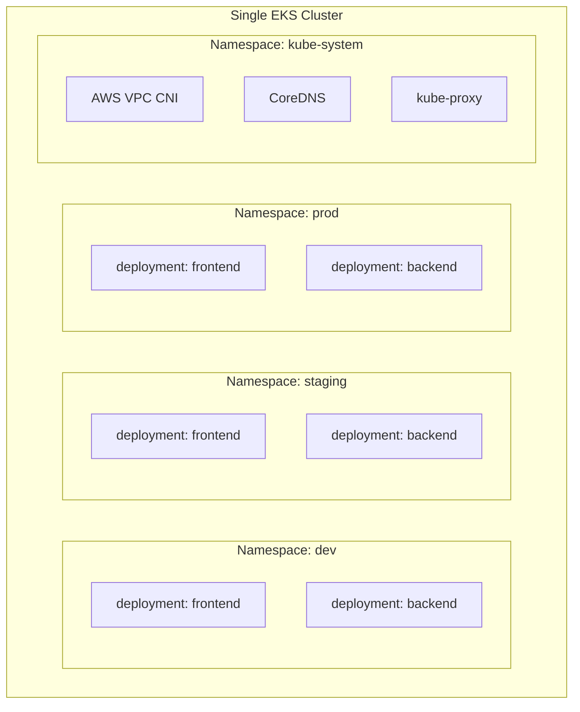
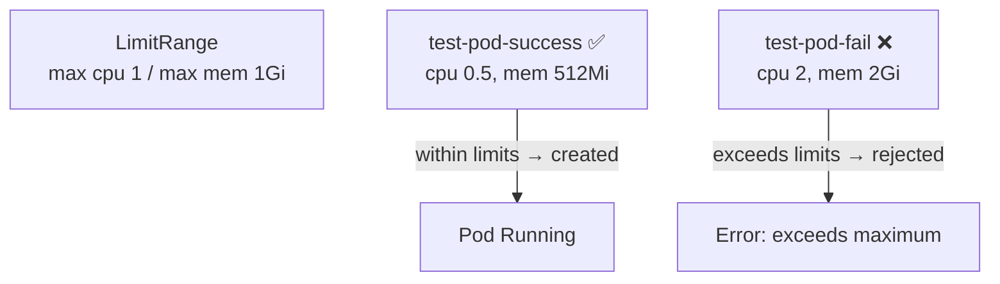

# Namespaces in Kubernetes

> A **namespace** is a **logical isolation mechanism** that groups resources within a cluster. It's essential for organizing and managing workloads in multi-team or multi-environment setups.

---

## Table of Contents

- [What is a Namespace?](#what-is-a-namespace)
- [How is a Namespace Useful?](#how-is-a-namespace-useful)
- [Challenges Solved by Namespaces](#challenges-solved-by-namespaces)
- [Default Namespaces in EKS](#default-namespaces-in-eks)
- [Demo: Namespace + Deployment + Service](#demo-namespace--deployment--service)
- [Testing Resource Quotas with LimitRange](#testing-resource-quotas-with-limitrange)

---

## What is a Namespace?

A namespace divides the cluster into **isolated environments** where resources (Deployments, Pods, Services, etc.) have **unique names** within that namespace. The same name can be reused in different namespaces without conflict.



Notice how `frontend` and `backend` can be duplicated across `dev`, `staging`, and `prod` — **namespaces keep them isolated**.

---

## How is a Namespace Useful?

- **Multi-Tenancy** – Different teams work in isolated environments within the same cluster.
- **Resource Quotas** – CPU/memory limits can be set per namespace.
- **Security & Access Control** – RBAC restricts access to specific namespaces.
- **Environment Separation** – Staging, development, and production share one cluster safely.

---

## Challenges Solved by Namespaces

1. **Avoids Resource Conflicts**
   - Multiple applications run on the same cluster without naming conflicts.
   - Two teams can both use a `frontend` deployment name — one in `team-a`, one in `team-b`.

2. **Better Organization**
   - Large clusters with hundreds of services are grouped logically (`dev`, `staging`, `prod`).

3. **Fine-Grained Access Control**
   - RBAC lets developers access **only their namespace** instead of the whole cluster.

4. **Simplifies Resource Management**
   - Per-namespace quotas prevent a single team from consuming all cluster resources.

---

## Default Namespaces in EKS

When you create an EKS cluster, it comes with these default namespaces:

| Namespace        | Purpose                                                                                 |
|------------------|-----------------------------------------------------------------------------------------|
| **default**      | Default namespace for resources when none is specified.                                 |
| **kube-system**  | Kubernetes system components (CoreDNS, kube-proxy, AWS VPC CNI). Don't modify these.    |
| **kube-public**  | Publicly readable namespace, used for cluster-wide info (e.g., discovery).               |
| **kube-node-lease** | Manages node heartbeats to track node availability efficiently.                       |
| **aws-observability** (EKS) | Stores AWS Observability components (e.g., Fluent Bit for logging). Only in EKS.   |

---

## Demo: Namespace + Deployment + Service

A sample YAML that creates a namespace and deploys an nginx application inside it.

```yaml
apiVersion: v1
kind: Namespace
metadata:
  name: dev-namespace
---
apiVersion: apps/v1
kind: Deployment
metadata:
  name: nginx-deployment
  namespace: dev-namespace
spec:
  replicas: 2
  selector:
    matchLabels:
      app: nginx
  template:
    metadata:
      labels:
        app: nginx
    spec:
      containers:
        - name: nginx
          image: nginx:latest
          ports:
            - containerPort: 80
---
apiVersion: v1
kind: Service
metadata:
  name: nginx-service
  namespace: dev-namespace
spec:
  selector:
    app: nginx
  ports:
    - protocol: TCP
      port: 80
      targetPort: 80
  type: ClusterIP
```

### Apply & Verify

```sh
# Apply the namespace, deployment, and service
kubectl apply -f namespace-deployment.yaml

# Check created namespaces
kubectl get namespaces

# List resources inside the namespace
kubectl get deployments,pods,services -n dev-namespace

# Delete the namespace (cleanup)
kubectl delete namespace dev-namespace
```

---

## Testing Resource Quotas with LimitRange

> **LimitRange** enforces resource constraints **at the namespace level**. It provides defaults for CPU/memory requests and limits, and rejects pods that exceed the maximum.

### Step 1: Create a LimitRange for `dev-namespace`

```yaml
apiVersion: v1
kind: LimitRange
metadata:
  name: dev-namespace-limits
  namespace: dev-namespace
spec:
  limits:
    - default:
        cpu: "1"          # Max CPU a container can use
        memory: "1Gi"     # Max memory a container can use
      defaultRequest:
        cpu: "0.5"        # Default requested CPU
        memory: "512Mi"   # Default requested memory
      type: Container
```

```sh
kubectl apply -f limitrange.yaml
kubectl get limitrange -n dev-namespace
kubectl describe limitrange dev-namespace-limits -n dev-namespace
```

### Step 2: Create a Pod (Success Scenario)

```yaml
apiVersion: v1
kind: Pod
metadata:
  name: test-pod-success
  namespace: dev-namespace
spec:
  containers:
    - name: nginx
      image: nginx
      resources:
        requests:
          cpu: "0.5"      # Within the allowed limit
          memory: "512Mi" # Within the allowed limit
        limits:
          cpu: "1"        # Allowed max CPU
          memory: "1Gi"   # Allowed max memory
```

```sh
kubectl apply -f test-pod-success.yaml
kubectl get pod -n dev-namespace
kubectl describe pod test-pod-success -n dev-namespace
```

**Expected:** Pod runs successfully — requests/limits are within the LimitRange.

### Step 3: Create a Pod (Fail Scenario)

```yaml
apiVersion: v1
kind: Pod
metadata:
  name: test-pod-fail
  namespace: dev-namespace
spec:
  containers:
    - name: nginx
      image: nginx
      resources:
        requests:
          cpu: "2"       # Exceeds the allowed limit (1)
          memory: "2Gi"  # Exceeds the allowed limit (1Gi)
        limits:
          cpu: "3"       # Exceeds the allowed limit (1)
          memory: "2Gi"  # Exceeds the allowed limit (1Gi)
```

```sh
kubectl apply -f test-pod-fail.yaml
kubectl get pod -n dev-namespace
kubectl describe pod test-pod-fail -n dev-namespace
```

**Expected:** Pod is **rejected** — the LimitRange blocks creation because the resource values exceed the namespace maximum.



---

## Summary

| Concept      | Scope          | Purpose                                  |
|--------------|----------------|------------------------------------------|
| Namespace    | Cluster-wide   | Logical isolation of workloads/teams.    |
| LimitRange   | Namespace      | Default and max resource values.         |
| ResourceQuota | Namespace     | Total resource capacity per namespace.   |
| RBAC         | Cloud / Cluster| Locks down who can access each namespace. |

## Next Steps

Explore higher-level workloads that manage groups of pods — continue with [07-statefulset-daemonset-configmap-secret.md](07-statefulset-daemonset-configmap-secret.md).