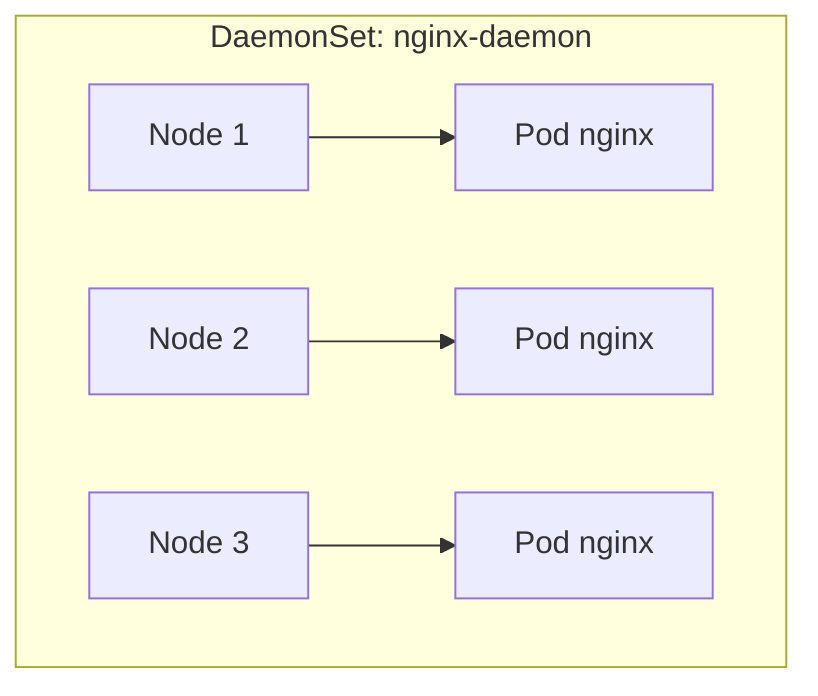
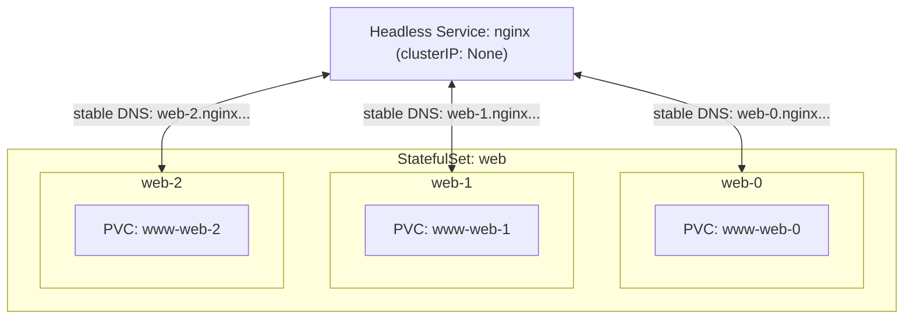
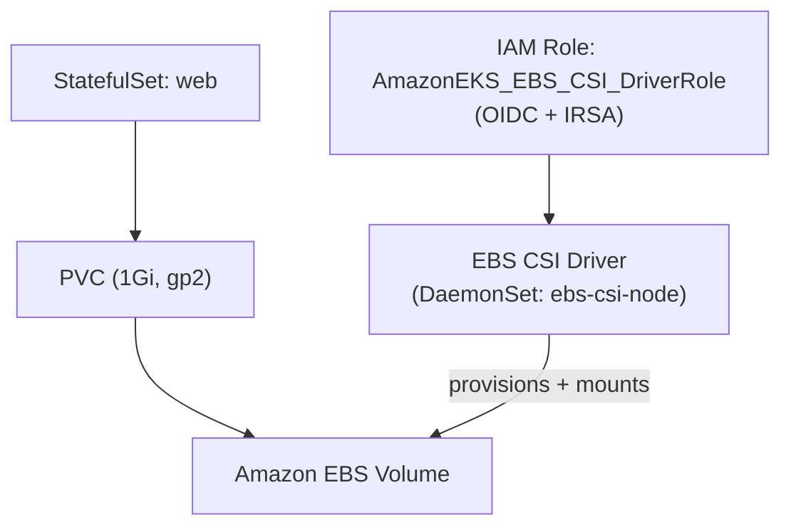
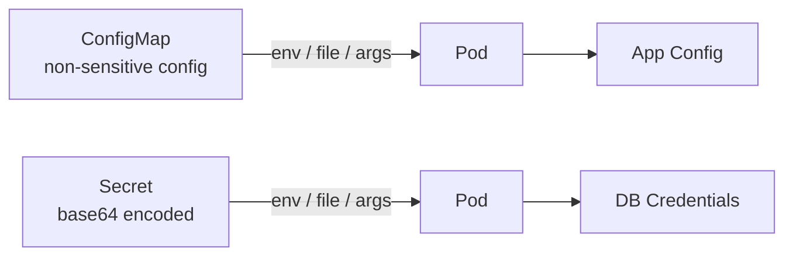

# DaemonSet, StatefulSet, ConfigMap & Secrets

> Learn the higher-level Kubernetes controllers and configuration objects you'll need for real workloads: **DaemonSets**, **StatefulSets**, **ConfigMaps**, and **Secrets**.

---

## Table of Contents

- [DaemonSet](#daemonset)
- [StatefulSet](#statefulset)
- [How to Enable Amazon EBS CSI Driver on EKS](#how-to-enable-amazon-ebs-csi-driver-on-eks)
- [ConfigMap](#configmap)
- [Secrets](#secrets)

---

## DaemonSet

### What is a DaemonSet?

A **DaemonSet** ensures that a **specific Pod runs on every (or selected) node** in your Kubernetes cluster. It's ideal for running **background services** that should exist on **each node**:

- Log collectors (Fluent Bit, Filebeat)
- Monitoring agents (Prometheus Node Exporter)
- Network plugins (Calico, Cilium, AWS VPC CNI)
- Security agents (Falco)

### Key Characteristics

- One Pod per node (unless node selectors/affinity are applied)
- Automatically runs on **newly added nodes**
- Deletes Pods when nodes are removed
- Often used for **infra-level workloads**



### Sample: DaemonSet with NGINX

This example runs an NGINX container on **every node** in the cluster:

```yaml
apiVersion: apps/v1
kind: DaemonSet
metadata:
  name: nginx-daemon
  namespace: default
spec:
  selector:
    matchLabels:
      app: nginx-daemon
  template:
    metadata:
      labels:
        app: nginx-daemon
    spec:
      containers:
        - name: nginx
          image: nginx:latest
          ports:
            - containerPort: 80
```

### How to Deploy

```bash
kubectl apply -f nginx-daemonset.yaml
kubectl get daemonsets
kubectl get pods -o wide     # Observe 1 pod per node
```

### Use nodeSelector to Limit to Specific Nodes

```yaml
spec:
  template:
    spec:
      nodeSelector:
        dedicated: monitoring
```

Make sure your target nodes are labeled accordingly:

```bash
kubectl label node <node-name> dedicated=monitoring
```

---

## StatefulSet

### What is a StatefulSet?

A **StatefulSet** is a Kubernetes controller for **stateful applications**. It ensures Pods have:

- A **persistent identity** (name, network)
- **Stable, unique storage**
- **Ordered** creation and termination

Unlike Deployments (stateless replicas), StatefulSets are designed for apps that **maintain state across Pod restarts**, like databases and clustered systems.

### Key Features

| Feature                | Description                                             |
|------------------------|---------------------------------------------------------|
| **Stable Pod names**   | Predictable names like `web-0`, `web-1`                 |
| **Ordered deployment** | Pods start one by one, in order                         |
| **Persistent volumes** | Each Pod gets its own PersistentVolumeClaim            |
| **Stable DNS**         | DNS names like `web-0.nginx.default.svc.cluster.local`  |

### Use Cases

- Databases (MySQL, PostgreSQL, Cassandra)
- Message queues (Kafka, RabbitMQ)
- Storage systems (ElasticSearch, HDFS)
- Any clustered app that requires **identity + persistence**

### Headless Service (Required)

A **Headless Service** has no ClusterIP (`.spec.clusterIP: None`). It doesn't load-balance traffic; instead it exposes each Pod directly, which is required to give every Pod a **stable DNS** name.

```yaml
apiVersion: v1
kind: Service
metadata:
  name: nginx
spec:
  clusterIP: None   # Important!
  selector:
    app: nginx
  ports:
    - port: 80
      targetPort: 80
```

### Sample StatefulSet YAML

```yaml
apiVersion: apps/v1
kind: StatefulSet
metadata:
  name: web
spec:
  serviceName: "nginx"   # Must match the headless service
  replicas: 2
  selector:
    matchLabels:
      app: nginx
  template:
    metadata:
      labels:
        app: nginx
    spec:
      containers:
        - name: nginx
          image: nginx
          ports:
            - containerPort: 80
          volumeMounts:
            - name: www
              mountPath: /usr/share/nginx/html
  volumeClaimTemplates:
    - metadata:
        name: www
      spec:
        accessModes: ["ReadWriteOnce"]
        storageClassName: gp2  # Make sure gp2 exists in your EKS
        resources:
          requests:
            storage: 1Gi
```



### Deploy It

```bash
kubectl apply -f nginx-headless-service.yaml
kubectl apply -f nginx-statefulset.yaml
kubectl get pods -o wide
```

You'll see ordered pod names:

```
web-0
web-1
web-2
```

### Verify Volume Stability

Even if a Pod is deleted (e.g., `web-1`), it will be re-created **with the same volume** and hostname.

---

## How to Enable Amazon EBS CSI Driver on EKS

EBS-backed volumes power StatefulSets and PVCs on EKS. This enables the **Amazon EBS CSI Driver** add-on.

### Step 1: Connect kubectl to Your EKS Cluster

```bash
aws eks update-kubeconfig --region ap-south-1 --name ekswithavinash
```

### Step 2: Associate IAM OIDC Provider (One-time setup)

```bash
cluster_name=ekswithavinash
eksctl utils associate-iam-oidc-provider --cluster $cluster_name --approve
```

### Step 3: Create IAM Role for EBS CSI Driver

Creates the role (without binding it to the service account yet) and attaches `AmazonEBSCSIDriverPolicy`.

```bash
eksctl create iamserviceaccount \
  --name ebs-csi-controller-sa \
  --namespace kube-system \
  --cluster ekswithavinash \
  --attach-policy-arn arn:aws:iam::aws:policy/service-role/AmazonEBSCSIDriverPolicy \
  --approve \
  --role-only \
  --role-name AmazonEKS_EBS_CSI_DriverRole
```

### Step 4: Export Role ARN

```bash
export SERVICE_ACCOUNT_ROLE_ARN=arn:aws:iam::501170964283:role/AmazonEKS_EBS_CSI_DriverRole
```

Ensure the ARN matches the role you created.

### Step 5: Install the EBS CSI Driver Add-on

Deploys the driver as a managed add-on, associated with your custom IAM role.

```bash
eksctl create addon \
  --name aws-ebs-csi-driver \
  --cluster ekswithavinash \
  --service-account-role-arn $SERVICE_ACCOUNT_ROLE_ARN \
  --force
```

### Final Validation

```bash
kubectl get daemonset ebs-csi-node -n kube-system
kubectl get pods -n kube-system
```

You should see the `ebs-csi-node` **DaemonSet** running on each node.



---

## ConfigMap

### What is a ConfigMap?

A **ConfigMap** stores **non-sensitive configuration data** in key-value format, **outside of your container image**.

You can inject this data into Pods as:

- Environment variables
- Command-line arguments
- Mounted files

### Why Use ConfigMap?

- Keep images **generic** and configuration **external**.
- Change config without rebuilding the container.
- Share common config across multiple Pods.

### Step-by-Step: Basic Example

**Step 1 — Create a ConfigMap:**

```bash
kubectl create configmap my-config --from-literal=GREETING="Hello from ConfigMap"
```

This creates a ConfigMap named `my-config` with:

```
GREETING=Hello from ConfigMap
```

**Step 2 — Run a Pod that uses it (`configmap-simple-pod.yaml`):**

```yaml
apiVersion: v1
kind: Pod
metadata:
  name: configmap-demo
spec:
  containers:
    - name: demo
      image: busybox
      command: ["sh", "-c", "echo $GREETING && sleep 3600"]
      env:
        - name: GREETING
          valueFrom:
            configMapKeyRef:
              name: my-config
              key: GREETING
```

```bash
kubectl apply -f configmap-simple-pod.yaml
```

**Step 3 — Check the output:**

```bash
kubectl logs configmap-demo
```

Expected output:

```
Hello from ConfigMap
```

---

## Secrets

### What are Secrets?

A **Secret** is a ConfigMap for **sensitive data** — passwords, tokens, and SSH keys. Values are stored **Base64-encoded** and are safer than hardcoding secrets into Pod specs.

**Step 1 — Create a Secret (`my-secret.yaml`):**

```yaml
apiVersion: v1
kind: Secret
metadata:
  name: my-secret
type: Opaque
stringData:
  DB_PASSWORD: mydummysecret
```

This creates a Secret named `my-secret` with:

```
DB_PASSWORD = mydummysecret
```

**Step 2 — Create a Pod that uses the Secret (`secret-simple-pod.yaml`):**

```yaml
apiVersion: v1
kind: Pod
metadata:
  name: secret-demo
spec:
  containers:
    - name: demo
      image: busybox
      command: ["sh", "-c", "echo $DB_PASSWORD && sleep 3600"]
      env:
        - name: DB_PASSWORD
          valueFrom:
            secretKeyRef:
              name: my-secret
              key: DB_PASSWORD
```

```bash
kubectl apply -f secret-simple-pod.yaml
```

**Step 3 — Check the output:**

```bash
kubectl logs secret-demo
```

Expected output:

```
mydummysecret
```



---

## Summary

| Object        | Perspective Type | Use Case                                 | Storage          |
|---------------|------------------|------------------------------------------|------------------|
| **DaemonSet** | Controller       | Run one Pod on every node.               | Stateless        |
| **StatefulSet**| Controller      | Stable identity + storage for stateful apps. | Persistent (EBS) |
| **ConfigMap** | Configuration    | Non-sensitive config (env, files).       | In-cluster       |
| **Secret**    | Configuration    | Sensitive data (passwords, tokens).      | In-cluster (base64) |

## Next Steps

Expose your applications to the internet with routing rules — continue with [08-services-and-ingress.md](08-services-and-ingress.md).