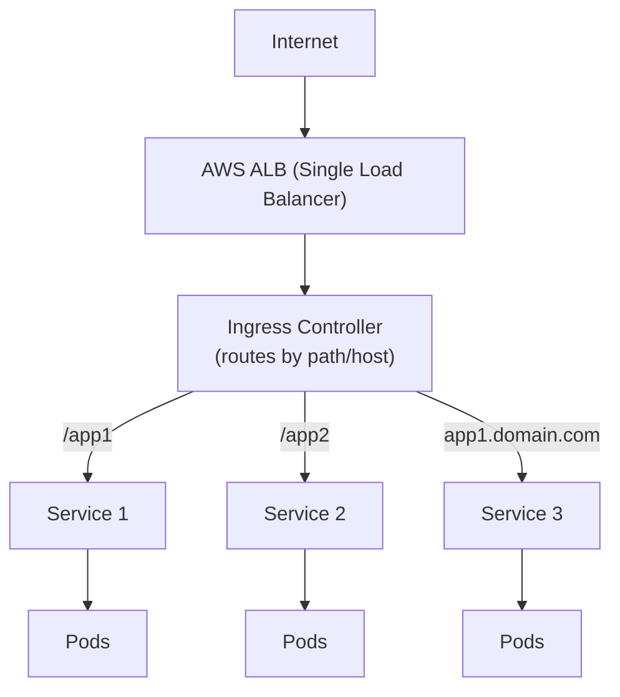
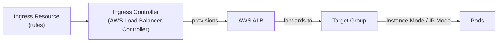
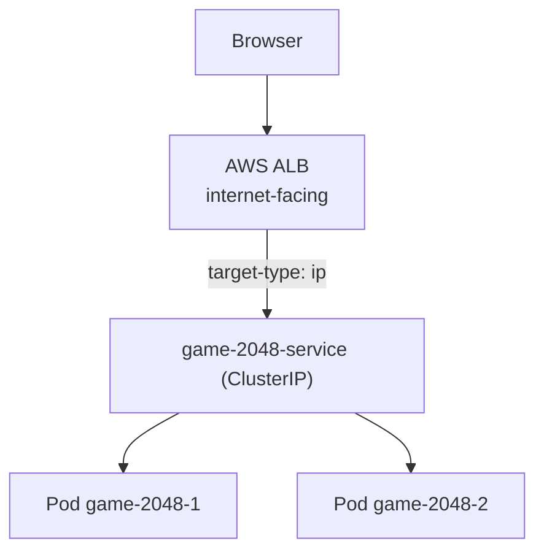

# Services & Ingress in EKS

> Ingress provides a **centralized way to manage external access** to your services. Instead of creating a LoadBalancer per service, one Ingress can route traffic to many services using path-based or host-based rules — saving AWS ELB costs and simplifying operations.

---

## Table of Contents

- [Why is Ingress Widely Used?](#why-is-ingress-widely-used)
- [Components of Ingress](#components-of-ingress)
- [Instance Mode vs IP Mode](#instance-mode-vs-ip-mode)
- [Path-Based vs Host-Based Routing](#path-based-vs-host-based-routing)
- [Hands-On: Deploy the 2048 Game with AWS Load Balancer Controller](#hands-on-deploy-the-2048-game-with-aws-load-balancer-controller)
- [Deployment with Custom Domain (Route53 + ACM)](#deployment-with-custom-domain-route53--acm)

---

## Why is Ingress Widely Used?

### Key Advantages of Ingress

- **Single Entry Point** – Manages access to multiple services from one external URL.
- **Path-Based Routing** – Different apps under different paths (`/app1`, `/app2`).
- **Host-Based Routing** – Different domains/subdomains (`app1.example.com`, `app2.example.com`).
- **TLS/SSL Termination** – Secures apps with HTTPS, offloading SSL at the Ingress.
- **Load Balancing** – Distributes incoming traffic across multiple backend pods.
- **Reduces Costs** – Eliminates the need for a separate AWS ELB per service.




---

## Components of Ingress

| Component          | Description                                                                         |
|--------------------|-------------------------------------------------------------------------------------|
| **Ingress Resource** | Kubernetes object defining routing rules (path/host, SSL).                          |
| **Ingress Controller** | The actual implementation processing rules and provisioning AWS ALB/NLB. Examples: **AWS Load Balancer Controller**, NGINX, Traefik. |
| **Load Balancer**   | The external AWS **ALB** or **NLB** that routes traffic (created/managed by the controller). |
| **Target Groups**   | AWS resources that the ALB forwards traffic to. **Instance Mode** → EC2 instances; **IP Mode** → pod IPs. |



---

## Instance Mode vs IP Mode

In AWS EKS, the AWS Load Balancer Controller supports **two modes** for managing traffic.


| Feature          | **Instance Mode**                                     | **IP Mode**                                     |
|------------------|--------------------------------------------------------|--------------------------------------------------|
| **Target Type**  | Routes traffic to EC2 instances                        | Routes traffic directly to pod IPs                |
| **Networking**   | Uses AWS VPC routing; requires worker nodes in a Public Subnet | Uses AWS VPC CNI; direct pod communication      |
| **Target Group** | **Instance Target Group**                             | **IP Target Group**                               |
| **Traffic Flow** | ALB → NodePort → Pods                                  | ALB → Pods (bypassing NodePort)                   |
| **Use Case**     | EC2 worker nodes in public subnets                     | Fargate or private nodes; lower latency           |
| **Security Group** | Worker nodes must allow inbound traffic from ALB     | Pods must allow inbound traffic from ALB          |

**When to use Instance Mode?**

- Cluster runs EC2 instances and you want a simpler setup.
- Using traditional Kubernetes `NodePort` services.

**When to use IP Mode?**

- Running on **EKS Fargate** or using private subnets.
- Want **better performance and lower latency** (traffic goes straight to pods).
- Want to avoid the extra hop through `NodePort`.

---

## Path-Based vs Host-Based Routing


| Routing Type        | Example                          | Use Case                                    |
|---------------------|----------------------------------|---------------------------------------------|
| **Path-Based**      | `example.com/app1`, `/app2`      | Multiple apps behind one domain.            |
| **Host-Based**      | `app1.example.com`, `app2.example.com` | Distinct domain per app (multi-tenant). |

---

## Hands-On: Deploy the 2048 Game with AWS Load Balancer Controller

Deploy the 2048 game application on EKS and expose it through an **Application Load Balancer (ALB)**.

### Prerequisites

- **eksctl**, **kubectl**, and **AWS CLI** installed and configured.
- An existing EKS cluster.

### Step 1: Connect kubectl to Your EKS Cluster

```bash
aws eks update-kubeconfig --region ap-south-1 --name ekswithavinash
```

### Step 2: Create an IAM OIDC Provider for Your Cluster

```bash
cluster_name=ekswithavinash
oidc_id=$(aws eks describe-cluster --name $cluster_name --query "cluster.identity.oidc.issuer" --output text | cut -d '/' -f 5)
echo $oidc_id
```

Check if an IAM OIDC provider already exists:

```bash
aws iam list-open-id-connect-providers | grep $oidc_id | cut -d "/" -f4
```

- **If output is returned:** You already have an OIDC provider — skip to Step 3.
- **If no output is returned:** Create it:

```bash
eksctl utils associate-iam-oidc-provider --cluster ekswithavinash --approve
```

### Step 3: Install AWS Load Balancer Controller with Helm

#### 3.1 Download and Create the IAM Policy

```bash
curl -O https://raw.githubusercontent.com/kubernetes-sigs/aws-load-balancer-controller/v2.11.0/docs/install/iam_policy.json

aws iam create-policy \
    --policy-name AWSLoadBalancerControllerIAMPolicy \
    --policy-document file://iam_policy.json
```

#### 3.2 Create the IAM Service Account

```bash
eksctl create iamserviceaccount \
    --cluster=ekswithavinash \
    --namespace=kube-system \
    --name=aws-load-balancer-controller \
    --attach-policy-arn=arn:aws:iam::<<account-id>>:policy/AWSLoadBalancerControllerIAMPolicy \
    --override-existing-serviceaccounts \
    --region ap-south-1 \
    --approve
```

> Replace `<<account-id>>` with your AWS account ID (shown in the IAM policy ARN you created).

#### 3.3 Install the AWS Load Balancer Controller

```bash
helm repo add eks https://aws.github.io/eks-charts
helm repo update eks

helm install aws-load-balancer-controller eks/aws-load-balancer-controller \
  -n kube-system \
  --set clusterName=ekswithavinash \
  --set serviceAccount.create=false \
  --set serviceAccount.name=aws-load-balancer-controller
```

#### 3.4 Verify the Controller Deployment

```bash
kubectl get deployment -n kube-system aws-load-balancer-controller
```

### Step 4: Deploy the 2048 Game Application

#### 4.1 Namespace (`namespace.yaml`)

```yaml
apiVersion: v1
kind: Namespace
metadata:
  name: 2048-game
```

```bash
kubectl apply -f namespace.yaml
```

#### 4.2 Deployment (`deployment.yaml`)

```yaml
apiVersion: apps/v1
kind: Deployment
metadata:
  name: game-2048-deployment
  namespace: 2048-game
  labels:
    app: game-2048
spec:
  replicas: 2
  selector:
    matchLabels:
      app: game-2048
  template:
    metadata:
      labels:
        app: game-2048
    spec:
      containers:
        - name: game-2048
          image: thipparthiavinash/2048-game
          ports:
            - containerPort: 80
```

```bash
kubectl apply -f deployment.yaml
```

#### 4.3 Service (`service.yaml`)

```yaml
apiVersion: v1
kind: Service
metadata:
  name: game-2048-service
  namespace: 2048-game
  labels:
    app: game-2048
spec:
  type: ClusterIP
  ports:
    - port: 80
      targetPort: 80
      protocol: TCP
      name: http
  selector:
    app: game-2048
```

```bash
kubectl apply -f service.yaml
```

> **NodePort alternative:** If you want to test with a node port instead of an ingress-backed ALB:

```yaml
apiVersion: v1
kind: Service
metadata:
  name: game-2048-service
  namespace: 2048-game
  labels:
    app: game-2048
spec:
  type: NodePort
  selector:
    app: game-2048
  ports:
    - protocol: TCP
      port: 80          # Service Port
      targetPort: 80    # Container Port
      nodePort: 30080   # Optional: custom port, or let Kubernetes assign one
```

#### 4.4 Ingress (`ingress.yaml`)

```yaml
apiVersion: networking.k8s.io/v1
kind: Ingress
metadata:
  name: game-2048-ingress
  namespace: 2048-game
  annotations:
    kubernetes.io/ingress.class: alb
    alb.ingress.kubernetes.io/scheme: internet-facing
    alb.ingress.kubernetes.io/target-type: ip
    alb.ingress.kubernetes.io/listen-ports: '[{"HTTP":80}]'
spec:
  rules:
    - http:
        paths:
          - path: /*
            pathType: ImplementationSpecific
            backend:
              service:
                name: game-2048-service
                port:
                  number: 80
```

```bash
kubectl apply -f ingress.yaml
```

### Step 5: Verify the Deployment

```bash
kubectl describe ingress game-2048-ingress -n 2048-game
```

When the ALB is ready, you'll see its **DNS name** in the `Address` field. Open it in a browser to play 2048.



---

## Deployment with Custom Domain (Route53 + ACM)

If you have a **Route53 hosted zone** and an **ACM certificate**, use this ingress to map a custom domain (e.g., `game.learnaws.today`) to the ALB:

```yaml
apiVersion: networking.k8s.io/v1
kind: Ingress
metadata:
  name: game-2048-ingress
  namespace: 2048-game
  annotations:
    kubernetes.io/ingress.class: alb
    alb.ingress.kubernetes.io/scheme: internet-facing
    alb.ingress.kubernetes.io/target-type: ip
    alb.ingress.kubernetes.io/certificate-arn: arn:aws:acm:ap-south-1:1234567890:certificate/Your-Cert-ARN
    alb.ingress.kubernetes.io/listen-ports: '[{"HTTP":80}, {"HTTPS":443}]'
    alb.ingress.kubernetes.io/ssl-policy: ELBSecurityPolicy-TLS13-1-2-2021-06
spec:
  rules:
    - host: game.learnaws.today
      http:
        paths:
          - path: /
            pathType: Prefix
            backend:
              service:
                name: game-2048-service
                port:
                  number: 80
```

Then map the domain name `game.learnaws.today` in Route53 (e.g., an **A record → ALB alias**) and test the output over HTTPS.

---

## Summary

| Ingredient                    | Role                                                         |
|-------------------------------|--------------------------------------------------------------|
| **Ingress Resource**          | Declares routing rules (path host, TLS).                     |
| **Ingress Controller**        | Implements the rules and provisions the AWS LB.              |
| **Instance Mode**             | ALB → NodePort → Pods (public subnet nodes).                 |
| **IP Mode**                   | ALB → Pod IPs (lower latency, Fargate-friendly).             |
| **Certificate + Route53**     | Secure HTTPS access with a custom domain.                    |

## Next Steps

Automate application packaging and deployment — continue with [09-helm-package-manager.md](09-helm-package-manager.md).