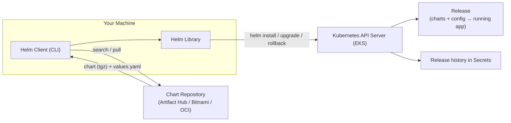
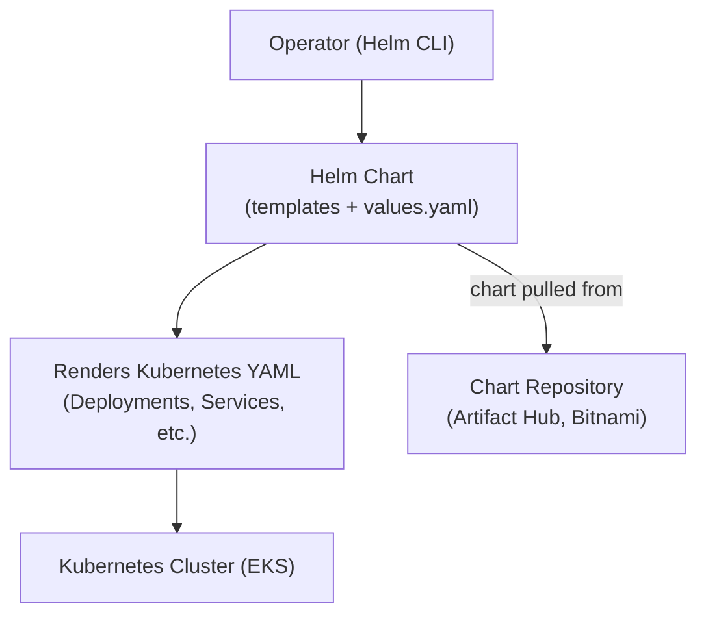
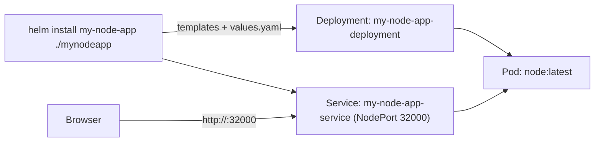

# Helm: The Kubernetes Package Manager

> **Helm** is a package manager for **Kubernetes**, similar to how **apt** (Ubuntu) or **yum** (Amazon Linux) work for Linux. It simplifies deploying and managing applications on EKS using **Helm Charts** — pre-packaged, templated Kubernetes resources.

---

## Table of Contents

- [What is Helm and Charts?](#what-is-helm-and-charts)
- [Key Components of Helm](#key-components-of-helm)
- [Why is Helm Important?](#why-is-helm-important)
- [Common Use Cases in EKS](#common-use-cases-in-eks)
- [Example 1: Install Nginx Using Helm](#example-1-install-nginx-using-helm)
- [Example 2: Deploy a Custom Node.js App](#example-2-deploy-a-custom-nodejs-app)
- [Helm Command Reference](#helm-command-reference)

---

## What is Helm and Charts?



## Key Components of Helm

1. **Helm CLI** – Command-line tool to install and manage Helm charts.
2. **Helm Chart** – A collection of YAML files that define Kubernetes resources (Deployment, Service, ConfigMaps, etc.).
3. **Helm Repository** – A storage location for charts (e.g., ArtifactHub, Bitnami Helm Repo).
4. **Values File (`values.yaml`)** – Configurable parameters for the Helm chart.



---

## Why is Helm Important?

In an **enterprise EKS environment**, managing many microservices with raw YAML becomes complex. Helm provides:

- **Simplification** → Manage multiple Kubernetes objects as a single package.
- **Reusability** → Use the same chart across environments with different config.
- **Versioning & Rollbacks** → Roll back easily if a deployment fails.
- **Parameterization** → Customize deployments with `values.yaml` instead of editing YAML by hand.
- **Dependency Management** → Deploy dependent services (e.g., a database alongside the app).

---

## Common Use Cases in EKS

1. **Deploying Enterprise Applications** – Manage microservices-based applications.
2. **Installing Monitoring Tools** – Prometheus, Grafana, Loki, and Fluentd via Helm.
3. **Managing Database Deployments** – MySQL, PostgreSQL, MongoDB.
4. **CI/CD Integration** – Jenkins, GitHub Actions, ArgoCD.
5. **Managing Configurations** – Use `values.yaml` for dev, staging, and prod.

---

## Example 1: Install Nginx Using Helm

### Step 1: Install Helm (if not installed)

```sh
curl https://raw.githubusercontent.com/helm/helm/main/scripts/get-helm-3 | bash
```

### Step 2: Add the Bitnami Helm Repository

```sh
helm repo add bitnami https://charts.bitnami.com/bitnami
helm repo update
```

### Step 3: Install Nginx

```sh
helm install my-nginx bitnami/nginx
```

This installs an **Nginx Deployment and Service** on EKS using Bitnami's Helm chart.

### Step 4: Verify the Deployment

```sh
kubectl get pods
kubectl get svc
```

### Step 5: Uninstall Nginx

```sh
helm uninstall my-nginx
```

---

## Example 2: Deploy a Custom Node.js App

### Step 1: Create a New Helm Chart

```sh
helm create mynodeapp
```

This creates a directory structure like:

```
my-app/
├── charts/
├── templates/
│   ├── deployment.yaml
│   ├── service.yaml
│   ├── ingress.yaml
│   ├── _helpers.tpl
│   └── NOTES.txt
├── values.yaml
├── Chart.yaml
└── README.md
```

### Step 2: Update Helm Chart Files

#### `values.yaml`

```yaml
replicaCount: 1

image:
  repository: node
  pullPolicy: IfNotPresent
  tag: latest

service:
  type: NodePort
  port: 3000
  nodePort: 32000   # Choose a port in range 30000-32767

ingress:
  enabled: false

resources: {}

autoscaling:
  enabled: false

nodeSelector: {}

tolerations: []

affinity: {}
```

#### `templates/deployment.yaml`

```yaml
apiVersion: apps/v1
kind: Deployment
metadata:
  name: {{ .Release.Name }}-deployment
spec:
  replicas: {{ .Values.replicaCount }}
  selector:
    matchLabels:
      app: nodeapp
  template:
    metadata:
      labels:
        app: nodeapp
    spec:
      containers:
        - name: nodeapp
          image: "{{ .Values.image.repository }}:{{ .Values.image.tag }}"
          command: ["node", "-e", "require('http').createServer((req, res) => res.end('Hello from Node.js!')).listen(3000)"]
          ports:
            - containerPort: 3000
```

#### `templates/service.yaml`

Supports both `ClusterIP` and `NodePort`:

```yaml
apiVersion: v1
kind: Service
metadata:
  name: {{ .Release.Name }}-service
spec:
  type: {{ .Values.service.type }}
  selector:
    app: nodeapp
  ports:
    - protocol: TCP
      port: {{ .Values.service.port }}
      targetPort: 3000
      {{- if eq .Values.service.type "NodePort" }}
      nodePort: {{ .Values.service.nodePort }}
      {{- end }}
```

### Step 3: Remove Unnecessary Files

Since we aren't using a **ServiceAccount** or **HPA**, remove these:

```sh
rm mynodeapp/templates/serviceaccount.yaml
rm mynodeapp/templates/hpa.yaml
```

### Step 4: Install or Upgrade the Helm Chart

```sh
helm install my-node-app ./mynodeapp
```

If already installed, upgrade with:

```sh
helm upgrade my-node-app ./mynodeapp
```

### Step 5: Verify the Deployment

```sh
kubectl get pods
kubectl get svc my-node-app-service
```

### Step 6: Access the Application

```sh
# Find the node IP
kubectl get nodes -o wide

# Find the NodePort
kubectl get svc my-node-app-service -o yaml | grep nodePort

# Curl the app
curl http://<NODE_IP>:32000
```

Or open `http://<NODE_IP>:32000` in a browser.



---

## Helm Command Reference

| **Operation**                      | **Syntax**                                                        | **Example**                                                      | **Description**                                                         |
|------------------------------------|-------------------------------------------------------------------|------------------------------------------------------------------|-------------------------------------------------------------------------|
| Search for a chart                 | `helm search repo <chart-name>`                                   | `helm search repo bitnami/nginx`                                 | Searches repositories you've added.                                     |
| Search in Helm Hub                 | `helm search hub <keyword>`                                       | `helm search hub nginx`                                          | Searches Helm Hub / Artifact Hub.                                       |
| Install a chart                    | `helm install <release> <chart>`                                  | `helm install my-nginx bitnami/nginx`                            | Installs a chart in the cluster.                                        |
| Install with custom values         | `helm install <release> <chart> --set <k>=<v>`                    | `helm install my-nginx bitnami/nginx --set service.type=LoadBalancer` | Installs with overridden values.                                        |
| List installed releases            | `helm list`                                                       | `helm list`                                                       | Displays all installed releases.                                        |
| Upgrade a release                  | `helm upgrade <release> <chart>`                                  | `helm upgrade my-nginx bitnami/nginx`                            | Upgrades an existing release.                                           |
| Uninstall a release                | `helm uninstall <release>`                                        | `helm uninstall my-nginx`                                        | Deletes a release.                                                      |
| Pull a chart                       | `helm pull <chart>`                                               | `helm pull bitnami/nginx`                                        | Downloads a chart archive (`.tgz`).                                     |
| Extract a chart                    | `helm pull <chart> --untar`                                       | `helm pull bitnami/nginx --untar`                                | Downloads and extracts a chart locally.                                 |
| List repositories                  | `helm repo list`                                                  | `helm repo list`                                                  | Lists configured repositories.                                          |
| Add a repository                   | `helm repo add <name> <url>`                                      | `helm repo add bitnami https://charts.bitnami.com/bitnami`       | Adds a repository.                                                      |
| Update repositories                | `helm repo update`                                                | `helm repo update`                                                | Refreshes repo metadata.                                                |
| Release status                     | `helm status <release>`                                           | `helm status my-nginx`                                            | Shows status/health of a release.                                       |
| Values of a release                | `helm get values <release>`                                       | `helm get values my-nginx`                                       | Shows values used by a release.                                         |
| Dry run install                    | `helm install <release> <chart> --dry-run --debug`                | `helm install test-nginx bitnami/nginx --dry-run --debug`       | Previews output without applying.                                       |
| Render templates                   | `helm template <release> <chart> --debug`                         | `helm template my-nginx bitnami/nginx --debug`                   | Prints the generated manifests.                                         |
| Package a chart                    | `helm package <chart-dir>`                                        | `helm package my-custom-chart/`                                  | Packages a chart into a `.tgz`.                                        |
| Release history                    | `helm history <release>`                                          | `helm history my-nginx`                                          | Shows revision history.                                                 |
| Rollback a release                 | `helm rollback <release> <revision>`                              | `helm rollback my-nginx 2`                                       | Rolls back to a previous revision.                                      |
| Delete release + history           | `helm delete <release>`                                           | `helm delete my-nginx`                                           | Deletes a release along with its history.                               |

---

## Summary

| Concern                      | Helm Solution                                         |
|------------------------------|-------------------------------------------------------|
| Deploying many resources     | One `helm install` for the whole chart.               |
| Different environments       | Override `values.yaml` (dev, staging, prod).          |
| Upgrading & rollbacks        | `helm upgrade`, `helm rollback`, `helm history`.      |
| Reusing packages             | Public repos + your own packaged charts.              |

## Next Steps

Learn how to scale pods automatically — continue with [10-horizontal-pod-autoscaling.md](10-horizontal-pod-autoscaling.md).