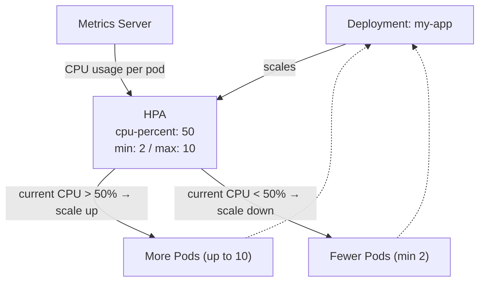
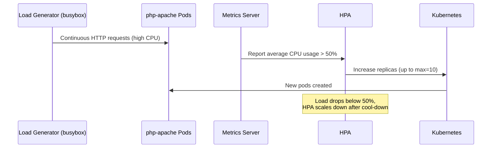

# Horizontal Pod Autoscaling (HPA)

> **HPA (Horizontal Pod Autoscaler)** automatically scales the **number of pods** based on **CPU, memory, or custom metrics**, so your application handles variable workloads efficiently — without manual intervention.

---

## Table of Contents

- [How HPA Works](#how-hpa-works)
- [Understanding CPU Requests and Limits](#understanding-cpu-requests-and-limits)
- [Understanding Memory Requests and Limits](#understanding-memory-requests-and-limits)
- [Hands-On: HPA Testing with PHP-Apache](#hands-on-hpa-testing-with-php-apache)
- [Deploying the Metrics Server](#deploying-the-metrics-server)

---

## How HPA Works

**Example:**

- If CPU usage exceeds **50%**, HPA increases the pod count.
- If load decreases, HPA reduces pods to save resources.

Enable HPA on a deployment:

```sh
kubectl autoscale deployment my-app --cpu-percent=50 --min=2 --max=10
```

This keeps **at least 2 pods**, scales up to **10 pods**, and maintains **50% CPU utilization**.



| Condition                          | Action    |
|------------------------------------|-----------|
| Average CPU > 50%                  | Scale **up** (add pods)   |
| Average CPU < 50% (after cool-down)| Scale **down** (remove pods) |

> HPA requires the **Metrics Server** to be installed in the cluster — see [Deploying the Metrics Server](#deploying-the-metrics-server).

---

## Understanding CPU Requests and Limits

### What does `200m` and `500m` mean?

- `m` stands for **millicores**.
- `1 CPU = 1000m` (1000 millicores).
- Kubernetes uses millicores to allow **fine-grained CPU allocation**.

### How is it calculated?

| Value    | Meaning       |
|----------|---------------|
| `200m`   | 0.2 CPU       |
| `500m`   | 0.5 CPU       |
| `1000m`  | 1 CPU core    |
| `2000m`  | 2 CPU cores   |

```yaml
resources:
  requests:
    cpu: 200m  # 0.2 CPU (Minimum required)
  limits:
    cpu: 500m  # 0.5 CPU (Maximum allowed)
```

This means:

- The container **gets at least 0.2 CPU core**.
- The container **can use up to 0.5 CPU core**, but not more.

### Why use millicores instead of full cores?

Kubernetes runs many containers on a single node. Instead of assigning **whole CPU cores**, it allows **fractions**, so small apps don't waste resources.

- A **small app** might need only `100m` (0.1 CPU).
- A **database** might need `2 CPU` (`2000m`).
- If only full cores (1, 2, …) were allowed, small apps would waste resources.

### Example

Imagine your node has **4 CPU cores** (`4000m`):

- Deploy 10 small containers, each requesting `200m`.
- Each gets **0.2 CPU**, so Kubernetes can run **20 such containers** on a **4-core machine**.

---

## Understanding Memory Requests and Limits

Memory is measured in **bytes**, commonly specified in:

| Unit      | Meaning                             |
|-----------|-------------------------------------|
| **Mi**    | Mebibytes: `1 Mi = 1024 KiB`        |
| **Gi**    | Gibibytes: `1 Gi = 1024 Mi`         |
| `M`/`G`   | Megabytes / Gigabytes (decimal)     |

> `Mi` and `Gi` are recommended for accuracy.

### Example

```yaml
resources:
  requests:
    memory: "256Mi"  # Minimum required (256 Mebibytes)
  limits:
    memory: "512Mi"  # Maximum allowed (512 Mebibytes)
```

- The container **is guaranteed at least `256Mi`**.
- The container **can use up to `512Mi`**, but not more.

### Typical Examples

- A **small Node.js app**:

  ```yaml
  requests:
    cpu: "100m"
    memory: "128Mi"
  limits:
    cpu: "500m"
    memory: "256Mi"
  ```

- A **MySQL database**:

  ```yaml
  requests:
    cpu: "500m"
    memory: "1Gi"
  limits:
    cpu: "2"
    memory: "4Gi"
  ```

---

## Hands-On: HPA Testing with PHP-Apache

### Prerequisites

- A running Kubernetes cluster (EKS in this case).
- `kubectl` installed and configured.
- `eksctl` installed (for EKS).
- `metrics-server` deployed for resource monitoring.

### Step 1: Verify Cluster and Environment

```sh
kubectl get all
eksctl get cluster
```

Ensure your cluster is up and running.

### Step 2: Deploy the PHP-Apache Application

Create `php-apache.yaml`:

```yaml
apiVersion: apps/v1
kind: Deployment
metadata:
  name: php-apache
spec:
  selector:
    matchLabels:
      run: php-apache
  template:
    metadata:
      labels:
        run: php-apache
    spec:
      containers:
        - name: php-apache
          image: registry.k8s.io/hpa-example
          ports:
            - containerPort: 80
          resources:
            limits:
              cpu: 500m
            requests:
              cpu: 200m
---
apiVersion: v1
kind: Service
metadata:
  name: php-apache
  labels:
    run: php-apache
spec:
  ports:
    - port: 80
  selector:
    run: php-apache
```

Apply and verify:

```sh
kubectl apply -f php-apache.yaml
kubectl describe svc php-apache
kubectl describe deployment php-apache
```

### Step 3: Enable Horizontal Pod Autoscaler (HPA)

Create an HPA with a CPU threshold of **50%** and scaling between **1 and 10 pods**:

```sh
kubectl autoscale deployment php-apache --cpu-percent=50 --min=1 --max=10
```

Check HPA status:

```sh
kubectl get hpa
```

### Step 4: Generate Load

Run a load generator to simulate traffic. HPA monitors CPU and, if it exceeds the 50% threshold, scales up pods automatically:

```sh
kubectl run -i --tty load-generator --rm --image=busybox:1.28 --restart=Never -- /bin/sh -c "while sleep 0.01; do wget -q -O- http://php-apache; done"
```

Monitor HPA scaling:

```sh
kubectl get hpa php-apache --watch
kubectl get deployment php-apache
kubectl get pods
```

> In the terminal where `load-generator` is running, stop the load by typing **`Ctrl+C`**.



---

## Deploying the Metrics Server

HPA needs resource metrics. Check if the Metrics Server is already running:

```sh
kubectl get deployment metrics-server -n kube-system
```

If not present, install it:

```sh
kubectl apply -f https://github.com/kubernetes-sigs/metrics-server/releases/latest/download/components.yaml
```

Verify HPA and resource usage:

```sh
kubectl get hpa
kubectl top pods
```

---

## Summary

| Concept                | Key Point                                                     |
|------------------------|---------------------------------------------------------------|
| **HPA**                | Scales pod **count** based on CPU/memory/custom metrics.       |
| **Requests**           | Minimum resources reserved; used for scheduling and HPA.       |
| **Limits**             | Maximum resources a container can consume.                     |
| **Metrics Server**     | Required for HPA to read CPU/memory usage.                     |
| **Scale policy**       | `--cpu-percent`, `--min`, `--max` on `kubectl autoscale`.      |

## Next Steps

Learn how VPA and Goldilocks recommend optimal resource sizes — continue with [11-vpa-and-goldilocks.md](11-vpa-and-goldilocks.md).