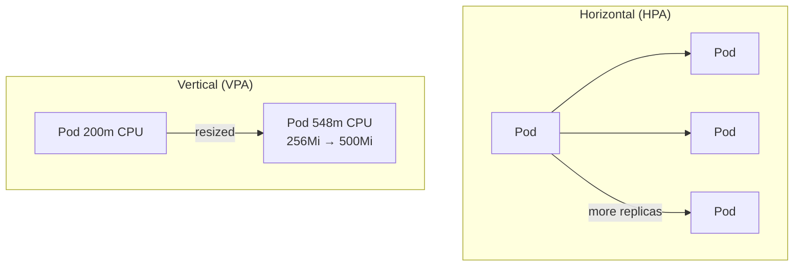
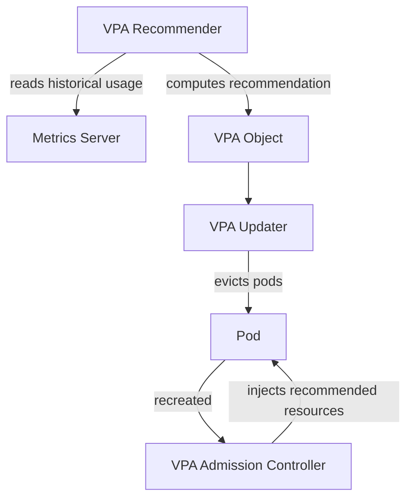
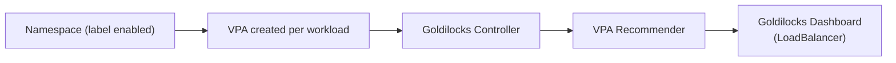

# Vertical Pod Autoscaler (VPA) & Goldilocks

> **Vertical Pod Autoscaler (VPA)** automatically adjusts **CPU and memory requests/limits** for running pods. Instead of scaling horizontally (adding more replicas), VPA **modifies the resource allocation** of existing pods to optimize performance.

---

## Table of Contents

- [What is VPA?](#what-is-vpa)
- [Why VPA is Not Recommended for Production](#why-vpa-is-not-recommended-for-production)
- [VPA Architecture](#vpa-architecture)
- [Hands-On: Install and Test VPA](#hands-on-install-and-test-vpa)
- [Understanding VPA Recommendations](#understanding-vpa-recommendations)
- [Goldilocks: Dashboard for VPA Recommendations](#goldilocks-dashboard-for-vpa-recommendations)

---

## What is VPA?

VPA is an open-source project from the **Kubernetes Autoscaler** repository on GitHub. It automates the process of right-sizing pods by learning their actual usage and publishing **recommendations** (Lower Bound, Target, Upper Bound).

| Scaling Type | What changes                     | Example                     |
|--------------|----------------------------------|-----------------------------|
| **HPA**      | Number of pods (scale out/in)    | 3 pods → 8 pods             |
| **VPA**      | Resources of each pod (resize)   | each pod 200m → 548m CPU    |



---

## Why VPA is Not Recommended for Production Workloads

Despite its advantages, VPA has limitations that make it **less suitable for production**:

1. **Pod Restarts Are Required**
   - VPA **terminates and restarts** pods to apply new resource requests/limits.
   - This disrupts running applications — **not ideal for stateful workloads** or high-availability apps.

2. **Conflicts with Horizontal Pod Autoscaler (HPA)**
   - **HPA and VPA don't work well together** — HPA scales pod count based on metrics, while VPA resizes existing pods.
   - **Best practice:** Use **HPA for stateless workloads**, **VPA for batch jobs or long-running background processes**.

3. **Unpredictable Scaling Decisions**
   - VPA relies on **historical usage data** and may not react quickly to sudden traffic spikes.

4. **Not Natively Supported in Managed Kubernetes (EKS, AKS, GKE)**
   - AWS EKS, Azure AKS, and Google GKE **don't natively support VPA** — they encourage **HPA + Cluster Autoscaler**.

---

## VPA Architecture

VPA has **three components**:

| Component                | Job                                                                 |
|--------------------------|---------------------------------------------------------------------|
| **Admission Controller** | Intercepts pod creation and applies recommended resources.          |
| **Recommender**          | Watches actual usage and computes recommendations.                  |
| **Updater**              | Evicts pods running with non-optimal resources so they restart.     |



---

## Hands-On: Install and Test VPA

### Step 1: Install VPA

```sh
# Clone the autoscaler repository
git clone https://github.com/kubernetes/autoscaler.git

# Navigate to the VPA directory
cd /autoscaler/vertical-pod-autoscaler/
```

Install VPA:

```sh
./hack/vpa-up.sh
```

### Step 2: Verify Installation

```sh
kubectl get pods -n kube-system | grep vpa
```

Expected output:

```
vpa-admission-controller-xxxxx   Running
vpa-recommender-xxxxx            Running
vpa-updater-xxxxx                Running
```

### Step 3: Deploy the Example App (Hamster)

```sh
kubectl apply -f ./examples/hamster.yaml
kubectl get pods
```

### Step 4: Get VPA Recommendations

```sh
kubectl describe vpa hamster-vpa
```

Sample output:

```
Recommendation:
  Container Recommendations:
    Container Name:  hamster
    Lower Bound:
      Cpu:     100m
      Memory:  262144k
    Target:
      Cpu:     548m
      Memory:  262144k
    Uncapped Target:
      Cpu:     548m
      Memory:  262144k
    Upper Bound:
      Cpu:     1
      Memory:  500Mi
```

---

## Understanding VPA Recommendations

| Bound              | CPU      | Memory         | Meaning                                                                 |
|--------------------|----------|----------------|-------------------------------------------------------------------------|
| **Lower Bound**    | `100m`   | `262144k` (256Mi) | Minimum resources required to run safely.                              |
| **Target**         | `548m`   | `262144k` (256Mi) | **Optimal** allocation for smooth performance.                          |
| **Uncapped Target**| `548m`   | `262144k` (256Mi) | Theoretical optimum with no constraints (same as target here).          |
| **Upper Bound**    | `1`      | `500Mi`          | Maximum recommended — beyond this is over-allocation.                   |

**How to use it:**

Update your Deployment's `resources` to the **Target** values:

```yaml
resources:
  requests:
    cpu: 548m        # was 200m
    memory: 256Mi    # was 128Mi
  limits:
    cpu: "1"
    memory: 500Mi
```

---

## Goldilocks: Dashboard for VPA Recommendations

> **Goldilocks** (from Fairwinds) builds on VPA and provides a **dashboard** that visualizes recommended resource sizes for every workload in a namespace.



### 1. Install Helm (if not already installed)

```sh
curl https://raw.githubusercontent.com/helm/helm/main/scripts/get-helm-3 | bash
```

### 2. Add the Goldilocks Helm Repository and Install

```sh
helm repo add fairwinds-stable https://charts.fairwinds.com/stable
kubectl create namespace goldilocks
helm install goldilocks --namespace goldilocks fairwinds-stable/goldilocks
```

### 3. Enable Goldilocks for a Namespace

```sh
kubectl label ns goldilocks goldilocks.fairwinds.com/enabled=true
kubectl label namespace default goldilocks.fairwinds.com/enabled=true
```

### 4. Expose the Goldilocks Dashboard Externally

By default, Goldilocks deploys a **ClusterIP** service (cluster-internal only). Change it to **LoadBalancer**:

```sh
kubectl patch svc goldilocks-dashboard -n goldilocks -p '{"spec": {"type": "LoadBalancer"}}'
```

Get the external IP:

```sh
kubectl get svc goldilocks-dashboard -n goldilocks
```

Open `http://<EXTERNAL-IP>` in a browser to view the recommendations dashboard.

---

## Summary

| Component     | Role                                            | Production Recommendation |
|---------------|-------------------------------------------------|---------------------------|
| **VPA**       | Resizes pod CPU/memory based on actual usage.   | Not for HA workloads (restarts). |
| **VPA Recommender** | Computes Lower/Target/Upper bounds.      | —                         |
| **HPA + CA**  | Preferred scaling pattern on EKS.               | Yes                       |
| **Goldilocks**| Dashboard visualizing VPA recommendations.      | Useful for right-sizing.  |

## Next Steps

Scale your cluster nodes themselves — continue with [12-cluster-autoscaler.md](12-cluster-autoscaler.md).