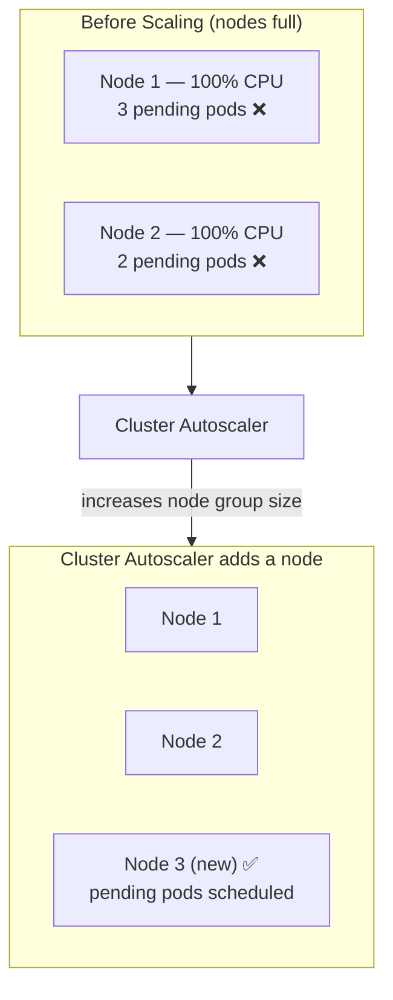
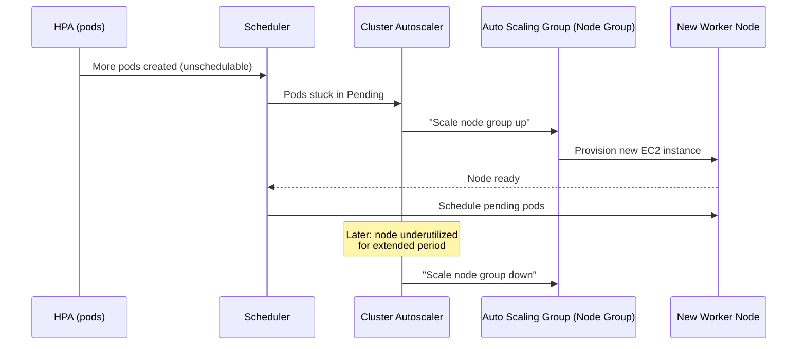
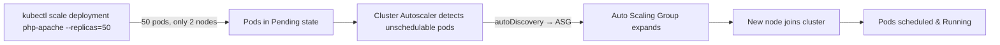

# EKS Cluster Autoscaler

> The **EKS Cluster Autoscaler** automatically adjusts the **number of worker nodes** in an Amazon EKS cluster based on workload demands. It ensures sufficient compute while optimizing costs by removing unused nodes.

---

## Table of Contents

- [What is the EKS Cluster Autoscaler?](#what-is-the-eks-cluster-autoscaler)
- [How It Works](#how-it-works)
- [Why Use It?](#why-use-it)
- [Implementation Guide](#implementation-guide)
- [Testing Autoscaling](#testing-autoscaling)

---

## What is the EKS Cluster Autoscaler?

EKS Cluster Autoscaler is a Kubernetes component that **scales the worker nodes** of an EKS cluster in response to **pending pods**. When pods can't be scheduled because the current nodes are full, Cluster Autoscaler adds nodes; when nodes are underutilized for a long period, it removes them.



## Why Use EKS Cluster Autoscaler?

- **Scales Up Nodes** – Adds new worker nodes when the cluster runs out of resources.
- **Scales Down Nodes** – Removes underutilized nodes to save costs.
- **Improves Performance** – Ensures applications have enough compute capacity.
- **Optimizes Costs** – Removes idle resources automatically.

> **Note:** Cluster Autoscaler works together with **HPA**. HPA scales the number of **pods**, Cluster Autoscaler scales the number of **nodes** when the new pods can't be scheduled.

---

## How It Works



---

## Implementation Guide

### Step 1: Describe the Node Group in EKS

Check the existing node group details (scaling config, IAM roles, status):

```sh
aws eks describe-nodegroup --cluster-name <cluster-name> --nodegroup-name <node-group-name>
```

### Step 2: Attach IAM Policy for Cluster Autoscaler

EKS worker nodes need IAM permissions to manage **Auto Scaling Groups (ASG)**. Attach the **AmazonEKSClusterAutoscalerPolicy** to the IAM role of your worker nodes.

### Step 3: Install Cluster Autoscaler using Helm

```sh
helm repo add autoscaler https://kubernetes.github.io/autoscaler
helm repo update
helm install cluster-autoscaler autoscaler/cluster-autoscaler \
  --namespace kube-system \
  --set autoDiscovery.clusterName=<cluster-name> \
  --set awsRegion=<region-code> \
  --set extraArgs.balance-similar-node-groups=true \
  --set extraArgs.skip-nodes-with-system-pods=false
```

**Explanation:**

| Parameter | Purpose |
|-----------|---------|
| `autoDiscovery.clusterName=<cluster-name>` | Enables automatic node-group discovery for the cluster. |
| `awsRegion=<region-code>` | Your AWS region (e.g., `ap-south-1` for Mumbai). |
| `balance-similar-node-groups=true` | Distributes workloads evenly across node groups. |
| `skip-nodes-with-system-pods=false` | Ensures system pods don't block node termination. |

#### Verify the Cluster Autoscaler Deployment

```sh
kubectl get pods -n kube-system | grep cluster-autoscaler
```

---

## Testing Autoscaling

### Step 1: Deploy `php-apache` Application

Deploy a sample app and increase the replica count to trigger node scaling.

#### Scale Up the Application

```sh
kubectl scale deployment php-apache --replicas=50
```

- Increases running pods from the default count to **50**.
- If the current worker nodes **don't have enough resources**, Cluster Autoscaler scales up and adds more nodes.

### Step 2: Verify Logs and Autoscaler Behavior

#### Check Application Logs

```sh
kubectl logs -f deployment/php-apache
```

#### Monitor Cluster Autoscaler Logs

```sh
kubectl logs -f -n kube-system deployment/cluster-autoscaler
```

- If scaling works, you'll see messages like **"Expanding node group"**.
- If it doesn't scale, inspect the Cluster Autoscaler logs for errors.



---

## Summary

| Concern                      | Solution                                             |
|------------------------------|------------------------------------------------------|
| Not enough nodes for pods    | CA scales the node group **up**.                     |
| Nodes idle for a long time   | CA scales the node group **down** (saves cost).      |
| HPA adds pods, node full     | CA provisions a new **node** so pods can schedule.   |
| Even distribution            | `balance-similar-node-groups=true`.                  |

## Next Steps

Track and optimize your cluster spend — continue with [13-kubecost.md](13-kubecost.md).