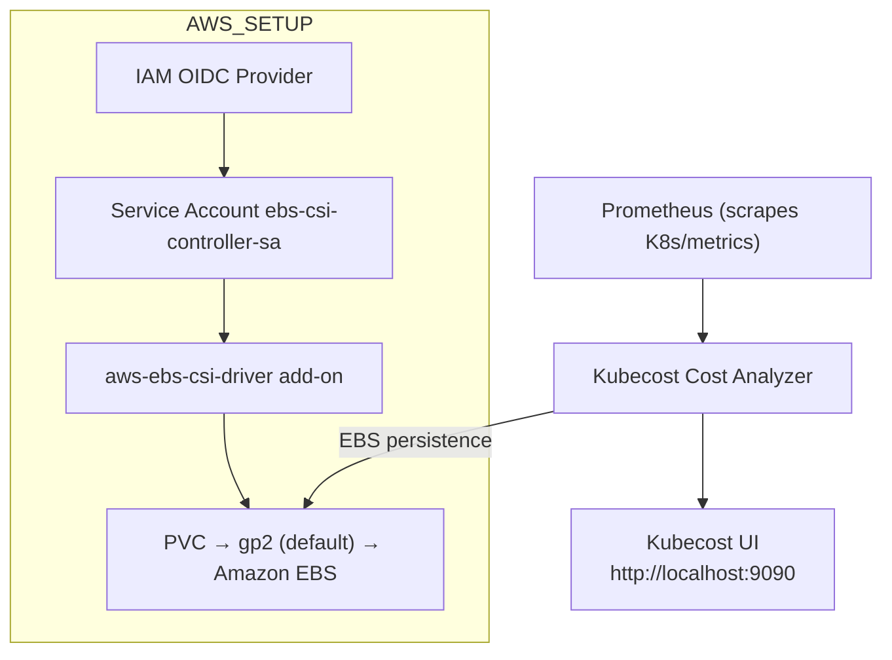
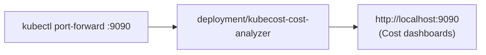

# Kubecost on EKS

> **Kubecost** is a cost-monitoring tool for Kubernetes. It gives you real-time visibility into what your cluster workloads actually cost — broken down by namespace, deployment, pod, label, and more.

---

## Table of Contents

- [What is Kubecost?](#what-is-kubecost)
- [Prerequisites](#prerequisites)
- [Step 1: Connect kubectl to Your EKS Cluster](#step-1-connect-kubectl-to-your-eks-cluster)
- [Step 2: Create an IAM OIDC Provider](#step-2-create-an-iam-oidc-provider)
- [Step 3: Create an IAM Service Account (EBS CSI)](#step-3-create-an-iam-service-account-ebs-csi)
- [Step 4: Set IAM Role ARN as Environment Variable](#step-4-set-iam-role-arn-as-environment-variable)
- [Step 5: Create the EBS CSI Driver Add-on](#step-5-create-the-ebs-csi-driver-add-on)
- [Step 6: Authenticate to ECR Public with Helm](#step-6-authenticate-to-ecr-public-with-helm)
- [Step 7: Add Kubecost Helm Repository](#step-7-add-kubecost-helm-repository)
- [Step 8: Update Helm Repositories](#step-8-update-helm-repositories)
- [Step 9: Install Kubecost Using Helm](#step-9-install-kubecost-using-helm)
- [Step 10: Patch gp2 StorageClass as Default](#step-10-patch-gp2-storageclass-as-default)
- [Step 11: Access the Kubecost UI](#step-11-access-the-kubecost-ui)

---

## What is Kubecost?



Kubecost installs into the `kubecost` namespace and uses the **Amazon EBS CSI Driver** so its metrics are stored persistently on an **EBS volume**.

---

## Prerequisites

- An existing EKS cluster (named `ekswithavinash` in this guide).
- `aws`, `kubectl`, `eksctl`, and `helm` installed and configured.
- EKS access configured via `aws eks update-kubeconfig`.

---

## Step 1: Connect kubectl to Your EKS Cluster

```bash
aws eks update-kubeconfig --region ap-south-1 --name ekswithavinash
```

---

## Step 2: Create an IAM OIDC Provider

```bash
cluster_name=ekswithavinash
oidc_id=$(aws eks describe-cluster --name $cluster_name --query "cluster.identity.oidc.issuer" --output text | cut -d '/' -f 5)
echo $oidc_id
```

Check if an OIDC provider already exists:

```bash
aws iam list-open-id-connect-providers | grep $oidc_id | cut -d "/" -f4
```

- **If output is returned:** Already exists — skip to Step 3.
- **If no output:** Create it:

```bash
eksctl utils associate-iam-oidc-provider --cluster ekswithavinash --approve
```

---

## Step 3: Create an IAM Service Account (EBS CSI)

```bash
eksctl create iamserviceaccount \
   --name ebs-csi-controller-sa \
   --namespace kube-system \
   --cluster ekswithavinash \
   --attach-policy-arn arn:aws:iam::aws:policy/service-role/AmazonEBSCSIDriverPolicy \
   --approve \
   --role-only \
   --role-name AmazonEKS_EBS_CSI_DriverRole
```

- Creates the service account `ebs-csi-controller-sa` in `kube-system`.
- Attaches `AmazonEBSCSIDriverPolicy` so the driver can manage EBS volumes.
- `--role-only` creates the IAM role (`AmazonEKS_EBS_CSI_DriverRole`) without binding it yet.

---

## Step 4: Set IAM Role ARN as Environment Variable

```bash
export SERVICE_ACCOUNT_ROLE_ARN=arn:aws:iam::501170964283:role/AmazonEKS_EBS_CSI_DriverRole
```

This variable links the created role to the add-on in the next step.

---

## Step 5: Create the EBS CSI Driver Add-on

```bash
eksctl create addon --name aws-ebs-csi-driver --cluster ekswithavinash \
   --service-account-role-arn $SERVICE_ACCOUNT_ROLE_ARN --force
```

- Creates the `aws-ebs-csi-driver` add-on.
- Associates the add-on with the IAM role from Step 4.
- `--force` ensures creation even if partially installed.

---

## Step 6: Authenticate to ECR Public with Helm

```bash
aws ecr-public get-login-password --region us-east-1 | helm registry login --username AWS --password-stdin public.ecr.aws
```

Retrieves an ECR Public token and logs Helm in so it can pull the Kubecost chart from `public.ecr.aws`.

---

## Step 7: Add Kubecost Helm Repository

```bash
helm repo add kubecost https://kubecost.github.io/cost-analyzer/
```

---

## Step 8: Update Helm Repositories

```bash
helm repo update
```

---

## Step 9: Install Kubecost Using Helm

```bash
helm upgrade -i kubecost \
  oci://public.ecr.aws/kubecost/cost-analyzer --version 2.6.5 \
  --namespace kubecost --create-namespace \
  -f https://raw.githubusercontent.com/kubecost/cost-analyzer-helm-chart/develop/cost-analyzer/values-eks-cost-monitoring.yaml
```

- Installs/upgrades the **kubecost** chart (version `2.6.5`) from ECR Public.
- Creates the `kubecost` namespace if needed (`--create-namespace`).
- Uses the EKS-specific values file for optimal configuration.

---

## Step 10: Patch gp2 StorageClass as Default

```bash
kubectl patch storageclass gp2 -p '{"metadata": {"annotations":{"storageclass.kubernetes.io/is-default-class":"true"}}}'
```

Marks `gp2` as the default StorageClass so new **PVCs** (including Kubecost's) automatically use it.

---

## Step 11: Access the Kubecost UI

```bash
kubectl port-forward --namespace kubecost deployment/kubecost-cost-analyzer 9090
```

Open the Kubecost UI at:

```
http://localhost:9090
```

You'll see cost dashboards such as:

| Dashboard                | Shows                                             |
|--------------------------|---------------------------------------------------|
| **Allocation**           | Cost by namespace, deployment, label, service.    |
| **Assets**               | Cost by node, disk, load balancer.                |
| **Efficiency**           | How much of what you pay for is actually used.    |
| **Cloud Costs**          | External cloud spend (S3, RDS, etc.).             |



---

## Summary

| Step | Tool         | Purpose                                    |
|------|--------------|--------------------------------------------|
| 1-2  | AWS CLI/eksctl | Connect to cluster, ensure OIDC provider. |
| 3-5  | eksctl       | EBS CSI driver for persistent storage.     |
| 6-9  | Helm         | Install Kubecost from ECR Public.          |
| 10   | kubectl      | Make `gp2` the default StorageClass.       |
| 11   | kubectl      | Port-forward to open the dashboard.        |

## Next Steps

Set up monitoring and dashboards — continue with [14-prometheus-and-grafana.md](14-prometheus-and-grafana.md).