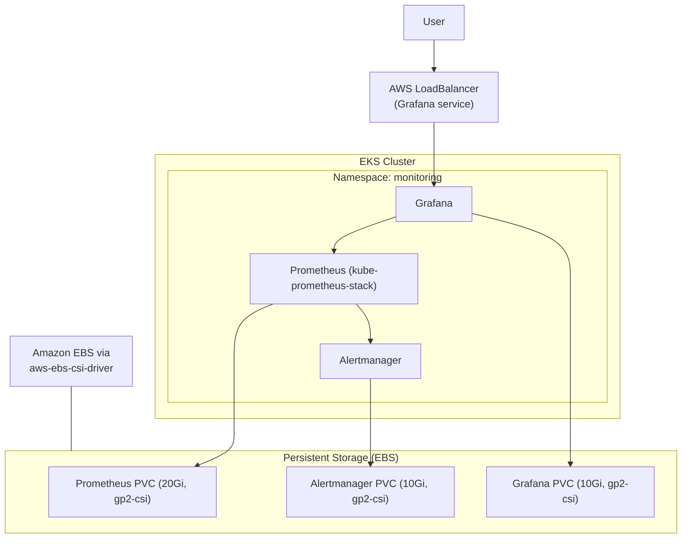
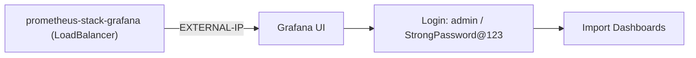

# Prometheus and Grafana on Amazon EKS

> A complete, production-ready setup of **Prometheus** and **Grafana** on an EKS cluster with **persistent EBS volumes** and **Grafana exposed via LoadBalancer**.

---

## Table of Contents

- [Architecture](#architecture)
- [Prerequisites](#prerequisites)
- [Step 1: Install AWS EBS CSI Driver](#step-1-install-aws-ebs-csi-driver)
- [Step 2: Attach Required IAM Policy to Node Group Role](#step-2-attach-required-iam-policy-to-node-group-role)
- [Step 3: Create StorageClass for EBS CSI](#step-3-create-storageclass-for-ebs-csi)
- [Step 4: Create Namespace](#step-4-create-namespace)
- [Step 5: Create values.yaml File](#step-5-create-valuesyaml-file)
- [Step 6: Add Helm Repository](#step-6-add-helm-repository)
- [Step 7: Install Prometheus and Grafana Stack](#step-7-install-prometheus-and-grafana-stack)
- [Step 8: Verify Resources](#step-8-verify-resources)
- [Step 9: Access Grafana](#step-9-access-grafana)
- [Step 10: Import Dashboards](#step-10-import-dashboards)
- [Optional Cleanup](#optional-cleanup)

---

## Architecture



**Components deployed by `kube-prometheus-stack`:**
- **Prometheus** — scrapes and stores metrics (15-day retention).
- **Alertmanager** — routes alerts.
- **Grafana** — dashboards and visualization (accessed via LoadBalancer).

---

## Prerequisites

- EKS cluster with at least **2 × t3.large** nodes.
- Installed tools: **aws CLI**, **kubectl**, **eksctl**.
- kubeconfig set up for your EKS cluster.

---

## Step 1: Install AWS EBS CSI Driver

```bash
eksctl create addon --name aws-ebs-csi-driver --cluster <your-cluster-name> --force
```

---

## Step 2: Attach Required IAM Policy to Node Group Role

Identify the `NodeInstanceRole` from your node group and attach the policy:

```bash
aws iam attach-role-policy \
  --role-name <NodeInstanceRoleName> \
  --policy-arn arn:aws:iam::aws:policy/service-role/AmazonEBSCSIDriverPolicy
```

---

## Step 3: Create StorageClass for EBS CSI

Create a file named `storageclass.yaml`, add the content below, then apply it:

```yaml
apiVersion: storage.k8s.io/v1
kind: StorageClass
metadata:
  name: gp2-csi
  annotations:
    storageclass.kubernetes.io/is-default-class: "true"
provisioner: ebs.csi.aws.com
parameters:
  type: gp2
reclaimPolicy: Delete
volumeBindingMode: WaitForFirstConsumer
allowVolumeExpansion: true
```

Apply it:

```sh
kubectl apply -f storageclass.yaml
```

---

## Step 4: Create Namespace

```bash
kubectl create namespace monitoring
```

---

## Step 5: Create values.yaml File

Save the following content in a file named `values.yaml`:

```yaml
prometheus:
  prometheusSpec:
    retention: 15d
    storageSpec:
      volumeClaimTemplate:
        spec:
          storageClassName: gp2-csi
          accessModes: ["ReadWriteOnce"]
          resources:
            requests:
              storage: 20Gi
    serviceMonitorSelectorNilUsesHelmValues: false
    podMonitorSelectorNilUsesHelmValues: false
    ruleSelectorNilUsesHelmValues: false

alertmanager:
  alertmanagerSpec:
    storage:
      volumeClaimTemplate:
        spec:
          storageClassName: gp2-csi
          accessModes: ["ReadWriteOnce"]
          resources:
            requests:
              storage: 10Gi

grafana:
  adminPassword: "StrongPassword@123"
  service:
    type: LoadBalancer
  persistence:
    enabled: true
    storageClassName: gp2-csi
    accessModes: ["ReadWriteOnce"]
    size: 10Gi
```

**Highlights:**

| Setting                                            | Purpose                                    |
|----------------------------------------------------|--------------------------------------------|
| `prometheus.prometheusSpec.retention: 15d`         | Keep metrics for 15 days.                  |
| `storageClassName: gp2-csi`                        | Use the EBS-backed StorageClass.           |
| `grafana.service.type: LoadBalancer`               | Expose Grafana externally.                 |
| `grafana.adminPassword`                            | Set the initial admin password.            |

> For production, don't hardcode the Grafana password in a committed file — use a Secret or environment variable injection.

---

## Step 6: Add Helm Repository

```bash
helm repo add prometheus-community https://prometheus-community.github.io/helm-charts
helm repo update
```

---

## Step 7: Install Prometheus and Grafana Stack

```bash
helm install prometheus-stack prometheus-community/kube-prometheus-stack \
  --namespace monitoring \
  --values values.yaml
```

---

## Step 8: Verify Resources

```bash
kubectl get pods -n monitoring
kubectl get pvc -n monitoring
```

Ensure all pods are **Running** and PVCs are **Bound**.

---

## Step 9: Access Grafana

```bash
kubectl get svc -n monitoring prometheus-stack-grafana
```

Note the `EXTERNAL-IP` and access Grafana:

```
http://<EXTERNAL-IP>
```

Login:

- **Username:** `admin`
- **Password:** `StrongPassword@123`



---

## Step 10: Import Dashboards

1. Go to **Dashboards > Import**.
2. Use ID **6417** for Kubernetes Monitoring.
3. Select **Prometheus** as the data source.

Other useful dashboard IDs:

| ID    | Dashboard                    |
|-------|------------------------------|
| 6417  | Kubernetes Monitoring        |
| 315   | Kubernetes Cluster Monitoring|
| 3662  | Kubernetes Pod/Container     |

---

## Optional Cleanup

```bash
helm uninstall prometheus-stack -n monitoring
kubectl delete namespace monitoring
```

---

## Summary

| Component     | Role                                            | Storage   |
|---------------|-------------------------------------------------|-----------|
| **Prometheus**| Metrics collection & retention (15d).           | 20Gi EBS  |
| **Alertmanager** | Alert routing & notifications.               | 10Gi EBS  |
| **Grafana**   | Dashboards & visualization (LoadBalancer).      | 10Gi EBS  |
| **gp2-csi StorageClass** | Persistent EBS-backed volumes.         | —         |

## Next Steps

Learn about the future of EKS operations — continue with [15-eks-auto-mode.md](15-eks-auto-mode.md).