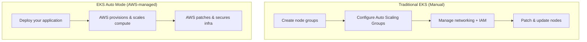
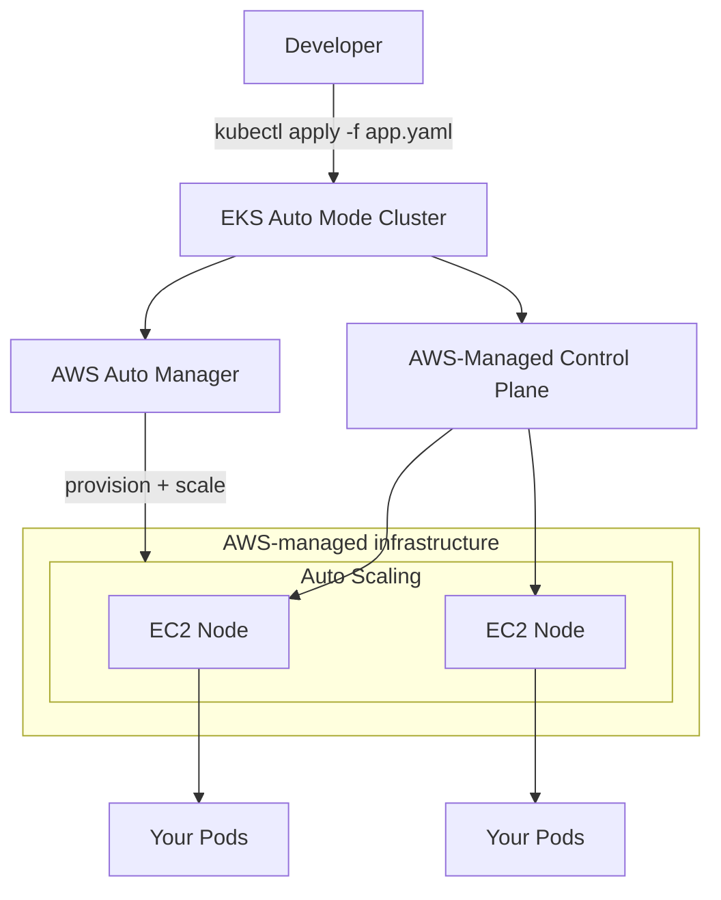

# EKS Auto Mode

> **EKS Auto Mode** streamlines the deployment and management of Kubernetes workloads by **eliminating manual worker node management**. AWS automatically provisions, configures, and manages the underlying compute infrastructure.

---

## Table of Contents

- [What is EKS Auto Mode?](#what-is-eks-auto-mode)
- [EKS Auto Mode vs Traditional EKS](#eks-auto-mode-vs-traditional-eks)
- [Architecture](#architecture)
- [Key Advantages](#key-advantages)
- [When to Use EKS Auto Mode](#when-to-use-eks-auto-mode)
- [Connecting to an EKS Auto Mode Cluster](#connecting-to-an-eks-auto-mode-cluster)

---

## What is EKS Auto Mode?

**EKS Auto Mode** handles the infrastructure you'd normally manage yourself:

- EC2 instance provisioning
- Node group configuration
- Auto Scaling
- Networking and IAM setup
- Updates and patches

You focus **only on deploying and managing your Kubernetes applications**.



---

## EKS Auto Mode vs Traditional EKS

| Aspect              | Traditional EKS                                      | EKS Auto Mode                                  |
|---------------------|------------------------------------------------------|------------------------------------------------|
| **Worker nodes**    | You create/manage EC2 instances or Fargate.          | AWS provisions and manages them.               |
| **Auto Scaling Groups** | You configure them.                               | AWS handles scaling automatically.             |
| **Networking & IAM**| You configure node↔control-plane connectivity.        | AWS manages it.                                 |
| **Updates & Patches**| You maintain node security and performance.          | AWS applies patches automatically.              |
| **Operational model**| "Serverless-like" control plane, nodes on you.       | Fully managed, like **serverless Kubernetes**.  |

---

## Architecture



In Auto Mode you skip node groups, ASGs, patching, and VPC/CNI setup — AWS handles all of it.

---

## Key Advantages

1. **Elimination of Node Management**
   - AWS fully manages worker node provisioning, configuration, and maintenance.

2. **Dynamic Scaling**
   - Resources scale up/down automatically with workload demand — no manual intervention.

3. **Cost Efficiency**
   - Resources are allocated based on actual usage, minimizing over-provisioning.

4. **Simplified Operations**
   - No complex infrastructure configs; teams focus on application development.

5. **Accelerated Deployment**
   - No delay from manual node provisioning or configuration.

6. **Enhanced Security and Compliance**
   - AWS automatically applies security patches and updates.

---

## When to Use EKS Auto Mode

- **Kubernetes Workloads Without Node Management** – run apps without the operational burden of nodes.
- **Dynamic Workloads with Fluctuating Traffic** – variable traffic patterns that need automatic scaling.
- **Cost-Optimized Solutions** – pay only for the resources consumed.
- **Developer-Centric Workflows** – prioritize app development over infra management.

---

## Connecting to an EKS Auto Mode Cluster

To connect to the EKS cluster, update the kubeconfig:

```
aws eks --region ap-south-1 update-kubeconfig --name <clustername>
```

Then manage it like any other cluster:

```sh
kubectl get nodes
kubectl get pods -A
kubectl apply -f deployment.yaml
```

---

## Summary

| Question                          | Answer                                                |
|-----------------------------------|-------------------------------------------------------|
| Who manages nodes in Auto Mode?   | **AWS** (provisioning, scaling, patching).            |
| What do you deploy?               | Just your Kubernetes workload YAMLs.                  |
| Best for?                         | Teams wanting serverless-like operations and cost/ops savings. |

## Next Steps

Explore advanced service-to-service traffic control — continue with [16-istio-service-mesh.md](16-istio-service-mesh.md).