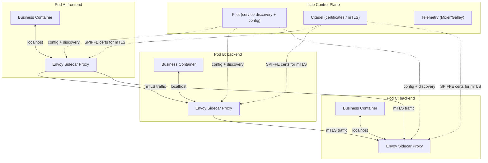
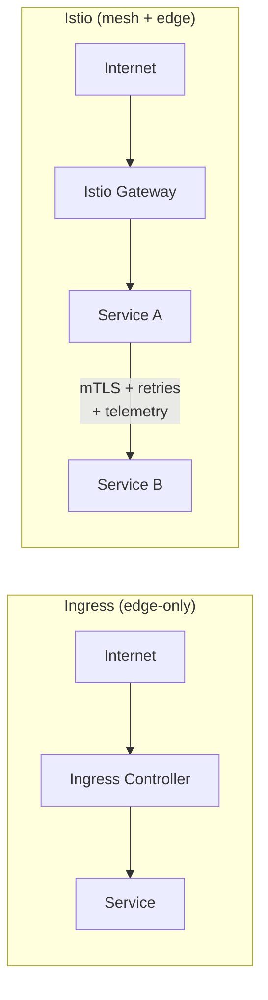

# Istio Service Mesh on EKS

> **Istio** is a "traffic manager + security guard + observability toolkit" for microservices running inside Kubernetes. Instead of hard-coding retries, timeouts, mTLS, canary splits, and request logs inside every app, Istio adds these features **from the platform** using lightweight **Envoy sidecar proxies**.

---

## Table of Contents

- [What Istio Is](#what-istio-is)
- [Why You Should Care](#why-you-should-care)
- [Architecture](#architecture)
- [Istio vs Ingress](#istio-vs-ingress)
- [When to Choose What](#when-to-choose-what)

---

## What Istio Is

Istio sits **next to every pod** (as a sidecar) and handles:

- Service-to-service networking
- Security (mTLS, identity, authorization)
- Observability (metrics, traces, logs)

You keep writing business code; Istio handles the platform layer.

---

## Why You Should Care

Use Istio when you need **any** of the following **without touching application code**:

- **Zero-trust security** — automatic mutual TLS (mTLS) between services.
- **Progressive delivery** — canary, A/B, traffic mirroring.
- **Fine-grained traffic control** — header-based routing, rate limiting.
- **Resilience** — retries, timeouts, circuit breaking.
- **Gold-standard telemetry** — uniform metrics, distributed traces, request logs.

It's especially valuable on EKS where teams need **consistent, auditable security and traffic policy** across many services and namespaces.

---

## Architecture

**Data plane:** Envoy sidecars per pod (**injected automatically**).
**Control plane:** `istiod` — combines discovery, certificate authority, and configuration distribution.

---

## Istio vs Ingress

| Topic           | **Istio (Service Mesh)**                                       | **Ingress (Ingress Controller)**                     |
|-----------------|----------------------------------------------------------------|------------------------------------------------------|
| **Scope**       | **Inside the cluster** (service↔service) **+** edge            | **Edge-only** (external traffic → cluster)           |
| **Data plane**  | Envoy sidecars per pod + ingress/egress gateways               | One or few edge proxies (NGINX, ALB)                 |
| **Traffic features** | Rich L7: canary %, header-based routes, fault injection, retries, timeouts, mirroring | Basic L7: host/path routing; some controllers add canary via annotations |
| **Security**    | **mTLS** between services, identity (SPIFFE), authz policies   | TLS termination at edge; **no service-to-service mTLS** |
| **Policy**      | Mesh-wide, namespace-scoped, per-workload                      | Mostly per-Ingress resource at the edge              |
| **Observability** | **Uniform** metrics, traces, detailed logs for every hop       | Edge metrics; limited internal visibility            |
| **Changes to app** | No code changes (sidecar handles it)                         | No code changes, but fewer mesh features             |
| **Complexity**  | Higher (sidecars + control plane)                              | Lower (single controller)                            |
| **When to choose** | Many services, zero-trust, advanced routing/rollouts, deep telemetry | Simple north-south routing only                 |

---

## When to Choose What

| Scenario                                       | Recommendation |
|------------------------------------------------|----------------|
| "Expose `Service A` on `/api`"                 | **Ingress**    |
| Service-to-service security + traffic control + consistent telemetry | **Istio** |
| Simple north-south traffic only                | **Ingress**    |
| Many services, zero-trust, advanced rollouts   | **Istio**      |

> **Rule of thumb:** If you just need to expose Services to the internet, an **Ingress** is enough. If you need **service-to-service security, traffic control, and consistent telemetry**, use **Istio**.

---

## Summary

| Capability        | What Istio Gives You                                    |
|-------------------|---------------------------------------------------------|
| **Traffic**       | Canary, A/B, header routing, retries, timeouts, mirrors. |
| **Security**      | Automatic mTLS, SPIFFE identity, authorization policies. |
| **Observability** | Uniform metrics, traces, and logs across all services.   |
| **Ops**           | No application code changes required (sidecar injection). |

## Next Steps

Return to the [index](README.md) to review any other topic in this EKS learning series.