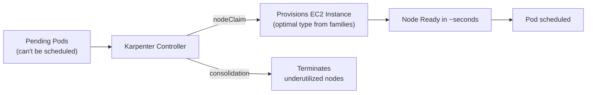
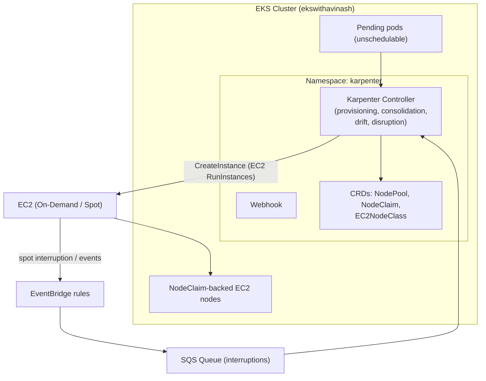
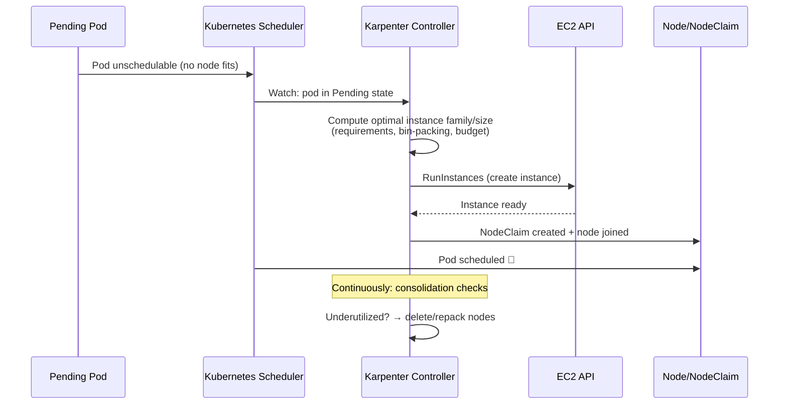
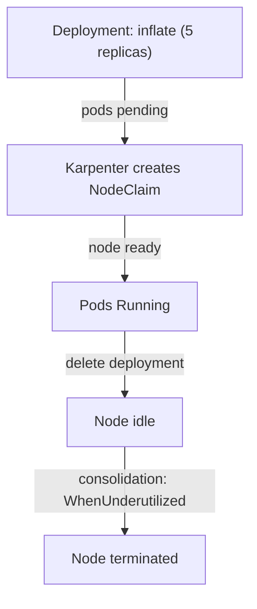
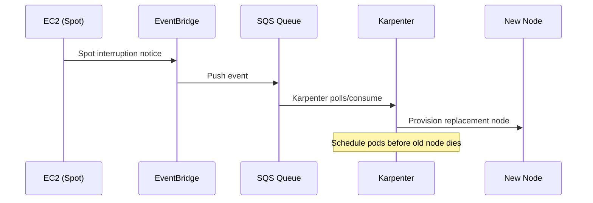

# Karpenter: The Modern Node Autoscaler for EKS

> **Karpenter** is an open-source, high-performance **Kubernetes node scaling** solution built by AWS. It watches for **pending pods** and automatically provisions the **right EC2 instance** for them in seconds — then **consolidates** down when nodes are underutilized. It's the recommended modern alternative (and future) to the traditional Cluster Autoscaler.

---

## Table of Contents

- [What is Karpenter?](#what-is-karpenter)
- [Karpenter vs Cluster Autoscaler](#karpenter-vs-cluster-autoscaler)
- [Architecture & Key Concepts](#architecture--key-concepts)
- [How Karpenter Works](#how-karpenter-works)
- [Prerequisites](#prerequisites)
- [Installation](#installation)
- [NodePool + EC2NodeClass Configuration](#nodepool--ec2nodeclass-configuration)
- [Testing: Scale Up & Down](#testing-scale-up--down)
- [Consolidation & Disruption](#consolidation--disruption)
- [Interruption Handling](#interruption-handling)
- [Best Practices](#best-practices)
- [Summary](#summary)

---

## What is Karpenter?

Karpenter directly provisions **EC2 nodes** (or in some cases uses **Fargate profiles**) to run pending pods, choosing the optimal instance type based on pod requirements. It does **not** rely on fixed **Auto Scaling Groups (ASGs)** — instead it discovers subnets, security groups, and instance families via tags/selectors.



### Why Karpenter?

- **Faster** than Cluster Autoscaler — launches nodes in **seconds**, not minutes.
- **Right-sizing** — picks the **smallest instance family/type** that fits the pod's requests.
- **Bin-packing** — packs multiple workloads onto the same node efficiently.
- **Consolidation** — continuously right-sizes/terminates underutilized nodes.
- **Spot + On-Demand** — mixed capacity handled automatically.
- **Interruption handling** — reacts to EC2 spot interruptions & rebalance events.

---

## Karpenter vs Cluster Autoscaler

| Feature                     | Cluster Autoscaler                              | Karpenter                                           |
|-----------------------------|-------------------------------------------------|-----------------------------------------------------|
| **Node discovery**          | Fixed node groups + Auto Scaling Groups         | **Tag/selector-based** discovery (subnets, SG, AMIs)|
| **Instance selection**      | Uses the ASG's instance type(s)                 | Picks the **best-fit** type from instance families  |
| **Time to new node**        | Minutes (ASG + launch)                          | **Seconds**                                         |
| **Scaling granularity**     | Whole node groups                               | Individual **NodeClaims** (per-pod)                 |
| **Bin-packing**             | Limited                                         | Aggressive, workload-aware                          |
| **Consolidation**           | Scales down after idle timeout                  | **Continuous** right-sizing (delete / repack)       |
| **Spot interruption**       | Via ASG lifecycle / mixed instances policy      | Event-driven via **SQS queue**                      |
| **Drift detection**         | Manual                                          | Automated (AMI, security group, subnet drift)       |
| **Complexity**              | Simpler mental model                            | More CRDs to configure                              |

> **Recommendation:** New AWS guidance favors **Karpenter** for new clusters. Cluster Autoscaler is still supported but is being superseded.

---

## Architecture & Key Concepts

Karpenter is installed as a **controller Deployment** in the `karpenter` namespace and uses **three core CRDs**:

| CRD             | API Group          | Purpose                                                                  |
|-----------------|--------------------|--------------------------------------------------------------------------|
| **NodePool**    | `karpenter.sh/v1`  | Scheduling **requirements** + capacity types + **disruption policy**.    |
| **NodeClaim**   | `karpenter.sh/v1`  | An individual node/instance created by Karpenter (status layer).         |
| **EC2NodeClass**| `eks.amazonaws.com/v1` | AWS-specific config: AMI family, subnets, security groups, IAM role, tags. |

> ⚠️ **Naming history:** `Provisioner` → **`NodePool`**, `Machine` → **`NodeClaim`**, `AWSNodeTemplate` → **`EC2NodeClass`** (Karpenter v0.32+ / v1.x).



---

## How Karpenter Works



---

## Prerequisites

- An existing EKS cluster (e.g., `ekswithavinash` in `ap-south-1`) with an **EKS OIDC provider**.
- `aws`, `kubectl`, and `helm` installed and configured.
- At least one node running so Karpenter itself can be scheduled (the cluster's bootstrap node group).

---

## Installation

### Step 1: Connect to the Cluster

```bash
aws eks update-kubeconfig --region ap-south-1 --name ekswithavinash
```

### Step 2: Create Environment Variables

```bash
export CLUSTER_NAME=ekswithavinash
export AWS_DEFAULT_REGION=ap-south-1
export AWS_ACCOUNT_ID=$(aws sts get-caller-identity --query Account --output text)
```

### Step 3: Tag Subnets & Security Groups for Discovery

Karpenter creates instances **directly**, so it needs to know which subnets/SGs to use. Tag them:

```bash
# Tag all private/public subnets in the cluster's VPC
aws ec2 describe-subnets \
  --filters "Name=tag:Name,Values='*ekswithavinash*'" \
  --query 'Subnets[].SubnetId' --output text | tr '\t' '\n' | while read sid; do
    aws ec2 create-tags --resources "$sid" --tags "Key=karpenter.sh/discovery,Value=$CLUSTER_NAME"
  done

# Tag the cluster security group
SG_ID=$(aws eks describe-cluster --name $CLUSTER_NAME --query "cluster.resourcesVpcConfig.clusterSecurityGroupId" --output text)
aws ec2 create-tags --resources "$SG_ID" --tags "Key=karpenter.sh/discovery,Value=$CLUSTER_NAME"
```

### Step 4: Grant Karpenter IAM Permissions (via EKS Pod Identity or IRSA)

**EKS Pod Identity (recommended):**

```bash
# 1. Download the official Karpenter controller IAM policy (JSON)
curl -fsSLo karpentercontrollerpolicy.json \
  https://raw.githubusercontent.com/aws/karpenter-provider-aws/refs/heads/main/website/content/en/preview/getting-started/getting-started-with-karpenter/karpentercontrollerpolicy.json

aws iam create-policy \
  --policy-name KarpenterControllerPolicy \
  --policy-document file://karpentercontrollerpolicy.json

# 2. Create the EKS Pod Identity association
eksctl create podidentityassociation \
  --cluster $CLUSTER_NAME \
  --namespace karpenter \
  --service-account-name karpenter \
  --permission-policy-arns arn:aws:iam::${AWS_ACCOUNT_ID}:policy/KarpenterControllerPolicy \
  --region $AWS_DEFAULT_REGION
```

### Step 5: Install Karpenter with Helm

```bash
helm upgrade --install karpenter oci://public.ecr.aws/karpenter/karpenter \
  --version v1.3.3 \
  --namespace karpenter --create-namespace \
  --set "settings.clusterName=${CLUSTER_NAME}" \
  --set "settings.interruptionQueue=${CLUSTER_NAME}" \
  --set controller.resources.requests.cpu=1 \
  --set controller.resources.requests.memory=1Gi
```

### Step 6: Set Up Interruption Handling (SQS + EventBridge)

```bash
# Create the queue
aws sqs create-queue \
  --queue-name ${CLUSTER_NAME} \
  --attributes '{"MessageRetentionPeriod": "86400"}'
```

Attach an IAM policy allowing Karpenter's IAM role to **Read/Delete** from this queue, then create EventBridge rules to forward **Spot Interruption**, **Instance Rebalance**, and **Scheduled Change** events to the queue. Pass the queue name to Helm via `settings.interruptionQueue=${CLUSTER_NAME}` (already set in Step 5).

> Full EventBridge → SQS wiring can be automated with the **`karpenter` Terraform module** or the docs' CloudFormation template. This is **recommended for production** so spot termination notices re-initiate the node promptly.

### Step 7: Verify the Controller

```bash
kubectl get pods -n karpenter
kubectl logs -f -n karpenter deploy/karpenter
```

---

## NodePool + EC2NodeClass Configuration

### Create the EC2NodeClass

```yaml
apiVersion: eks.amazonaws.com/v1
kind: EC2NodeClass
metadata:
  name: default
spec:
  amiFamily: AL2                 # Amazon Linux 2; or Bottlerocket, Ubuntu
  role: "KarpenterNodeRole-ekswithavinash"   # IAM instance profile role
  subnetSelectorTerms:
    - tags:
        karpenter.sh/discovery: ekswithavinash
  securityGroupSelectorTerms:
    - tags:
        karpenter.sh/discovery: ekswithavinash
```

### Create the NodePool

```yaml
apiVersion: karpenter.sh/v1
kind: NodePool
metadata:
  name: default
spec:
  template:
    spec:
      requirements:
        - key: kubernetes.io/arch
          operator: In
          values: ["amd64"]
        - key: karpenter.sh/capacity-type
          operator: In
          values: ["on-demand", "spot"]
        - key: karpenter.sh/instance-category
          operator: In
          values: ["c", "m", "r"]        # compute, general, memory
      nodeClassRef:
        group: eks.amazonaws.com
        kind: EC2NodeClass
        name: default
  disruption:
    consolidationPolicy: WhenUnderutilized   # or WhenEmpty
    expireAfter: 720h                          # rotate nodes every 30 days
```

```bash
kubectl apply -f ec2nodeclass.yaml -f nodepool.yaml
```

---

## Testing: Scale Up & Down

### Scale Up — Deploy a workload that needs more capacity

```bash
kubectl create deployment inflate --image=public.ecr.aws/eks-distro/kubernetes/pause:3.7
kubectl scale deployment inflate --replicas=5
kubectl get pods -o wide
```

Watch Karpenter provision nodes in seconds:

```bash
kubectl logs -f -n karpenter deploy/karpenter
kubectl get nodeclaims
kubectl get nodes
```

### Scale Down — Delete the workload

```bash
kubectl delete deployment inflate
```

Karpenter's consolidation will notice the now-underutilized node and **terminate it** (see `kubectl get nodeclaims`).



---

## Consolidation & Disruption

| Setting                          | Description                                                        |
|----------------------------------|--------------------------------------------------------------------|
| `consolidationPolicy: WhenEmpty`   | Terminate nodes only when completely empty.                         |
| `consolidationPolicy: WhenUnderutilized` | Continuously consolidate underutilized nodes (default).    |
| `expireAfter: 720h`              | Rotate nodes periodically (security/compliance).                   |
| `drift: true`                    | Replace nodes when AMI/SG/subnet drift from the NodeClass.          |
| `disruption.budgets`             | Pod Disruption Budgets to keep availability during disruption.      |

Karpenter chooses from three consolidation actions:
1. **Delete** — delete an empty node.
2. **Replace** — move workloads to a cheaper/better node.
3. **Do nothing** — keep current node (already optimal).

---

## Interruption Handling

Karpenter listens to EC2 events via **SQS**:

| Event                            | Karpenter Action                                         |
|----------------------------------|----------------------------------------------------------|
| **Spot Instance Interruption**   | Pre-emptively re-provision workloads before termination. |
| **Instance Rebalance**           | Graceful migration before the interruption window.       |
| **Scheduled Change / Health**    | Retires or replaces impaired nodes.                      |



---

## Best Practices

- **Keep a small bootstrap node group** (or Fargate profile) so `karpenter` itself always runs.
- Use **multiple NodePools** for separation: e.g., `general`, `spot`, `gpu`, `data`.
- Set `karpenter.sh/capacity-type` requirements so spot is used where appropriate.
- Enable **Pod Disruption Budgets** for stateful workloads during `replace`.
- Tag subnets explicitly; never mix discovery tags across clusters.
- For production, wire **interruption queue** (SQS + EventBridge).
- Backup/rotate the controller via `expireAfter` + drift detection.

---

## Summary

| Question                                  | Answer                                                |
|-------------------------------------------|-------------------------------------------------------|
| What does Karpenter replace?              | **Cluster Autoscaler** (node-level scaling).          |
| How does it decide instance size?         | Pod requirements + bin-packing → **best-fit** type.    |
| Node discovery mechanism                  | Tags/selectors (**NodePool + EC2NodeClass**), no ASGs.|
| Scaling speed                             | Seconds.                                              |
| Cost optimization                         | Spot capacity, consolidation, right-sizing.            |

## Next Steps

Learn how Karpenter's cost impact can be measured — revisit [13-kubecost.md](13-kubecost.md) — or review the rest of the series from the [index](README.md).