# 🚀 AWS EKS — Complete Visual Study Guide

> **Interactive & visual reorganization of the KodeKloud *AWS EKS* course (v1.0)**.


---

## 🧭 Table of Contents

| # | Module | Focus |
|---|---|---|
| 1 | [Intro & Overview](#1--intro--overview) | What is EKS, Control Plane vs Data Plane |
| 2 | [Control Plane Deep Dive](#2--control-plane-deep-dive) | etcd, API Server, Multi-AZ, OIDC |
| 3 | [Creating a Cluster](#3--creating-an-eks-cluster) | Console, CloudFormation, Terraform, CLI |
| 4 | [Cluster Access & Auth](#4--cluster-access--authentication) | aws-iam-authenticator, RBAC mapping |
| 5 | [VPC CNI Networking](#5--vpc-cni-networking) | ENI, IP limits, Prefix Delegation, IPv6 |
| 6 | [Network Policies](#6--network-policies) | eBPF, egress/ingress control |
| 7 | [Storage](#7--storage) | EBS, EFS, FSx, S3, Local, In-cluster |
| 8 | [Secrets](#8--secrets) | Native vs External Secret Stores (CSI) |
| 9 | [Load Balancing & Services](#9--load-balancing--services) | ELB, Load Balancer Controller, ExternalDNS |
| 10 | [Ingress](#10--ingress) | NGINX, ALB Controller, L7 routing |
| 11 | [Gateway API & Lattice](#11--gateway-api--vpc-lattice) | Gateway classes, routes, service network |
| 12 | [Compute Options](#12--compute-fargate--node-groups--karpenter) | Fargate, Node Groups, Karpenter |
| 13 | [Control Plane Security](#13--control-plane-security) | aws-auth ConfigMap, Cluster Access API |
| 14 | [Pod IAM](#14--pod-iam-kube2iam--irsa--pod-identity) | kube2iam, IRSA, Pod Identity |
| 15 | [Security Groups for Pods](#15--security-groups-for-pods) | Trunk ports & alternatives |
| 16 | [Observability](#16--observability) | CloudWatch, ADOT, X-Ray, AMP/AMG |
| 17 | [Upgrades](#17--cluster-upgrades) | Support windows, in-place vs blue-green |
| 18 | [EKS Add-ons](#18--eks-add-ons) | Managed add-ons & gotchas |

> **💡 Tip:** This file uses **Mermaid diagrams** (rendered natively on GitHub), **collapsible sections**, **comparison tables**, and **code blocks**. Open it on github.com for the best experience.

---

## 1. 🧠 Intro & Overview

### What is EKS?

> **EKS = Elastic Kubernetes Service** — the **hosted/managed** way to run Kubernetes on AWS. Exactly like running Kubernetes anywhere else, *except half of it is managed by AWS*.

### ☸️ Control Plane vs Data Plane

Abstractly, every Kubernetes cluster has two halves:

| Plane | Who runs it | What lives there |
|---|---|---|
| **Control Plane** 🎛️ | AWS account | etcd, API Server, Scheduler, Controller Managers |
| **Data Plane** 🖥️ | **Your** account | Worker nodes, Pods, workloads |

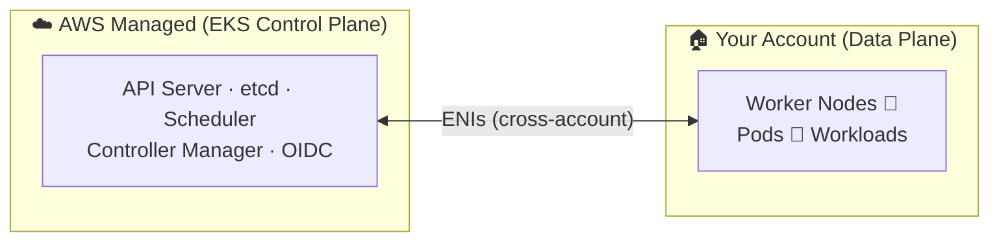

> **Key insight:** When you log into the console you'll see an "EKS cluster", but you will **never** see the control-plane components inside it — AWS manages those for you.

### 🌐 Two VPCs, One "Cable"

The EKS control plane lives in **AWS's own VPC**, and your nodes live in **your VPC**. They are connected by cross-account ENIs — think of it as two physically separate networks hooked together with a single cable.

### 🆚 Self-managed (EC2) vs EKS

| Aspect | Run it yourself on EC2 | EKS |
|---|---|---|
| Control plane | ✅ You manage | ☁️ AWS manages |
| etcd backups | ❌ **You** are responsible | ☁️ AWS handles |
| Scheduler flags / versions | Full control | Use what AWS provides |
| Scale size | Up to you | AWS managed |
| Operations burden | High (upgrades, etcd, HA) | Low for control plane |
| Custom images / AMIs | Full control | Possible via launch templates |
| Cost | $0 service fee (pay EC2) | ~$0.10/hour + compute |

<details>
<summary><b>📌 Why people switch to EKS (click to expand)</b></summary>

> **etcd is the wake-up call.** etcd is the distributed database that backs *every* cluster. Most people try a hosted service the first time they have to **restore an etcd backup**. If that data is lost, the cluster basically no longer exists. EKS hands that responsibility to AWS.
</details>

### 🤔 Why run Kubernetes in AWS at all?

> Main use case: you already have **other AWS services** (RDS, S3, Route 53, global load balancers). The easiest way to integrate Kubernetes with the rest of AWS is **EKS**.

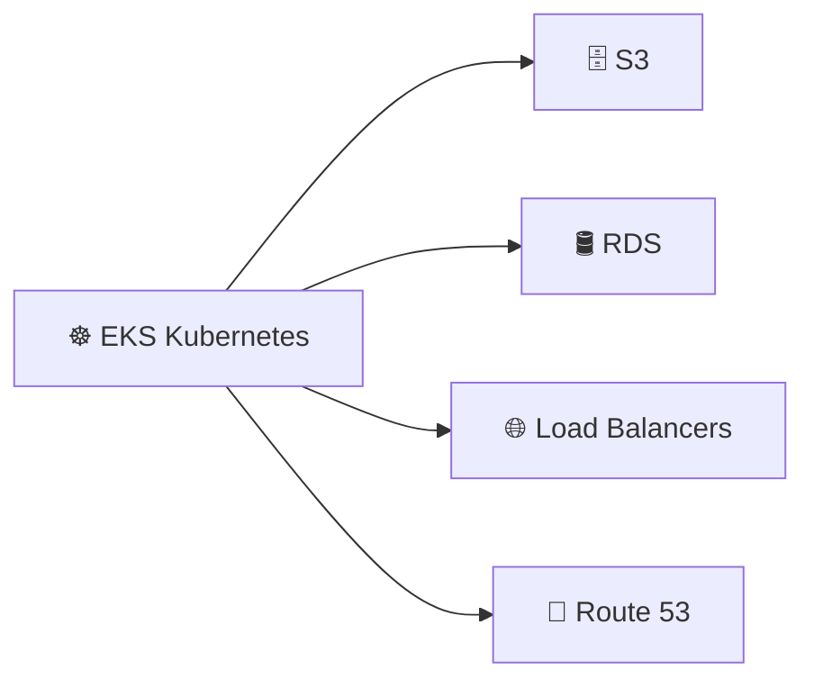

#### 📄 Example: A minimal EKS cluster (eksctl)

```yaml
# cluster-config.yaml — run with: eksctl create cluster -f cluster-config.yaml
apiVersion: eksctl.io/v1alpha5
kind: ClusterConfig
metadata:
  name: my-eks-cluster
  region: ap-south-1
  version: "1.31"
availabilityZones:
  - ap-south-1a
  - ap-south-1b
  - ap-south-1c

iam:
  withOIDC: true                 # required for IRSA (Module 14)

cloudwatch:
  clusterLogging:                # sends control-plane logs to CloudWatch
    enableTypes:
      - api
      - audit
      - authenticator
      - controllerManager
      - scheduler

managedNodeGroups:               # your side of the line = the data plane
  - name: ng-default
    instanceType: t3.small
    desiredCapacity: 2
    minSize: 2
    maxSize: 4
    managed: true
```

```bash
eksctl create cluster -f cluster-config.yaml

# or straight AWS CLI
aws eks create-cluster \
  --name my-eks-cluster \
  --version 1.31 \
  --role-arn arn:aws:iam::123456789012:role/AmazonEKSClusterRole \
  --resources-vpc-config subnetIds=subnet-aaa,subnet-bbb,subnet-ccc,endpointPublicAccess=true
```

---

## 2. 🎛️ Control Plane Deep Dive

When you create an EKS cluster, AWS provisions (across at least **3 Availability Zones**):

| Component | Purpose | HA layout |
|---|---|---|
| **etcd** 🗃️ | Distributed KV store, quorum-based | 3–5 nodes spread across AZs |
| **API Server** 🔌 | What `kubectl` talks to | Multiple, behind a load balancer |
| **Scheduler** 📅 | Assigns pods to nodes | Multiple |
| **Controller Manager** 🧭 | Maintains desired state | Multiple |

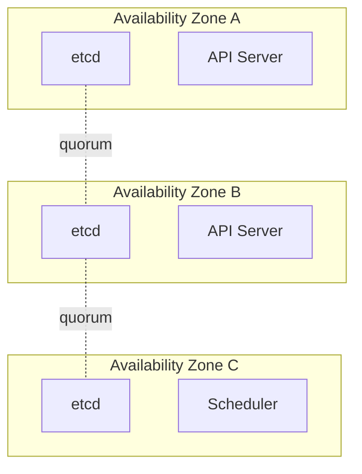

> **⚠️ Gotcha:** If one AZ goes down, etcd may become **read-only** and the API server fails over. This is normal distributed-systems behavior that EKS handles for you. If you use one physical AZ event to knock a whole cluster over, this is the real-world cost of "just run it yourself".

### ➕ Extra `EKS`-only components

Not part of vanilla Kubernetes, but bundled with every cluster:

- 🔐 **OIDC endpoint** — authentication for things calling into the cluster (maps to IAM roles)
- 📝 **Logging → CloudWatch** — send control-plane logs centrally (must be enabled)
- 👤 **Authentication** — `aws-auth` ConfigMap (older) or the new **cluster access APIs**
- 👷 **Node Groups** — EKS API that touches *your* account (data plane)
- 🧩 **Add-ons** — scheduled through EKS API but run workloads *inside your cluster* (your responsibility once running)

---

## 3. 🛠️ Creating an EKS Cluster

There are several ways to create a cluster:

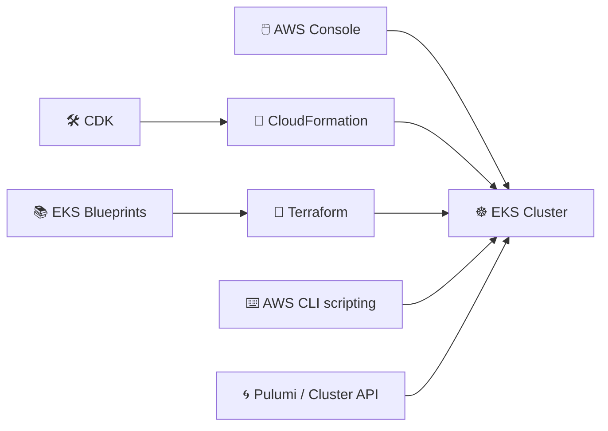

| Method | Pros | Cons |
|---|---|---|
| **Console** 🖱️ | Easy first step | Hard to reason across many AWS tabs; easy to misconfigure IAM |
| **CloudFormation** 📄 | True IaC, repeatable clusters | Everything written from scratch |
| **CDK** 🛠️ | Real programming language → CloudFormation | Adds a layer of abstraction |
| **Terraform** 🧱 | **Most popular**; helper modules, `EKS Blueprints` | You own state & access management |
| **Other tools** 🌀 | Pulumi, Cluster API, etc. | Vary in maturity |

> **⚠️ Permissions:** EKS touches EC2, VPCs, security groups, load balancers, and IAM roles — creating clusters requires **broad permissions**.

### 🔑 The must-have CLI tool

**`aws-iam-authenticator`** — a `kubectl` plugin that authenticates your AWS IAM credentials against the EKS API server (which sits behind a load balancer).

```text
kubectl get nodes
    → aws-iam-authenticator
        → "I'm this IAM user/role in this AWS account"
            → EKS API server grants access
```

---

## 4. 🔑 Cluster Access & Authentication

How do people *and pods* get in? Three mechanisms:

| Mechanism | What it does |
|---|---|
| **OIDC** 🔐 | Identity provider for things calling into the cluster |
| **`aws-auth` ConfigMap** 📋 | Maps AWS IAM identities → internal RBAC (older way) |
| **EKS API itself** 🔌 | Handles control-plane-side permissions/access |

> If you run Kubernetes **on-prem**, everything around you already has permission. Inside AWS, **IAM** gates everything — proving *who* or *what process* is allowed to do something becomes critical.

---

## 5. 🌐 VPC CNI Networking

The VPC CNI is how pods get **real VPC IP addresses** (no overlay!). Nodes and pods draw IPs from the **subnets** in each AZ.

### 🖧 How it works (simplified)

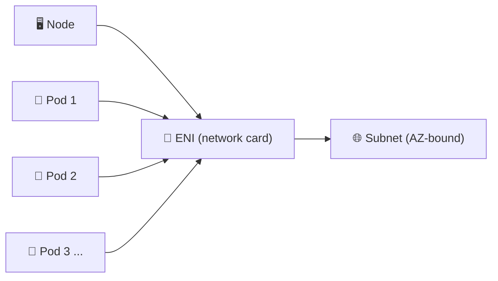

- Each node gets an **ENI** (like a physical NIC) with a **primary IP**.
- Pods consume **secondary IPs** on the same ENI — one physical port can carry many IPs.
- Every node & pod plugs into the VPC using **Elastic Network Interfaces (ENIs)**.
- IPs come from **subnets**, and subnets are **bound to an Availability Zone**.

### 🚧 The bottleneck: instance limits

Different EC2 instance types allow different numbers of **ENIs** and **IPs per ENI**:

| Small/medium instance | Example |
|---|---|
| Max ENIs | 4–5 |
| Max IPs per ENI | 4–5 |

```text
Node takes 1 IP (primary)..
ENI limit (say 5 total): →
  4 pods fit on ENI #1
 5th+ pod → needs a NEW ENI  (slow: register + attach + bring up)
16th pod → node simply has NO more IPs → pod never connects to network
```

> **Two fixes:** use bigger instance types **or** turn on **Prefix Delegation** (16 IPs per ENI at once instead of 1).

### 🌡️ Warm ENI vs Warm IP targets

| Setting | Behavior | Best for |
|---|---|---|
| **Warm ENI target** | Keeps spare ENIs already attached | Uniform instance sizes |
| **Warm IP target** | Keeps N spare IPs; CNI computes how many ENIs are needed | Mixed instance sizes (avoids wasteful ENIs) |

- ENI attachment is **slower** than handing out an IP (seconds to a minute).
- **Leases** on IPs matter: pods churning fast can exhaust a subnet's IPs even after pods die (lease expiry).

<details>
<summary><b>💡 Warm IP target example (click to expand)</b></summary>

Set warm IP target = 10:
- 5-IP instance → gets 1 default ENI (1 IP for node) + 2 new ENIs.
- 20-IP instance → no new ENI until it crosses 10 allocated IPs. Fewer wasted ENIs.
</details>

### 🏷️ Prefix Delegation (recommended by EKS best practices)

> Assign a **/28 CIDR (16 IPs)** in one shot instead of single IPs — makes the node a mini-**_router_** for that block inside the VPC.

```yaml
# VPC CNI environment variable
ENABLE_PREFIX_DELEGATION: "true"   # boolean
```

**Why it's great:**

```text
ENI can hold 5 IPs  →  1 used by node  →  4 /28 slots left
4 × 16 IPs = 64 pod IPs per ENI   (vs only 4 without)

16th pod was impossible → now 64+ pods per ENI. 🎉
```

### 📡 IPv6 (Dual-Stack VPC)

- Requires enabling IPv6 **from the start** — you can't convert later.
- VPC becomes **dual-stack** (IPv4 + IPv6). EKS has **no pod dual-stack** — pods get **IPv6 only**.
- Each node gets a **/80** = **100 trillion IPs**. Running out is no longer a problem. 😅

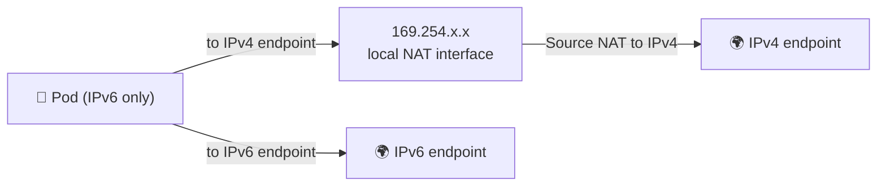

> **⚠️ Watch out:** IPv6 addresses are globally routable & usually **public**. Use an **egress-only gateway** so traffic can go out but nothing can reach *in*. Also, many pods sharing one IPv4 egress path can become a bottleneck.

> **✅ Recommendation:** For brand-new clusters & massive scale — start with IPv6. Running out of subnet IPs was the #1 customer problem.

---

## 6. 🛡️ Network Policies

A **standard Kubernetes resource** that controls ingress/egress between pods — now supported by the **VPC CNI via eBPF** (runs inside the Linux kernel, not a sidecar).

| Layer | Tool |
|---|---|
| Kernel | eBPF (VPC CNI) |
| In-kernel iptables | classic CNIs |
| AWS layer | Security Groups |
| Application-native | NetworkPolicy manifests (deployed with the app) |

**Benefits:**
- Aligns network rules **closely with the app's needs** — managed via the same deployment manifests.
- No more emailing a "firewall team" to open ports — you control it in-cluster.
- Evolve rules as the app's dependencies (RDS, S3, DNS) change — all deployed together.

> **⚠️ Debugging gotcha:** figuring out *where* traffic is blocked (iptables? security group? eBPF?) adds one more layer to troubleshoot.

---

## 7. 🗄️ Storage

### Block vs File — the mental model

| Type | Analogy | Example |
|---|---|---|
| **Block** 🧱 | Plug in a raw hard drive, format it, do what you want | **EBS** |
| **File** 📁 | An existing file system — just read/write files | **EFS** (NFS) |

### 🗿 EBS (Elastic Block Storage)

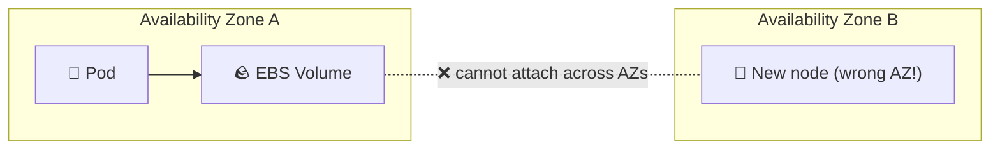

| Property | Detail |
|---|---|
| Scope | **AZ-bounded** 🎯 |
| Speed | Very fast (same data center, low latency) |
| Types | gp2/gp3, io1/io2 (higher throughput) |
| Size | Terabytes — easy |
| Durability | Local NVMe = fast but **ephemeral** |
| Tooling | Snapshots, restore — great ecosystem |

> **⚠️ The Cluster Autoscaler trap:** if a pod needs an EBS volume (which is AZ-bound) and the autoscaler provisions a new node in a **different AZ**, the pod hangs & times out, then jumps to *another* AZ... until it finally lands in the right one. Databases can be down a long time.

**CSI driver anatomy** (how Kubelet talks to storage):

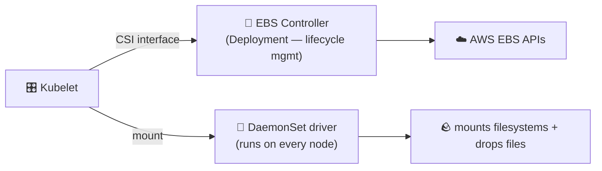

### 📁 EFS (Elastic File System)

*NFS with AWS complexity added.*

| Property | Detail |
|---|---|
| Scope | **Regional** 🌍 |
| Sharing | Multiple pods across AZs share the **same** mount |
| Set-up | Must create mount point, **IAM permissions**, and **security groups** yourself |
| Provisioning | Dynamic provisioning **not** available on **Fargate** or **Windows** |

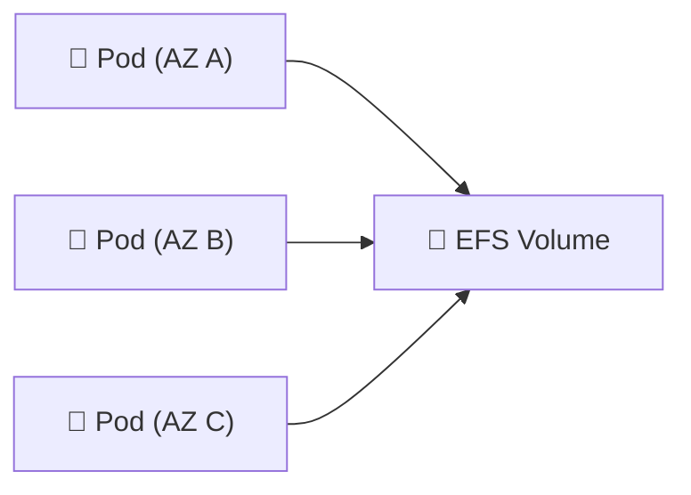

**When to pick EFS:** multi-AZ shared mounts; similar to NFS you already know.
**Watch out:** file locking / high concurrent writes can hang another pod (classic NFS behavior).

### 🆚 Storage decision cheat-sheet

| Need | Best choice |
|---|---|
| Fast, low-latency block storage | **EBS** |
| Shared multi-AZ file access | **EFS** |
| Object storage / huge scale, cheap | **S3** (+ S3 Mountpoint / CSI driver) |
| Ultra-high throughput parallel FS | **FSx Lustre** |
| Fastest possible, ephemeral | **Local NVMe** |
| Portable, multi-cloud, replica in-cluster | **Ceph / Longhorn / OpenEBS / Rook** |

<details>
<summary><b>🧩 In-cluster storage options (click to expand)</b></summary>

Ceph, Longhorn (Rancher), OpenEBS, Rook — all replicate data *inside* the cluster using node local volumes. Managed Kubernetes-natively (controller/operator + CRD + RBAC). Great when you have no EFS/EBS access, need multi-cloud portability, or want a lower barrier to start — but **you** own the data and its backups.
</details>

> **Remember:** if you can't back the data up or someone else can't manage it — that's a business risk. Choose storage like your business depends on it (because it does). 🚨

---

## 8. 🔒 Secrets

### 🧊 The truth about Kubernetes secrets

>A Kubernetes **Secret** is basically a **ConfigMap** with **base64** encoding.

| | ConfigMap | Secret |
|---|---|---|
| Purpose | Non-sensitive config | "Sensitive" config |
| Encoding | Plain | base64 |
| Actual security | — | ❌ **base64 is NOT encryption** — decode it instantly |
| Size limit concern | — | base64 is ~33% larger |

> **⚠️ Just because it's called a Secret doesn't make it secret.** Protect native secrets with strong **RBAC + namespace separation** — or better, move secrets *outside* the cluster.

### 🔐 The recommended approach: External secret stores

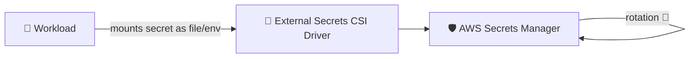

| Outside store | Great for |
|---|---|
| **Hashicorp Vault** 🏛️ | On-prem / self-managed, full control |
| **AWS Secrets Manager** 🗄️ | Inside AWS/EKS |

**What the `secrets-store-csi-driver` gives you:**

- 🗂️ Mounts secrets from many backends as **volumes**
- 🔁 **Secret syncing** — creates a *temporary in-cluster secret* (for env vars); auto-deletes when the pod dies
- 🔄 **Rotation** — workloads always fetch the latest secret, no manual re-deploy

> **Pro tip:** with AWS, fetch secrets via **pod identity** (see Module 14) so IAM policies, not in-cluster RBAC alone, control who gets what.

---

## 9. 🌐 Load Balancing & Services

### From old to new

| Era | Controller | Creates |
|---|---|---|
| Legacy | (built into k8s) **Cloud Controller Manager** | Classic **ELB** only |
| Modern | **AWS Load Balancer Controller** 🧭 | **ALB** / **NLB** based on annotations |

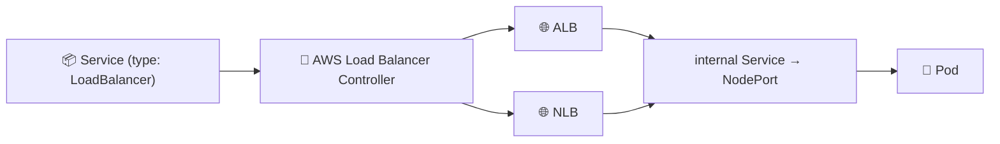

### How a Service actually works

- Every Service ultimately maps to a **pod + a NodePort** exposed on hosts.
- `kube-proxy` on *every* node knows where the port actually lives and **reroutes** traffic to the correct node/pod.

> **💡 Best practice:** set `externalTrafficPolicy: Local` (or annotate) so the port is only exposed where the app actually runs — avoids a cross-AZ `kube-proxy` hop.

### 🧭 External DNS

Open-source controller that watches Services and creates friendly **Route 53** names pointing at ALBs/NLBs:

```text
Service "my-app" → ALB →  myapp.example.com (created automatically in Route 53) ✨
```

### 🌍 Global Load Balancer (GLB)

- **Global** resource (not regional) — front for load balancers across **multiple regions**.
- Route by **geo-location** or **weighted traffic split** (60/40 for failover).
- ⚠️ Not yet managed by the AWS Load Balancer Controller.

---

## 10. 🚦 Ingress

### Ingress vs Service

> A **Service** exposes a port. **Ingress** does **L7 routing** (hostname/path → service) — so you don't burn a load balancer per service.

### Classic NGINX ingress (inside-cluster)

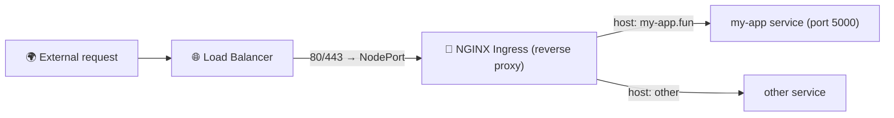

- NGINX looks at the **Hostname** and reverse-proxies to the correct internal service. That's the L7 magic.
- Load balancer in front doesn't need to know anything about hosts.

### AWS Load Balancer Controller managed ingress

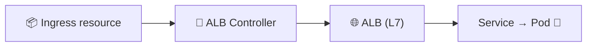

- Controller creates an **ALB** for you — skip running NGINX entirely.
- **Reuse a single ALB** for many ingress resources (new host rules, not new load balancers) — cheaper with hundreds of services.
- ⚠️ Currently does **not** support the **Gateway API**.

### Alternatives & meshes

- **Other controllers:** Contour (Envoy-based), and many more.
- **Service meshes:** Istio, Linkerd — can handle north-south too.
- **VPC Lattice** — see next module.

---

## 11. 🚪 Gateway API & VPC Lattice

### Gateway API = "Ingress v2"

Layer-7 (and more) ingress, **graduating past Ingress**, more flexible + more protocols.

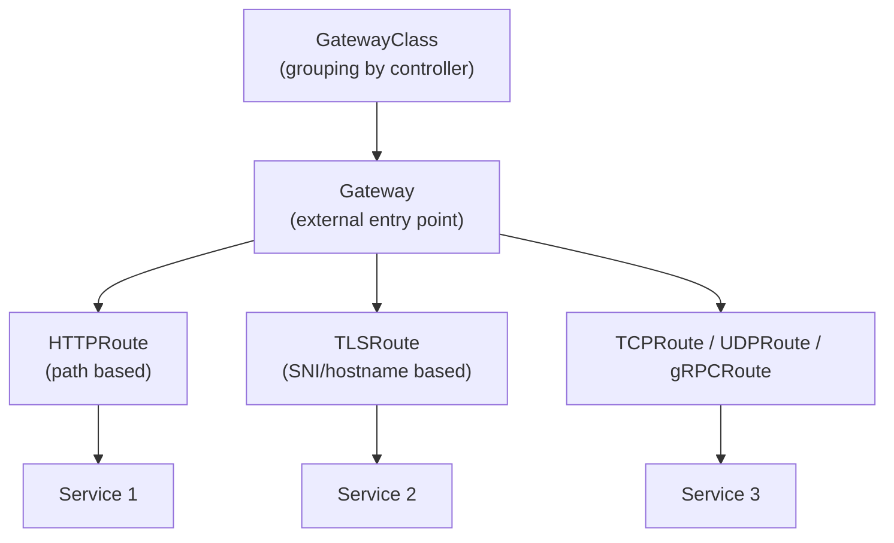

| Route type | Matches on |
|---|---|
| **HTTPRoute** | URL path |
| **TLSRoute** | SNI (server name) + termination at gateway |
| **TCP / UDP / gRPCRoute** | connection type |

### 🧩 VPC Lattice

AWS's service-to-service mesh — sits *below/transparent to* your VPCs.

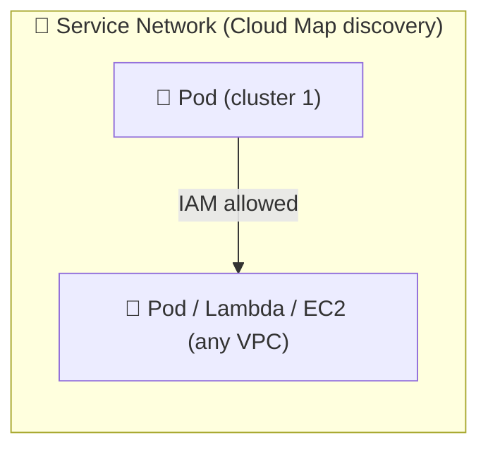

| Benefit | Great when |
|---|---|
| Cross-VPC / cross-account / cross-region routing | Large enterprises with many VPCs |
| Talks to Lambda, EC2, anything in VPC | Advanced, platform-teams world |
| Route via **service network** endpoints (Cloud Map registration) | Simplifies connectivity |

| Downside | Impact |
|---|---|
| Everything is **IAM-gated** | More advanced IAM to manage |
| **5–10 min** to create service networks | Feels slow vs instant k8s ingress |
| Complex to operate | Only for large multi-network environments |

> **💡 Verdict:** Lattice is **not** for 1–2 cluster setups. Use it only when you have dozens–hundreds of VPCs/clusters and a platform team.

---

## 12. 🖥️ Compute: Fargate · Node Groups · Karpenter

Three ways to attach compute to an EKS cluster:

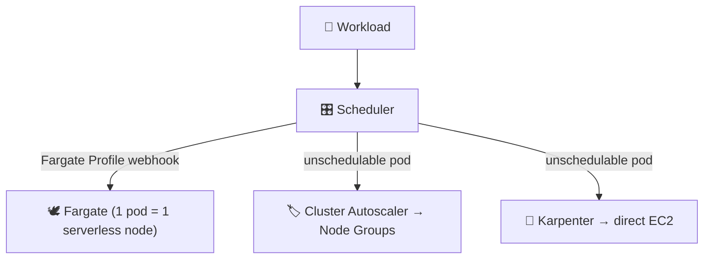

### 🕊️ Fargate

| Feature | Detail |
|---|---|
| What it is | "Serverless" — no EC2 instance in your account |
| Node per pod | **1 pod = 1 Fargate node** |
| Scheduling | Fargate-specific scheduler (webhook modifies pod) |
| Get it | Scheduler picks cheapest matching profile by CPU/RAM request |
| Isolation | Separate process/memory/FS per pod — great for critical internal services |

**Limitations:**

- ❌ No EBS mount (cross-account boundary)
- ❌ No dynamic **EFS** provisioning
- ❌ **DaemonSets don't run** → convert them to sidecars (or duplicate per pod ✋)

**Best for:**

- Dedicated/isolated compute for **cluster-critical services** (Metrics Server, Cluster Autoscaler, Karpenter itself).
- Workloads needing guaranteed, isolated resources.
> ⚠️ **Not** a full security boundary — global cluster resources (ingress, volumes, RBAC leaks) still span the whole cluster.

### 👷 Node Groups

| | Unmanaged (BYO) | Managed |
|---|---|---|
| What | Auto Scaling Group you create | ASG managed for you |
| AMI | Custom, always | Custom via **launch templates** |
| Upgrades | **You** roll them | ✅ **Managed upgrades** (rolling VM replacement) |
| IAM/kubelet join | All on you | Handled |

- Grouping of similar instances — you can have **several** (e.g., general compute + GPU).
- Managed upgrade churn: node replaced → pods migrate to old nodes → migrate again to a new node. **Pod churn** is real, but auto-scaling groups handle it.
- Cluster Autoscaler (CA) scales node groups up/down.

### 🤖 Karpenter

> Developed by AWS and donated to the CNCF Autoscaling SIG. A **Kubernetes-native, workload-aware autoscaler.**

| Feature | Detail |
|---|---|
| Nodes | No ASGs — direct to **EC2** |
| Node pools | Group instance types (allow/deny classes) |
| Cost-aware 💰 | Picks the **cheapest** instance type that fits |
| Consolidation | Packs workloads, deletes waste, replaces with cheaper nodes |
| Speed | Provision nodes **on demand** based on workload needs |

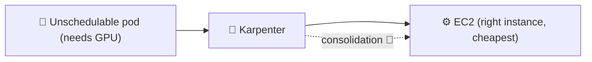

**⚠️ Maturity requirements** (or you *will* have an outage):

1. **Pod Disruption Budgets** — guarantee minimum running replicas
2. **Topology spread constraints** — otherwise everything lands on ONE cheap instance (no HA!)
3. **Resource requests** — must be defined; Karpenter schedules on declared needs

### 🆚 Compute comparison

| | Fargate | Node Groups | Karpenter |
|---|---|---|---|
| Grouping | None (per pod) | ASG | Node pools |
| Compute control | Lowest | Medium | High |
| Cost optimization | Medium | Manual | **Automatic** 💰 |
| Upgrade churn | Per-pod replace | Rolling per group | Clever, consolidation-aware |
| Best for | Internal services, isolation | Predictable groups, custom AMIs | Dynamic workloads, scale, cost |

---

## 13. 🛡️ Control Plane Security

How *you* (and nodes) get past the API server.

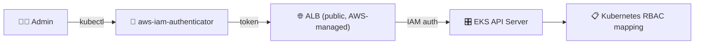

| Method | Age | How it works | Drawback |
|---|---|---|---|
| **`aws-auth` ConfigMap** 📋 | Old | Map IAM ARN → RBAC role via ConfigMap | You own formatting; cluster creator gets permanent cluster-admin you can't remove |
| **Cluster Access API** ✅ | New | IAM mappings in **EKS API** (declarative) | Needs newer EKS + tooling changes |

- The API server is public on the Internet; **AWS authentication** protects it — just like every other AWS API.
- `aws-auth` is still supported but **no longer recommended** — a typo can lock you out.
- Cluster Access API lets the *cluster* creator delegate admin to a separate team, and survives IAM-role deletion.

> **Best practice:** create clusters with a **role** (not a personal user) so admins can be added/removed via IAM.

---

## 14. 🧑‍💻 Pod IAM: kube2iam · IRSA · Pod Identity

How a **pod** gets AWS credentials. Three ways:

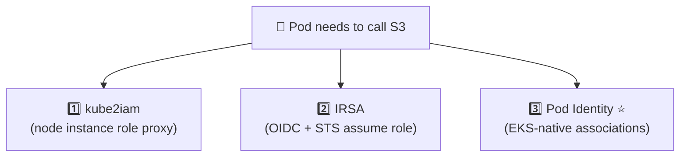

### 1️⃣ kube2iam
- Proxy on nodes reusing the **EC2 instance IAM role** (via metadata endpoint redirect).
- Simple but **node-wide permissions** (over-permissioned risk).

### 2️⃣ IRSA — IAM Roles for Service Accounts

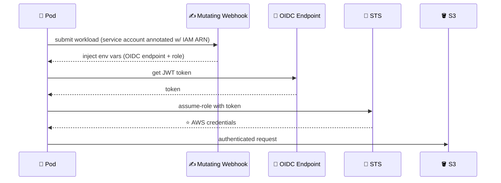

Setup requires:
1. Cluster's **OIDC endpoint** (comes with EKS)
2. IAM role **trusted relationship** with the OIDC endpoint
3. Service Account annotated with the IAM role ARN

**Downsides:**
- 🔢 Limit of **~100 OIDC endpoints** per account
- 🤝 Reusing one IAM role for many clusters hits the **5-bucket STS** constraint
- 🔄 Blue/green upgrades mean retrusting a 2nd OIDC endpoint on all roles
- ⏳ Can't pre-create IAM roles until the cluster's OIDC endpoint exists

### 3️⃣ Pod Identity ⭐ (recommended for EKS)

Eliminates OIDC/JWT entirely — associations live in the **EKS API**:

| IRSA | Pod Identity |
|---|---|
| Annotate Service Account | Associate in **EKS API** (cluster+ns+SA→IAM ARN) |
| Needs OIDC endpoint + trusted relationship | Uses `pods.eks.amazonaws.com` service principal — always the same ✅ |
| JWT + STS dance | Webhook injects a **169.254.x.x** local endpoint |
| Fixed OIDC limits | **ABAC** on tags — reuse roles freely 🏷️ |

```mermaid
flowchart LR
    POD["🐳 Pod"] -->|"169.254 local endpoint"| DS["👷 DaemonSet (privileged proxy)"]
    DS -->|"service account token"| EKSAPI["🎛️ EKS API (associations)"]
    EKSAPI -->|"correct IAM role + attributes"| DS
    DS --> POD
    POD --> S3["🪣 S3"]
```

> **✅ Recommendation:** In EKS → **Pod Identity**. Multi-cloud or plain k8s → **kube2iam**. IRSA works but is the fiddliest. IRSA & Pod Identity can coexist — the webhook just prefers Pod Identity.

---

## 15. 🚧 Security Groups for Pods

> **TL;DR — AWS Security Groups can be applied to pods via trunk ENIs, but the instructor strongly suggests you probably shouldn't.** 🚫

```mermaid
flowchart LR
    subgraph NODE["🖥️ Node (shared SG)"]
        TRUNK["🔌 Trunk ENI (branch per pod)"]
    end
    TRUNK -->|"SG-A"| P1["🐳 Pod A (allowed → RDS)"]
    TRUNK -->|"SG-B"| P2["🐳 Pod B (blocked)"]
```

**Complexities:**

- 🧩 Done via **private APIs** in a VPC controller — opaque to you
- ❗ Only certain instance types support **trunk ports** (huge lookup table)
- 📉 Security-group pods **don't count toward MaxPods** — manual per-node-group tuning
- 🌐 Mixing with custom CNIs (Calico/Cilium) = very hard to debug

**Better alternatives (in order of preference):**

| Option | Why |
|---|---|
| **IAM (Pod Identity)** ✅ | Tight auth per workload; network reachable ≠ usable |
| **Network Policies** | Block egress to CIDRs/subnets for the RDS ranges |
| **Node group / Karpenter node-class separation** 🗂️ | Isolate node-level security groups per workload type |
| **Separate EKS clusters** 🔒 | For truly sensitive data — own VPC, own SG, own IAM |

> **Key principle:** anything in one EKS cluster is *assumed shared* — multi-tenancy means Kubernetes isn't the place for a hard security boundary.

---

## 16. 📊 Observability

### Default AWS stack

```mermaid
flowchart LR
    CP["🎛️ Control-plane logs"] -->|"enable during creation"| CW["☁️ CloudWatch Logs"]
    NODE["🖥️ Node + container logs"] -->|"CloudWatch agent (DaemonSet)"| CW
    NODE -->|"ADOT add-on"| OTEL["🚀 OpenTelemetry"]
    OTEL --> CW
    OTEL --> AMP["📈 AWS Managed Prometheus"]
    CW --> AMG["📊 AWS Managed Grafana"]
    W["👩‍💻 Workload traces"] --> XRAY["🎯 AWS X-Ray"]
```

| Component | What it gives you |
|---|---|
| **Control-plane logging** | API server, controller, scheduler → CloudWatch (at cluster creation) |
| **CloudWatch agent** (add-on) | Node + container logs & metrics |
| **ADOT add-on** ⭐ | OpenTelemetry → CloudWatch or any OTEL endpoint |
| **AWS X-Ray add-on** | Traces from workloads |
| **Managed FluentBit / Firelens** | Fargate workload logging (via a config map trigger) |
| **AMP + AMG** | Managed **Prometheus + Grafana** — familiar open-source stack, IAM-integrated |

> **Fargate note:** no DaemonSets → logging agents don't run on Fargate nodes; use the special observability namespace + AWS logging config to trigger FluentBit for workload logs only (no rich node metadata).
>
> **Verdict:** most monitoring in AWS funnels **into CloudWatch** — pick your path in, then build (e.g., Grafana) on top.

---

## 17. 🔄 Cluster Upgrades

### The clock is ticking ⏰

| Milestone | Window | Cost |
|---|---|---|
| Standard support | 14 months | ~$0.10/hr ≈ **$175/yr** |
| Extended support | +12 more months (26 total) | **~$4,380/yr** in the last year |
| Practical upgrade cadence | Every **3–4 months** (~3/yr) | To stay current |

> Kubernetes releases **3× per year** → keep pace or pay extended-support prices. 🚨

### 🔍 Upgrade insights

- Console tab + CLI query showing **which APIs workloads use that will be removed** in the next version (e.g., PSPs removed going 1.24 → 1.25)
- EKS **cluster insights** API + **`kubent`** (kube-no-trouble) — the latter reads your namespaces with RBAC to pinpoint *which workloads* break.

### 🏗️ In-place (recommended) vs 🚢 Blue-green

```mermaid
flowchart TD
    subgraph INPLACE["🟦 In-place upgrade (recommended)"]
        CP1["🎛️ Control plane rolling replace (AWS managed)"] --> D1["👷 Data plane"]
        D1 --> NG["Node groups: roll one node at a time 🔁"]
        D1 --> KR["Karpenter: auto via node classes + consolidation"]
        D1 --> FG["Fargate: force a deployment rollout (1 node/pod)"]
    end
    subgraph BG["🟦→🟩 Blue-green"]
        OLD["Old cluster"] -->|migrate all workloads| NEW["New cluster"]
        OLD -. "DNS / LB cutover" .-> NEW
    end
```

| Strategy | When to use | Risks |
|---|---|---|
| **In-place** ✅ | Default; most of the time | Node-group churn (pods re-scheduled 3–5× during roll) |
| **Blue-green** 🚢 | CNI / network provider swap, huge version jumps (1.25 → 1.30), isolated testing | Slow (months), **2× cost**, DNS caching, LB/load migration pain |

> **Note:** control plane upgrades are fully **AWS-managed** (rolls components behind the ALB). The **data plane** is **yours** — node groups, Karpenter, Fargate, add-ons all upgrade separately — and **add-ons do NOT auto-upgrade.** Update them *before* node replacement.

---

## 18. 🧩 EKS Add-ons

> EKS-specific (not a Kubernetes concept): bundle default cluster services (e.g., VPC CNI, kube-proxy, CoreDNS, EBS/EFS CSI...).

```mermaid
flowchart LR
    EKSAPI["🎛️ EKS Add-ons API"] -->|"version + config"| DEP["Deployments in your cluster"]
```

**Gotchas & guidance:**

- ⚠️ Add-ons still need **individual upgrade calls** every cluster upgrade — 3×/year that's a lot of moving pieces.
- ⚠️ Waiting on marketplace vendor validation can **block your upgrades**.
- ✅ The instructor's opinion: prefer **bootstrapping your own base services** — Helm charts, plain manifests, GitOps — so *you* own the YAML and don't wait on a vendor to permit an upgrade.
- 📈 Add-ons have improved since 2024 but remain a point of friction for clean upgrade cadence.

---

## 🏁 Final Takeaway

```
EKS = Kubernetes, with AWS managing half of it.

Networking  → VPC CNI (IPs, prefix delegation, IPv6)
Storage     → EBS (block/AZ) · EFS (file/regional) · S3 · in-cluster
Secrets     → keep them EXTERNAL (Secrets Manager + CSI) 🔒
Traffic in  → Services → Load Balancer Controller · Ingress · Gateway/Lattice
Compute     → Node Groups (managed) · Fargate (isolation) · Karpenter (cost+scale) 🤖
Identity    → Pod Identity (EKS) · kube2iam · IRSA
Security    → Cluster Access API · RBAC · network policies · SG-for-pods = avoid
Observe     → CloudWatch + ADOT + AMP/AMG 📊
Upgrades    → every 3-4 months, in-place first, watch API deprecations ⏰
Add-ons     → own your YAML, don't get blocked by vendors 🧩
```

> **🚀 Biggest wins for EKS beginners:**
> 1. Enable **prefix delegation** and consider **IPv6** from day one.
> 2. Use **Pod Identity** for pod→AWS access.
> 3. Pick **Karpenter** for modern, cost-aware compute.
> 4. Keep secrets **outside** the cluster.
> 5. Plan for **3 upgrades a year** — never fall behind.

---

### 📚 Source

This Markdown is a visually reorganized, interactive version of the **KodeKloud "AWS EKS" course (v1.0)** PDF (`AWS-EKS v.1.0.pdf`). Content authored by Ali Maher / KodeKloud.

**Follow us on** [kodekloud.com](https://kodekloud.com/) to learn more.