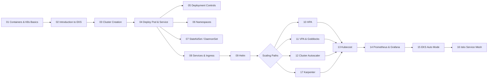

# Amazon EKS Learning Series

> A structured, from-scratch guide to **Amazon Elastic Kubernetes Service (EKS)** — covering containers, Kubernetes concepts, cluster creation, workloads, scaling, monitoring, cost optimization, and advanced topics like service meshes.

Each document is self-contained with **architecture diagrams (Mermaid + ASCII)** and hands-on YAML examples.

---

## 📚 Table of Contents

### Fundamentals

| #  | Topic                                                        | Description                                                        |
|----|--------------------------------------------------------------|---------------------------------------------------------------------|
| 01 | [Containers & Kubernetes Basics](01-containers-and-kubernetes-basics.md) | Containers, orchestration, control plane, nodes, Pods, ReplicaSets, Deployments, Services. |
| 02 | [Introduction to EKS](02-introduction-to-eks.md)             | What EKS is, features, vs self-managed K8s, control/data plane, eksctl. |
| 03 | [EKS Cluster Creation](03-eks-cluster-creation.md)           | Install kubectl/eksctl, create a cluster, IAM OIDC, kubectl cheatsheet. |
| 04 | [Deploy a Pod & Service](04-deploy-pod-and-service.md)       | Hands-on Pod → ReplicaSet → Deployment → NodePort/LoadBalancer Service. |
| 05 | [Deployment Controls](05-deployment-controls.md)             | Affinities, Taints & Tolerations, Probes, PDB, PriorityClasses.       |
| 06 | [Namespaces & Quotas](06-namespaces-and-resource-quotas.md)  | Namespace concepts, default namespaces, LimitRange testing.           |
| 07 | [StatefulSet, DaemonSet, ConfigMap & Secrets](07-statefulset-daemonset-configmap-secret.md) | Workload controllers + config/secrets + EBS CSI driver. |
| 08 | [Services & Ingress](08-services-and-ingress.md)             | Ingress components, Instance vs IP mode, ALB + 2048 game walkthrough. |

### Packaging, Scaling & Observability

| #  | Topic                                                        | Description                                                        |
|----|--------------------------------------------------------------|---------------------------------------------------------------------|
| 09 | [Helm Package Manager](09-helm-package-manager.md)           | Helm concepts, install Nginx, custom Node.js chart, command reference. |
| 10 | [Horizontal Pod Autoscaling](10-horizontal-pod-autoscaling.md) | HPA, CPU/memory requests & limits, hands-on PHP-Apache test.        |
| 11 | [VPA & Goldilocks](11-vpa-and-goldilocks.md)                 | Vertical Pod Autoscaler, recommendations, Goldilocks dashboard.     |
| 12 | [Cluster Autoscaler](12-cluster-autoscaler.md)               | Node-level scaling with Cluster Autoscaler on EKS.                  |
| 17 | [Karpenter](17-karpenter.md)                                 | Modern node autoscaler — right-sized EC2 in seconds, consolidation. |
| 13 | [Kubecost](13-kubecost.md)                                   | Cost monitoring with Kubecost on EKS.                               |
| 14 | [Prometheus & Grafana](14-prometheus-and-grafana.md)         | Production monitoring stack with persistent EBS storage.            |

### Advanced & Emerging

| #  | Topic                                                        | Description                                                        |
|----|--------------------------------------------------------------|---------------------------------------------------------------------|
| 15 | [EKS Auto Mode](15-eks-auto-mode.md)                         | Fully managed infrastructure — no manual node management.           |
| 16 | [Istio Service Mesh](16-istio-service-mesh.md)               | Istio vs Ingress, sidecar architecture, mTLS, observability.        |

---

## 🗺️ Suggested Learning Path



---

## 🧰 Tooling Covered

| Tool              | Used For                                              |
|-------------------|-------------------------------------------------------|
| `kubectl`         | Managing Kubernetes resources.                        |
| `eksctl`          | Creating/managing EKS clusters & node groups.         |
| `helm`            | Packaging and deploying applications.                 |
| `aws` CLI         | AWS services: EKS, IAM, ECR, EC2, Route53, ACM.      |

---

## 🚀 Quick Start (TL;DR)

```bash
# 1. Install tools
#    kubectl, eksctl, helm, aws CLI

# 2. Create a cluster
eksctl create cluster --name ekswithavinash \
  --region ap-south-1 \
  --version 1.31 \
  --nodegroup-name ng-default \
  --node-type t3.small --nodes 2 --managed

# 3. Connect kubectl
aws eks update-kubeconfig --region ap-south-1 --name ekswithavinash

# 4. Deploy an app
kubectl apply -f nginx-deployment.yaml

# 5. Cleanup when done
eksctl delete cluster --name ekswithavinash
```

---

## ⚠️ Note

> Some documents contain **real-looking values** (cluster names, account ARNs, passwords) used as examples from a working EKS lab. When reproducing, replace them with your own cluster name, account ID, and credentials — and never commit real secrets.

---

## 📄 License

This is a personal learning repository. Feel free to use, share, and adapt the content for your own EKS studies.